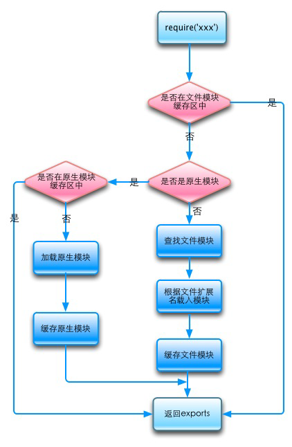

# 前言

CMD 全名 Common Module Definition，最初是由 [Sea.js](https://github.com/seajs/seajs) 来提出的模块定义、加载规范，CMD 现在基本见不到了，本文不介绍 CMD，有相关需求可以参考 [CMD 教程](https://github.com/seajs/seajs/issues/242) 和 [CMD 规范手册](https://github.com/cmdjs/specification/blob/master/draft/module.md)；

CommonJS 简称 CJS，它是一个项目，目的是为 JS 在浏览器以外实现模块化而制定规范，也是 Node.js 使用的模块化规范；

AMD 全名 Asynchronous Module Definition，最初是由 [require.js](https://requirejs.org/) 提出的，它是一种浏览器端的模块化异步加载约定；

ES Module 简称 ESM，它是语言规范进一步发展后新制定模块加载规范，目的是实现更先进的模块化方式，它既适用于浏览器侧也适用于 Node.js 侧，目前已被逐步支持。

CommonJS 使用的加载方式可以参考 [cnblog 博客上的介绍](https://www.cnblogs.com/littlebirdlbw/p/5670633.html)，以及 [CommonJS官网](http://www.commonjs.org/)，还可以参考《深入浅出 Node.js》一书；有关 AMD 的介绍，阮一峰写了一些 [介绍文章](http://www.ruanyifeng.com/blog/2012/10/javascript_module.html)；而 ES Module 的加载方式可以在 [ES6 入门](http://es6.ruanyifeng.com/) 中查看。


# CommonJS 简介

CommonJS 是 Node.js 使用的模块化规范。因为 Node.js 代码运行在服务器上，很可能要承担并发访问，并执行一些资源处理工作，瓶颈在磁盘访问上。这种场合下，相同或相似功能的代码通常要被执行多次，因此 CommonJS 的实现中具备缓存的功能。

CommonJS 规定了：

- 一个文件就是一个模块，模块具备单独的作用域，不会污染全局环境；
- 模块加载的结果会被缓存，因为模块很可能会频繁访问本地资源或是承担并发访问，因此模块可以多次加载，但是除了第一次加载，后续的调用均从缓存中取得；
- 因为上一条的原因，如果你想动态地输出变量，需要通过方法调用的方式来访问，模块直接导出的变量是不会变的。


## 定义和加载模块

一个 JS 文件就是一个具备单独作用域的模块，Node.js 会为每个模块提供以下变量：
- `require()`：引入其它模块；
- `module`：指当前模块本身，它有个属性 `.exports`，该属性上的值即是当前模块对外暴露的方法或变量；
- `exports`：它指向 `module.exports`，注意不要直接给它赋值，这会切断它的指向，可以在该对象上挂载方法、变量，这些方法和变量会作为当前模块导出的内容暴露出来；
- `__dirname`：当前模块的文件夹路径；
- `__filename`：当前模块的包含文件名的路径。

模块在第一次被加载时里面的代码会被执行，Node.js 会缓存挂载在 `module.exports` 上的所有方法和变量，并把这些方法和变量作为当前模块的导出内容。

*****

CommonJS 对每个模块提供 `require()` 方法用于加载其他模块。每当使用该方法时，Node.js 根据一系列判断逻辑来决定从何处获取模块文件：

引入整个模块对象：
``` js
const _ = require('lodash')
```
引入模块目录下的某个子目录：
``` js
const _omit = require('lodash/omit')
```
使用这两种引入方式，Node.js 会尝试从当前目录同级的 node_modules 目录下寻找名为 lodash 的目录来引入，如果找不到，会一直向上级目录递归寻找 node_modules 目录。如果一直找不到，则会报错。


## 加载模块的路径

例如有以下代码：
``` js
const mod = require(str)
```
在执行到这里时，Node.js 会按照以下顺序来尝试加载：
- 如果 str 是某个已经被缓存的文件模块，那么直接返回之；
- 如果 str 是某个Node.js 的内置模块名（例如 fs、path），那么直接返回该内置模块；
- 如果 str 以 `/` 或 `./` 或 `../` 这种相对路径开头：
    - 有后缀名时，则会将 str 当作文件名来查找；
    - 没有后缀时，Node.js 会依次添加 `.js ` / `.json` / `.node` 后缀来查找，如果找不到，还会将 str 当做目录，在其下查找 `package.json` / `index.js` / `index.json` / `index.node` 这几个文件（有关 package.json 的引入方式见下文）；
- 如果 str 为模块名，Node.js 从当前目录下的 node_modules 下查找同名的目录，在其下查找 `package.json` / `index.js` / `index.json` / `index.node` 这几个文件，如果找不到此目录，则会向父级目录递归此流程；
- 都没找到则会报错。

这里引用网上的一张判断流程图：




假设某文件位于 `/a/b.js` ，那么：

若它使用了代码 `require('c')`，则查找方式如下：

- **/a/node_modules/c.js**  （如果没找到则将 .js 后缀换成 .json 和 .node 来尝试）
- **/a/node_modules/c/**  （在这个目录内查找 `package.json` / `index.js` / `index.json` / `index.node` 这几个文件）
- **/node_modules/c.js**  （如果没找到则将 .js 后缀换成 .json 和 .node 来尝试）
- **/node_modules/c/**  （在这个目录内查找 `package.json` / `index.js` / `index.json` / `index.node` 这几个文件）

可以近似理解成，从当前目录下的 `node_modules` 文件夹里寻找文件；若找不到文件，则寻找目录；都没找到则返回父级目录继续，由此反复。


若它使用了代码 `require('./c')`，则查找方式如下：

- **/a/c.js** （如果没找到则将 .js 后缀换成 .json 和 .node 来尝试）
- **/a/c** （在这个目录内查找 `package.json` / `index.js` / `index.json` / `index.node` 这几个文件）

和上面的方式相比，它不会加入 node_modules 目录，也不会向父级目录递归。


## 浏览器端代码使用 CommonJS

因为 CommonJS 属于 Node.js 的规范，因此浏览器端无法使用，就算直接使用，也会因 `require()` 未定义而直接报错。

而 Webpack 这样的打包工具支持 CommonJS 格式的模块化写法，会自动帮我们处理和打包依赖。因此很多前端代码，尤其是在 ES Module 规范还没发布前，都是用 CommonJS 的方式来引入模块的。

前端代码使用 CommonJS 时，要注意以下几点：

- 代码在打包编译阶段就通过 `require()` 确定依赖关系，依赖的文件都会进入打包，并不是运行的时候再去引入模块；
- 因为代码最终是打包成一个 JS 来执行的，因此模块的导出不具备 Node.js 那样的缓存机制，可以直接导出变量；
- 前端不存在 `__dirname`、`__filename` 等变量，因为这些变量是 Node.js 运行时产生的；
- 一般只有 JS 算模块，其他的文件格式默认是不支持的，前端如果需要引入图片等非 JS 格式的文件，此时需要借助 Webpack 的相关 Loader 来实现；
- 前端存在 `window` 等全局对象，这些模块可以直接使用不需要 require；
- 前端不存在 `process` 等 Node.js 独有的变量，因此例如 `process.env.NODE_ENV` 这种环境变量会被 Webpack 特殊处理；
- 浏览器也可能使用 `<script>` 引入了例如 jQuery 等其他全局性的模块，这些模块也是可以在 JS 代码中使用的（前提是入口 JS 代码s的 `<script>` 在 HTML 上的位置比这些其他模块更靠后），并不需要写 require，如果写了 require，则通过 Webpack 的 `externals` 配置来处理；
- 因为没有用到的文件不会被打包，因此动态 require 时需要额外注意。

-----

浏览器如果使用 require 引入图片，需要写成：

```jsx

```

如果使用的 `file-loader` 或 `url-loader` 版本比较旧，或是开启了它们的 `esModule` 属性，则需要写成这样：

```jsx

```

因为 Webpack 打包图片时使用的 `file-loader` （图片体积小则是走 `url-loader`）的配置中有一个 `esModule` 属性，它表示是否将 require 引入的东西视为一个 ES Module 模块而不是字符串，它默认为 `true`，通常来说需要针对图片类资源将它配置为 `false`，否则传入 src 属性的将是字符串 `'[object Module]'`。

在 `file-loader` 低于 5.0.0 的版本中它默认为 `false`，甚至有某个版本它叫 `esModules` 多了个字母 s，这些版本中 require 引入图片不需要加 `.default` 后缀。


## 动态引入和批量引入

因为 Node.js 代码通常是放在固定代码目录下同步运行，因此 require 可以接受动态字符串，它会同步地去访问模块文件，然后同步执行其中的代码并将导出的内容返回。

Node.js 批量引入文件的方式比较简单，可以使用 `fs` 来读取目录，获取文件列表，然后 for 循环 require 来引入多个文件。

-----

前端是在打包编译阶段就将模块之间的依赖打包好的，因此需要使用特定的 require 语法来实现动态引入或批量引入。

如果是批量引入，必须给定部分目录，例如：

```js
// 给定部分目录
const files1 = require('./imgs/' + fileName)
// 也支持给定部分目录 + 后缀名
const files2 = require('./imgs/' + fileName + '.jpg')
```

此时，Webpack 会把 `./imgs/` 目录下的文件全部打包；如果指定了后缀名，则将此后缀名的全部文件打包。因为工具并不知道 fileName 可能是什么，所以它只能把符合条件的文件全部打包。

如果需要按照一定规则引入文件，则需要使用 Webpack 提供的批量引入写法：

```js
const webpackContext = require.context('./imgs/', false, /\.png|\.jpe?g|\.bmp|\.gif$/)
```

第一个参数为目录，第二个参数表示是否对子目录也递归引入，第三个参数是匹配文件名的正则表达式。使用这种方式，Webpack 会按照此规则来批量引入匹配条件的文件。

返回的值是这些模块的上下文环境，如果想使用其中的模块：

```js
const files = webpackContext.keys()
for (const key of files) {
  const module = webpackContext(key)
  // module ...
}
```

可以看到，需要先从 `webpackContext` 中拿到模块的 key，然后把它当做方法传入 key 来调用，此时返回值便是模块本身。


## Node.js 运行模块代码的方式

Node.js 的模块分为2类，内置模块和文件模块：内置模块是由 Node.js 编译出的二进制字节码文件，例如 fs、path 等都是 Node.js 的内置模块，加载速度最快；而文件模块是动态加载的，速度稍慢。这两类模块都会被缓存。

文件模块分为 `.js`、`.node`、`.json `  三种后缀，对于每种后缀 Node.js 的加载方式也有不同：`.js` 后缀的是普通的 CommonJS 文件模块；`.node` 后缀的是通过 C/C++ 编写的插件类的东西，用的也是特殊的加载方式；`.json` 则会读取文件并用 `JSON.parse()` 来解析加载。

可以参考 [阮一峰的文章](http://www.ruanyifeng.com/blog/2015/05/require.html)，源码实现可以参考《深入浅出 Node.js》一书，还有一篇 [社区的博文](https://cnodejs.org/topic/57454824991011691ef17b09)。

当加载 .js 后缀的模块时，Node.js 会使用 fs 来读取该文件，并将其内容放置于一个封闭的匿名函数中，形如：

``` js
(function (exports, require, module, __filename, __dirname) {
  /* 加载的模块的代码在这里执行 */
})
```
运行这一段代码使用的是 vm 原生模块中的 `vm.runInThisContext()` 方法，代码是在方法体内运行的，因此不会污染全局作用域。而前面提到的 CommonJS 可以使用的几个变量，其实都是这个方法的参数传进来。可以看做是把加载的模块的代码复制到方法体内执行。

Node.js 会在运行时计算出 `__filename` 和 `__dirname` 等参数的值，并传给这个方法。


# AMD 简介

AMD 是在用户的浏览器上随网页一起加载的，它的瓶颈是带宽，如果网速慢那么加载执行 JS 时会阻塞页面加载渲染，因此 AMD 实现了异步加载，在浏览器侧提供更好的用户体验。

如果想使用 AMD，需要：

- 引入 [require.js](https://requirejs.org/) ；
- 想被加载的模块需要按照正确的 AMD 写法才能被正确引入，如果没有按照AMD的规范来写，则需要一些额外的处理方式。


## 定义和加载模块

加载模块时 require.js 必须被先加载，因此很有可能要把 require.js 的 `<script>` 标签写在最前面。一般加载完 require.js 文件后，还要指定一个 JS 文件作为入口，AMD 从入口文件开始按照依赖关系异步完成加载。

写法如下：

``` html
<script defer data-main="js/index" src="js/require.js"></script>
```
这里在引入 require.js 的同时，使用了 `data-main` 属性来指定了 `js/index.js` 文件作为入口。require.js 一般允许你省略 .js 后缀。

AMD 加载模块的写法：
``` js
require(['jquery', 'underscore', 'vue'], function ($, _, Vue) {
  /* 在该函数内可以使用$、_、Vue参数名了 */
})
```
第一个参数是一个数组，传入要加载的模块名；第二个参数是一个 callback，它的参数依次是传入的模块名加载完成之后的模块变量。只有当前面定义的所有模块都加载完成后才会执行 callback。

上述代码会令浏览器加载 `jquery`、`underscore`、`vue ` 三个名称的模块，在 callback 中它们分别成为 `&`、`_`、`vue` 三个参数名。

*****

定义 AMD 模块则是使用 `define()` 方法，用法如下：

``` js
define(function () {
  /* 模块内容，此方法的返回值将作为模块暴露出去 */
  return somethingExport
})
```
如果该模块还依赖于其它模块，那么就要使用下面的用法：
``` js
define(['mod'], function (m) {
  /* 模块内容，这里可以使用变量 m 代表 mod 模块，且此方法的返回值将作为模块暴露出去 */
  return somethingExport
})
```
此时会先加载模块 `mod`，你在该模块中可以使用变量 `m` 来访问 `mod` 模块。


## 非 AMD 模块适配处理

AMD 加载的模块必须符合其规范，即使用 `define()` 定义依赖项，并在 callback 中返回模块暴露的内容。但是实际使用中很多模块并没有用符合 AMD 格式的方式定义，因此需要我们对这些模块进行适配。

这里我们以 jQuery 来举例进行 AMD 适配：

``` js
requirejs.config({
  shim: {
    jQuery: {
      exports: '$'
    }
  }
})
```
这里的 `shim ` 表示需要适配的模块，`exports` 表示 jQuery 使用变量 `$` 作为暴露出的接口。

如果需要适配的模块还依赖于其它模块，例如 jQuery 的 datatable 插件依赖于 jQuery 模块，所以也会产生一个依赖关系。因为 jQuery和 datatable 都不是 AMD 规范的，所以还可以在 require 中定义适配时的依赖关系：
``` js
requirejs.config({
  shim: {
    'jQuery.datatable': {
      deps: ['jQuery']
    }
  }
})
```
这里没有 `exports` 属性，因为它挂载在 `jQuery.fn` 上面，所以无需使用接口引出。

对于通过 `shim` 来适配 AMD 规范的模块而言，可以定义一个 `deps` 属性，它是一个表示该模块所依赖的模块的数组。


## 加载路径和别名

对于大的项目，如果其中的模块需要大量复用，并且模块存放在不同的路径下，那么可以为各个模块指定路径、别名。

以下示例为 AMD 模块指定加载来源和别名：

``` js
requirejs.config({
  paths: {
    'jQ': ['https://example.com/js/jquery-3.2.1.min', 'js/jquery-3.2.1.min'],
    'V': ['js/vue.min'],
    'T': ['test']
  }
})
```
这里使你可以使用 `jQ` 作为 jQuery 的别名而不用每次都写成复杂的 `'jquery-3.2.1.min'`，而且它给出了两个加载来源，先从 CDN 或者网络上获取文件，如果无法获取才从当前站点路径中获取。

另外可以注意到，加载的多个文件都来源于 ./js/ 路径下，因此可以指定一个基目录，所有加载的文件都来源自该基目录。

指定基目录的方式：

``` js
requirejs.config({
  baseUrl: 'js',
  paths: {
    'jQ': ['jquery-3.2.1.min'],
    'V': ['vue.min'],
    'T': ['../test']
    /* 因为指定基目录为js/，而test不在其中，因此test就要往上走一级了 */
  }
})
```


## 插件应用：加载 CSS

require.js 原生不支持加载 css，因此必须使用 css 插件。

准备好 require.js 的 css 加载插件，然后用以下方式：

``` js
requirejs.config({
  map: {
    '*': {
      css: 'js/require.css.min'
    }
  },
  shim: {
    index_style: {
        deps: ['css!./css/index.css']
    }
  }
})
```
使用这种方式，注意 deps 加载 css 文件需要加上 `css!` 前缀，表示调用定义名为 `css` 的插件来加载它。


# ES Module 简介

ES Module 已经被最新的浏览器支持，需要使用  `<script type="module"> ` 的方式引入，此时浏览器将 JS 视为“模块”而不是“代码”。新版本的 Node.js 也已支持 ES Module，需要在 package.json 中设置一些属性来开启，见下文。

ES Module 规范制定的时候，考虑到了以下因素：

- Node.js 端和浏览器端可以使用同一种语法加载和定义，无需修改；

- 出于上一条的原因，CommonJS 中的 `require`、`module`、`exports` 变量均无法使用；
- 因为 ES Module 和新的 ECMA 规范版本发布时间基本一致，因此要支持新的语法，要能落实严格模式，明确定义顶层作用域的 `this`；
- 模块应该能令编辑器进行静态分析，例如支持代码提示。


出于这些原因，ES Module 的模块化具备以下特点：

- 模块默认是严格模式；
- 模块内没有 `require`、`module`、`exports` 等属于 CommonJS 的变量；
- 顶层作用域的 `this` 始终为 `undefined`，浏览器端和 Node.js 端要做到统一；
- 模块在书写引入代码时就会被解析，支持静态分析，支持代码提示；
- 出于上一条原因，ES Module 使用的 `import` 引入语句无法使用拼接字符串等动态调用方式，导出的内容也需要写成静态的；
- 不同于 CommonJS，ESModule 模块不会被缓存运行结果。


## 定义和加载模块

ES Module 使用 `import` 语法来加载模块。加载整个模块的语法：
``` js
// 引入模块的默认（default）导出
import _ from 'lodash
// 可以看做是： import default as _ from 'lodash'

// 引入模块中导出的 omit 变量
import { omit } from 'lodash'

// 引入模块中导出的全部内容
import * as Example from 'example'
```

使用 import 时，引入的内容必须是编译时即可确定的，它不能是一个表达式。如果需要动态引入，可以使用 `import()` 函数，这个函数返回一个 `Promise` 包装的模块变量，可以实现动态加载。

如果只需要执行模块的代码，不需要用到模块的导出内容，可以这样写：
``` js
import 'example'
```
**import语句始终会在其他代码运行前执行**，可以当做隐含的变量提升。

需要注意的是，ES Module 不会缓存模块的输出。它不像 CommonJS 一样，模块对外暴露出的方法、变量在第一次运行之后就被缓存。ES Module 模块导出的实际上是一个引用，它可以用于获取实时的值。但是多次相同的 `import` 并不会使模块运行多次，模块虽然结果不被缓存，但是实际上还是单例模式运行。

另外，ESModule 加载的模块是只读的，任何赋值行为会导致错误。

*****

导出模块使用 `export` 命令。ES Module 的每个文件就是一个单独的模块，它具备单独的作用域而不会污染全局变量，如果你想将该文件中的某些变量和方法暴露出来作为模块的对外的接口，那么需要使用 `export` 关键字输出它们。

下面是一个输出模块的例子：
``` js
const firstName = 'Michael'
const lastName = 'Jackson'

function talkWith () { }

export { firstName, lastName, talkWith }
```

也可以写成下面的形式，两种方式是等价的：
``` js
export const firstName = 'Michael'
export const lastName = 'Jackson'
export function talkWith () { }
```

想要引入这些被导出的变量和方法，可以这样引入：

```js
// 引入模块中的变量
import { firstName, lastName } from 'example'
console.log(firstName)
console.log(lastName)
```

或：

``` js
// 将模块所有内容整体引入
import * as example from 'example'
console.log(example.firstName)
console.log(example.lastName)
```

可以看出，模块导出变量的时候必须有一个名字，引入的时候，要么明确指明引入的名称，要么不分名称地用 `*` 星号全部引入。而实际上模块可以有一个名为 `default` 的默认导出，在导入模块的默认导出时，不需要指定引入的名称。

这种指定变量名引入的方式，还可以支持按需引入功能，配合支持 TreeShaking 的打包工具，还可以删去没有被用到的代码，见下文。

模块的默认导出，写法和导出一个名为 `default` 的变量相同：

``` js
export default function () { /* ... */ };
```
在引入默认导出的时候，不需要指定名称，引入方式：

```js
import example from 'example'
// 其实可以看做：
// import default as example from 'example'
```


## 动态引入和批量引入

Node.js 和新式浏览器中支持动态引入，使用 `import()` 的方式，注意此函数的返回值是 `Promise`，需要 `.then` 或 `await` 来获取模块内容。

使用此种方式引入 CommonJS 的模块或是通过 loader 加载的模块时，如果找不到引入的值，可以尝试添加 `.default` 属性。


# 各类型的模块互相引入

因为 ES Module 是更新的技术，所以它是兼容 CommonJS 的。 但是，ES Module 代码会涉及到引入 `default` 的概念，而 CommonJS 的导出 `module.exports` 上很可能没有 `default` 对象，例如 React 就是这样，这会引起报错：

例如 React 的引入语句：

``` js
// 老项目
import * as React from 'react'
// 更理想的引入方式
import React from 'react'
```

如果使用 Typescript，可以编辑 tsconfig.json 设置属性 `compilerOptions.esModuleInterop` 值设为 `true`，这会另 CommonJS 模块的 `module.exports` 当做模块的默认导出，即将 `module.exports` 当做 `export default`。属性 `compilerOptions.allowSyntheticDefaultImports` 决定了自 CommonJS 中导入 default 时是否报错，开启了 `esModuleInterop` 后也会默认开启它。

因为 CommonJS 的导出不是静态的，因此这种方式只能加载 CommonJS 模块的整体，不能指定其中的导出名。

ES Module 来加载 CommonJS 的情况下，还是会在第一次加载模块后将运行结果缓存，来模拟原生 CommonJS 的加载方式。

-----

CommonJS 加载 ES Module 模块，不能使用 `require` 而是要使用 `import()` 函数，`import()` 返回值是一个对象，这个对象包含了 ES Module 模块中所有的接口，这个对象的 `.default` 属性就是 ES Module 模块的默认导出。

-----

CommonJS 模块和 ES Module 模块会遇到循环加载的问题。

CommonJS 因为模块的输出会被缓存，所以在遇到循环加载会直接从缓存中取出要加载的内容。但是如果循环加载的时候模块没有执行完毕，那么未被执行到的语句也不会运作。一般来说模块对外暴露方法、属性的代码都在最后，即这些类似 `module.exports` 的代码没有被执行到，显然会出错。

例如模块 A 运行到一半后加载模块 B，于是引擎转而去运行模块 B 的代码了，但是模块 B 执行到一半又需要加载模块 A，于是乎模块 B 只能访问到模块 A 前一半的输出，而 A 后半部分的 `module.exports` 导出的东西 B 自然就无法访问到了，导致 require 出一堆 undefined 。

ES Module 模块导出的只是接口的引用，因此 ES Module 遇到循环加载会报出一个变量未定义的错误。


# 关于 package.json

上面提到，加载模块时，如果把模块名当做目录来寻找文件，则不是优先寻找 index.js 而是优先寻找 package.json，因为 Node.js 的模块规范规定了模块的名称、入口、依赖等定义在 package.json 中。

对于一个模块而言，它的入口在 package.json 中有以下定义方式：

- `main`：使用 CommonJS 方式加载时，模块的入口文件相对路径；
- `module`： 使用 Module 方式加载时，模块的入口文件相对路径；
- `jsnext:main`： 曾经的 Module 方式加载的入口路径，现已被 `module` 字段取代，为了兼容性，建议还是保留；
- `type`： 取值为 `'commonjs'` （默认）或 `'module'`，它表示 .js 后缀文件的格式是是 CommonJS 还是 ES Module，注意 .mjs 后缀的文件始终会视为是 ES Module 格式，.cjs 后缀的文件始终会视为 CommonJS 格式。
- `sideEffects`： 只对 Webpack 之类的打包工具有用，用于在 TreeShaking 时指定有副作用的文件，见下文。


# 按需引入

对于前端代码而言，因为浏览器通过网络获取 JS 文件，需要耗费带宽和时间，因此可以使用打包工具在导入模块的时候将未用到的代码删去，减少代码包的大小，加快传输速度提高用户体验。这就是按需引入。按需引入通常需要配合打包工具，工具会从入口开始，根据引入到的变量和方法，自动删除未用到的代码。

只有打包工具支持 [ TreeShaking](https://webpack.docschina.org/guides/tree-shaking/#mark-the-file-as-side-effect-free)，才能实现按需引入。以下均以使用 Webpack 为例。

首先，使用者需要以按需引入的写法来引入 ES Module 模块：

```js
import { omit } from 'lodash-es'
```

其次，被引入的模块也需要使用 ES Module 的 `export` 语法来导出内容；

最后，被引入的模块需要在 package.json 中指定了 `module` 字段作为入口（或是 `jsnext:main` 字段，这是老式的写法），这个字段的值指向 ES Module 的入口文件。

只有上面这三个条件都满足，TreeShaking 才会生效，只提取用到的代码。

-----

但是，有些模块带有 “副作用”，这些模块导出的内容可能没被使用甚至没有导出任何模块，但是不引入它们会出问题，此时需要进行一些配置：

> 副作用的定义是：对于一个模块文件而言，在导入它时就会直接产生影响，而并不是只在使用到它导出的内容。  
> 例如样式文件、会修改 window 等全局对象的文件、polyfill 等都属于副作用模块。

如果使用了 Webpack 等支持 TreeShaking 的打包工具，package.json 可以带有一个 `sideEffects` 字段表示副作用：

`sideEffects`： 模块中有副作用的文件列表，值可以为 `false` 表示无副作用（等同于没有该字段的情况），或者是一个数组，数组中列出了有副作用的文件列表，支持通配符。对于这些带有副作用的文件，TreeShaking 时不会从它们中删去任何代码。

-----

有的模块是使用 CommonJS 来定义的，不支持按需引入，但是只要了解了模块的目录结构，便可以使用路径引入的方式，从模块代码包中引入某个子目录或文件，而不是走模块的统一入口，这样也可以减少引入的代码体积。

以 lodash 为例，如果只想引入其中的 `omit` 方法，可以这样写：

```js
import omit from 'lodash/omit'
```

此时会尝试从 lodash 包中找到 ./omit.js 或 ./omit 目录，来引入其中的代码。这种写法的优点是即使没有打包工具配合，也是按需引入。

-----

一般来说，库的作者会使用打包工具将库打包成 CommonJS 格式，并在 package.json 的 `'main'` 字段配置好 CommonJS 的入口文件。如果库还提供 ES Module 的引入方式，则还会打包一份 ES Module 格式的源码放在例如名为 esm 的目录下，并在 package.json 的 `'module'` 字段中配置 ES Module 的入口文件。

对于样式文件，则需要在 package.json 中配置 `'sideEffects'`，用文件通配符的方式把所有样式文件配置为副作用，例如：`"*.less"`、`"**/style/*"`。

以 antd 为例，因为 UI 组件库通常都以按需引入的方式来使用，因此它还在 CommonJS 的入口打印控制台警告，提示开发者此时按需引入失效了，会导致代码包体积过大。


## UI 组件库的按需引入

组件库本身包含大量 JS 代码，它可以看做是一个 JS 模块。如果想实现按需引入，也需要满足上面说的3个条件。

但是，有的组件库是样式分离的，即打包的时候做了配置，不将 CSS 编译到 JS 中而是单独输出成 CSS 文件：如 antd、element-ui 都是样式分离的，因此，**此类组件库在使用时需要单独引入样式**；而 material-ui 等组件库则不是样式分离，引入组件的时候即包含了该组件的样式，因此使用此类组件库不需要单独引入样式。

值得注意的是，有些组件库即使不需要单独引入组件样式，也可能存在全局样式、字体样式、ICON 样式、重置样式等，这样样式有可能也是需要单独引入的。

-----

这里以 antd 为例，入口文件一般这样写：

```jsx
import React from 'react'
import { render } from 'react-dom'

// 只引入用到的组件，这里是正确的按需引入示例
import { ConfigProvider, Button } from 'antd'
// 国际化语言包，通过源码目录的方式引入
import zhCN from 'antd/lib/locale/zh_CN'

// 【注意！】这里引入了所有的样式，但样式没有实现按需引入
import 'antd/dist/antd.css'

const App: React.FC = () => {
  return (
    <ConfigProvider locale={zhCN}>
      <Button>我是按钮</Button>
    </ConfigProvider>
  )
}

render(<App />, document.getElementById('root'))
```

类似这种 `'antd/dist/antd.css'` 的方式是引入了所有组件的样式。**以上写法只实现了 UI 组件的 JS 代码的按需引入，没有实现样式的按需引入。**如果想实现样式按需引入，**推荐使用下面的 babel-plugin-import 插件来实现**。

如果不使用 Babel 插件，也可以将所用用到的组件的样式依次引入，例如用到了 Button 组件，则可以在 LESS 中写：

```less
@import '~antd/es/button/style/index.less';
```

或在 JS 代码中写：

```js
import 'antd/es/button/style'
```

-----

如果是 Vue 项目，使用了类似 `Vue.use(ElementUI)` 或是 `app.use(ElementUI)` 的方式全局引入 UI 库，这种方式无法实现按需引入，因为它会把 Element 的所有组件挂载到 Vue。

Vue 项目想要实现按需引入，需要以下方式：

- 在入口文件中，用 `Vue.use(Button)` 或 `app.use(Button)` 的方式注册所有用到的组件，**没有用到的不要注册**；
- 如果是用到了 `$notify` 之类挂载在实例上的 API，Vue2 需要通过 `Vue.prototype.$notify = Notification` 的方式来注册，而 Vue3 仍是使用 `app.use(ElNotification)` 这种方式，同样**没有用到的不要注册**。

注意以上方式只实现了 JS 的按需引入（而且必须手动编排代码），而 element-ui 也是样式分离的，所以样式需要单独处理引入。

直接引入样式，而不是按需：

```js
// 【注意！】引入了所有样式，样式没有实现按需引入
import 'element-plus/lib/theme-chalk/index.css'
```

如果想实现样式的按需引入，需要使用 `babel-plugin-component` 插件，如果是 Vue3 则使用 `babel-plugin-import` 插件。

如果不使用 Babel 插件，也可以将所用用到的组件的样式依次引入。例如用到了 Button 组件，Vue2 引入样式：

```less
@import '~element-ui/lib/theme-chalk/button.css';
```

Vue3 则需要写成：

```less
@import '~element-plus/lib/theme-chalk/el-button.css';
```


## 强大的按需引入插件：babel-plugin-import

有的 UI 组件库是样式分离的，引入 JS 可以按需引入，但是样式没有太好的按需引入方式，因此可以使用 `babel-plugin-import` 插件来提供样式的按需引入。

安装：

```bash
yarn add -D babel-plugin-import
# 或者
npm i -D babel-plugin-import
```

-----

以 antd 为例，antd 只需要使用默认配置即可，因为是同一团队开发的：

配置（babel 配置文件）：

```json
{
  "plugins": [["import", { "libraryName": "antd", "style": true }]]
}
```

或（customize-cra 配合 react-app-rewired）：

```js
// config-overrides.js
const { override, fixBabelImports } = require('customize-cra')
module.exports = {
  webpack: override(
    fixBabelImports('antd', { libraryName: 'antd', style: true }),
    // ...
  )
}
```

-----

如果是 Element，可以这样配置：

```json
{
  "plugins": [["import", { 
    "libraryName": "element-ui", 
    "styleLibraryName": "theme-chalk", 
    "style": true
  }]]
}
```

如果是 Element Plus，推荐使用 [unplugin-vue-components](https://github.com/antfu/unplugin-vue-components)。

-----

如果是 Material-UI（最新已改名为 MUI），因为其 UI 组件的 JS 代码即为 ES Module 方式导出，且每个组件的 JS 代码即包含了自身样式，因此无需配置样式按需引入。


## 案例：lodash 的按需引入

lodash 没有使用 export 的写法，且其 package.json 文件中没有 `module` 或 `jsnext:main` 字段，因此它不支持按需引入。

为了减小引入文件的体积，可以使用以下方式：

```js
import _omit from 'lodash/omit'
```

这样只会从 lodash 的库中引入 omit 这一部分的代码，而不是从入口引入，导致引入全部文件。

或者是换用 lodash-es 这个库，它和 lodash 源码实现上基本一致，但是使用 export 的方式导出，且配置了 package.json 中的 ES Module 的入口，因此它支持按需引入：

```js
import { omit } from 'lodash-es'
```

如果既不想使用 lodash-es，也不想写成 lodash/omit 这种形式，还可以使用 `babel-plugin-lodash`，它可以在打包时将代码中用到 lodash 的部分替换成 `import _omit from 'lodash/omit'` 的这种形式，从而减少引入的代码体积。

使用方式：

```json
{
  plugins: ['lodash'],
}
```

>  lodash 中有些方法占了很大的体积，例如 `_.map` 占了整个 lodash 接近一半的体积。有一个 Webpack 的插件 `lodash-webpack-plugin` 可以让引入的 lodash 代码的体积变得特别小，但这会导致 `_.map` 只对数组有效，对对象无效。这个插件以减少功能为代价极大地缩减文件体积，但也可能会引发问题，除非传入一堆配置参数做配置。此处不做详细讨论。

