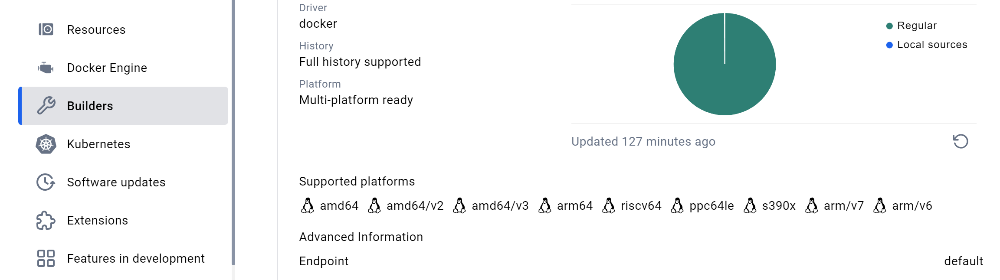
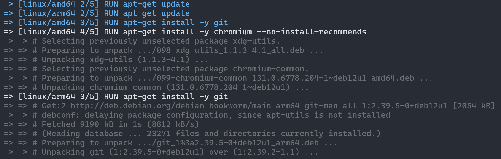
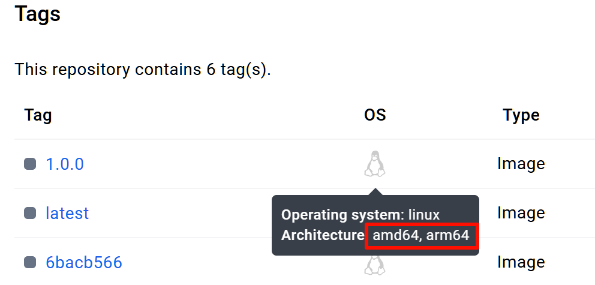

近期我遇到了 `puppeteer` 在 M1 芯片的 MacBook Pro 上运行不稳定的问题，因为项目运行在 Docker 中（使用了 [这个镜像](https://git.paperplane.cc/paperplane-docker/paperplane-api-base)），浏览器也是预装在镜像中的，而此镜像使用 x86 平台构建，在 ARM 芯片的电脑上运行时需要转译，可能是这里导致了问题。

> 当时还遇到了个小问题：Chrome 对于 ARM 平台只唯一提供 macOS 的版本，不提供 Linux 上那种无 UI 版本，所以需要换成 Chromium，这个很容易就解决了，仅记录一下。

一种解决思路是，基础镜像分别为两个平台构建一份。
我的运行镜像是基于 CI/CD 自动构建和推送的，所以需要实现：在一台 x86 服务器上，构建出 x86 和 ARM 两种平台的镜像。

Docker 具备跨平台构建镜像的能力，不过对于 Linux 用户而言，这需要一些配置；本文将流程重新整理和简化了，应该比网上大部分文章要清晰明了；当然更建议通过 [官网文档](https://docs.docker.com/build/building/multi-platform/) 来了解具体的方式和配置。


# Docker Desktop 用户看这里

**本文适用于 Linux 服务器用户。**Docker Desktop 默认捆绑了跨平台构建能力。

如果你在使用 Docker Desktop，那么你可以前往 Docker Desktop 中的设置页面，从侧边栏找到 “Builders”，然后查看已有的 builder 对跨平台的支持能力。



上图是我在 Windows 电脑中 Docker Desktop 的显示状况，可见它支持跨平台构建镜像。
（也有可能是一开始没有，我测试流程的时候在本机安装上了，总之如果列表找不到 `arm`，那就推荐阅读本文进行配置了）


# 越早做越好：切换成 `containerd` 镜像存储引擎

Docker 目前还是默认使用 `overlay2` 作为镜像存储引擎，而容器行业已经广泛推广 `containerd` 了，目前也只有后者支持存储跨平台镜像。

> 有关 Docker 和其他产品争夺市场和话语权的故事，建议阅读极客时间的 [《深入剖析 Kubernetes》](https://time.geekbang.org/column/intro/100015201)。

**想要支持多平台镜像的存储，必须切换成 `containerd` 模式，这会导致之前所有镜像无法使用。**所以这一步越趁早越好，最好在服务器刚初始化好，安装好 Docker，就马上做这一步。
不过，如果你直接使用阿里云、腾讯云这些供应商的制品库服务，那就不需要考虑这些问题了。

可以参考这一篇 [官网文档](https://docs.docker.com/engine/storage/containerd/) 来切换存储模式。
具体做法是：

修改 Docker 的配置文件，执行：`sudo vim /etc/docker/daemon.json` 
在文件中写入：

```json
{
  "features": {
    "containerd-snapshotter": true
  }
}
```

保存后，执行 `sudo systemctl restart docker` 重启 Docker 即可。
你会发现，之前的镜像全部无法使用，Docker 像是被重装了一样。

官网文档还推荐使用 `docker info -f '{{ .DriverStatus }}'` 指令查看是否正确切换到 `containerd` 存储引擎。


# 安装跨平台构建工具

经常使用 Docker，那么你对 `docker build` 肯定很熟悉；
不过，构建跨平台镜像这个功能属于进阶功能，需要使用 `docker buildx` 来运行，这是一个更为先进的工具。

可以通过 `docker buildx ls` 来查看当前的 builder：

```
NAME/NODE                DRIVER/ENDPOINT                   STATUS    BUILDKIT   PLATFORMS
default*                 docker
 \_ default               \_ default                       running   v0.16.0    linux/amd64, linux/amd64/v2, linux/amd64/v3
```

可以看到，这里支持的平台只有 `amd64`，并没有 `arm` 或 `arm64`。

<br />

接下来需要安装 QEMU，这是一个硬件虚拟化工具，没有它则无法为其他平台编译代码。

使用以下指令快速安装：

```bash
docker run --privileged --rm tonistiigi/binfmt --install all
```

这也是官方推荐的做法；
这个指令 `--install all` 会安装所有支持的的 QEMU，可以修改为例如 `--install arm64` 这种格式；如果出现问题，还可以改为 `--uninstall xxx` 来卸载特定平台的 QEMU。

再次执行 `docker buildx ls` 后：

```
NAME/NODE                DRIVER/ENDPOINT                   STATUS    BUILDKIT   PLATFORMS
default*                 docker
 \_ default               \_ default                       running   v0.16.0    linux/amd64, linux/amd64/v2, linux/amd64/v3, linux/arm64, linux/riscv64, linux/ppc64le, linux/s390x, linux/mips64le, linux/mips64, linux/arm/v7, linux/arm/v6
```

可以发现，`PLATFORMS` 列多出了 `arm64` 等多个平台。


# 构建跨平台镜像

完成以上步骤后，已经可以构建跨平台的镜像了。

这里给出使用的构建指令：

```bash
docker buildx build --platform linux/amd64,linux/arm64 -t <标签> .
```

指令使用 `buildx build`，同时需要 `--platform` 参数指定多个平台；
开始构建后，可以发现 Build Kit 可以并行开始两个平台的构建任务，非常高效；
如图：



构建完成后，只需要 `docker push` 便可以推送到制品库；
Docker Hub 支持跨平台镜像，已推送的跨平台镜像，会像这样显示：



<br />

如果你使用基于 [CNCF Distribution](https://distribution.github.io/distribution/) 私有部署的 Docker 制品库，你需要将它升级到 `2.8.0` 或更高版本，建议直接升级最新版。


# FAQ

**Q：**执行完操作后，镜像列表里多了个 `moby/buildkit` 镜像？

**A：**这是正常现象，如果你使用 `docker buildx create` 创建了新的 builder，那么还会有额外的容器正在运行，不用管它即可。

-----

**Q：**有的教程让我执行下面的指令：

```bash
docker buildx create \
  --name container-builder \
  --driver docker-container \
  --bootstrap --use
```

这会新建一个 builder 并使用它，我需要这么做吗？

**A：**我建议直接基于默认的 builder 即可，因为使用新建的 builder 会有一些麻烦：
构建完镜像后，`docker images` 并不能看到我们构建的镜像，且 Docker 会提示：

```
WARNING: No output specified with docker-container driver. Build result will only remain in the build cache. To push result image into registry use --push or to load image into docker use --load
```

这是因为不同的 builder 之间，镜像是隔离的；
新构建出的镜像可以通过添加 `--load` 参数来装载到默认的镜像列表中，或是直接使用 `--push` 参数推送到制品库。

你可以使用这个指令切换回默认的 builder：

```bash
docker buildx use default
```

并删除掉新建的 builder：

```bash
docker buildx rm container-builder
```

-----

**Q：**除了这种方案，还有没有什么方法构建其他平台的镜像？

**A：**Docker 还提供了构建网络的功能，例如你有很多平台的设备，可以使用 `docker swarm` 构建网络，加入的设备如果需要构建不属于自己平台的镜像，则会自动通过网络传递给对应平台的设备进行构建。

-----

**Q：**每次都执行 `docker buildx build`，这个指令太麻烦了，能否简化？

**A：**可以执行 `docker buildx install`，这将会使 `buildx` 取代默认的 `build` 指令；
以后想还原回来，只需要执行 `docker buildx uninstall` 即可。
