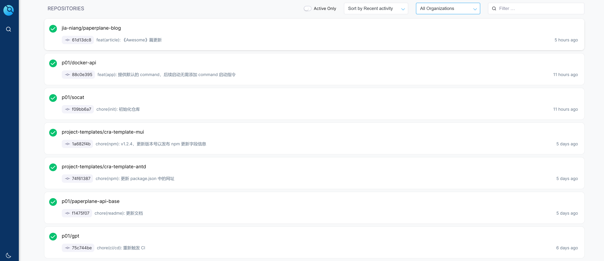
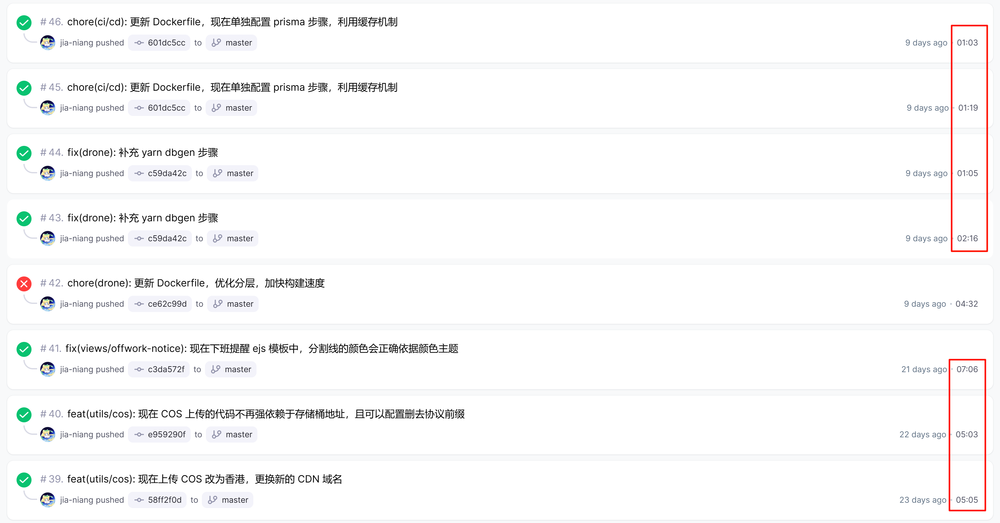
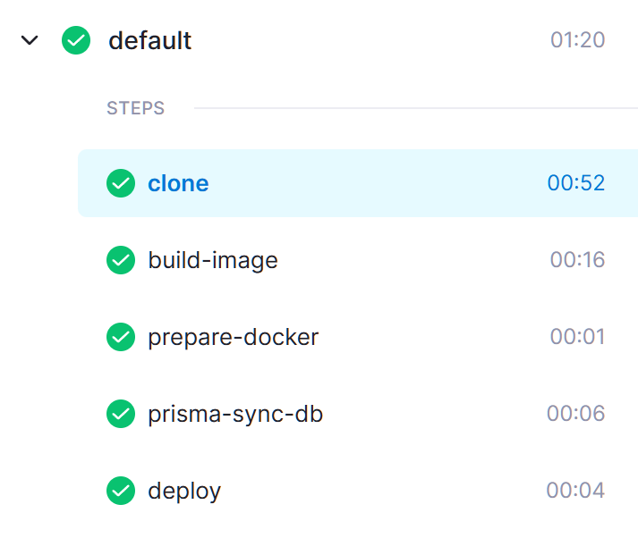
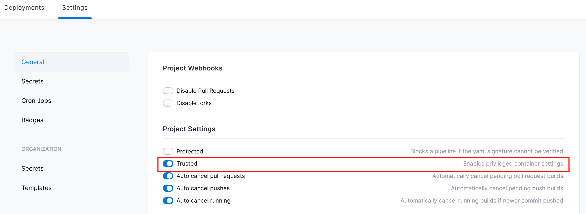
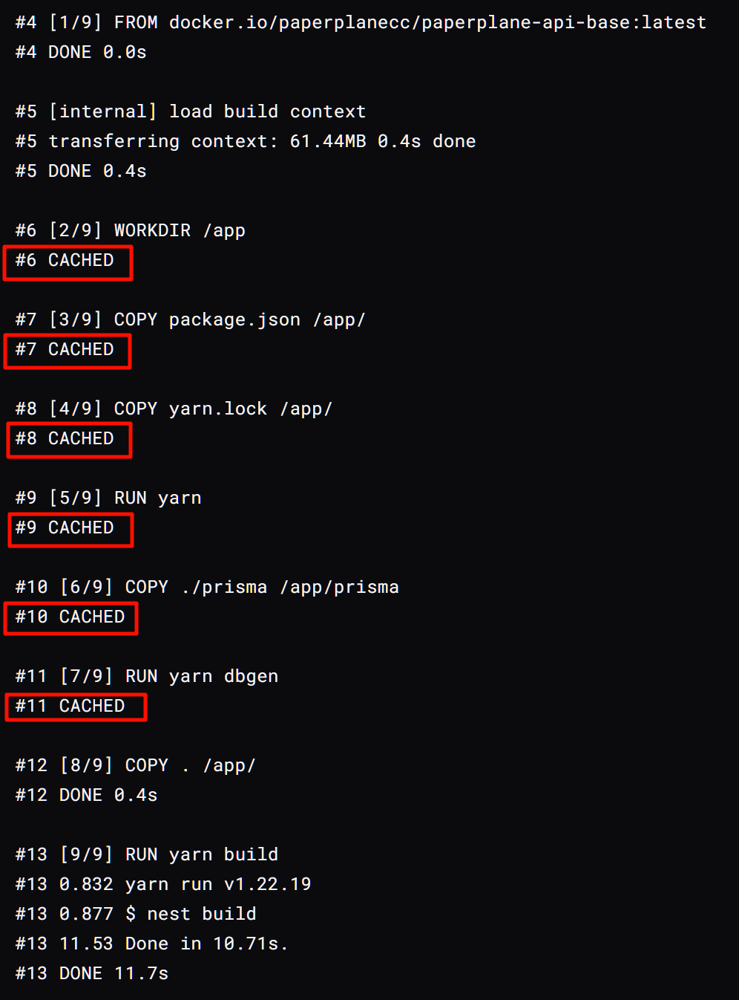

现在很多代码托管平台都提供基于 Docker 镜像的构建流水线，例如 GitHub、腾讯云等。

不同于 Jenkins 等传统的 CI/CD 工具，这种构建流水线对环境的要求和构建过程产生的副作用都非常小，在多次构建之间的差异也更小。因此，我推荐学习和使用此类构建工具。

而 [Drone CI](https://www.drone.io/) 就是这样的基于 Docker 镜像的构建流水线工具，也是本文的主题。
本博客也是使用它构建而来，[点击链接](https://drone.paperplane.cc/jia-niang/paperplane-blog) 查看构建状态。

目前在 https://drone.paperplane.cc/ 上大约运行了 20 多个 CI/CD 流水线，截图如下：




# 背景

Drone 采用的是类似 k8s 的架构，其自身负责提供网站 UI 界面、提供 API 以及触发发起或停止构建操作，类似于 k8s 的 Master 节点；
而具体运行构建任务的则是交给各种 Drone Runner 来负责，类似于 k8s 的 Worker 节点。

Runner 有很多种类：

- 在 Docker 中构建的 Docker Runner；
- 通过 SSH 执行命令的 SSH Runner；
- 直接在本机执行命令的 Exec Runner 等。

各个 Runner 通过 RPC 连接到 Drone，负责执行 Drone 分配的构建任务。

通常来说，99% 的使用场景都是 Docker Runner，其他几种 Runner 的使用频率很低，更何况 Drone 和 Runner 本身就是基于 Docker 而部署的。本文也只讨论 Docker Runner 的使用场景。


# 纯前端项目的部署方式

对于纯前端项目而言，CI/CD 步骤一般是这样（克隆代码的步骤省略）：

- 安装依赖，例如 `yarn`；
- 运行测试，例如 `yarn jest`；
- 编译打包，例如 `yarn build`；
- 部署，可以直接把文件 `scp` 或者 `rsync` 到服务器指定目录；
  或者是打包成一个基于 Nginx 的镜像，让部署机运行这个镜像，以此暴露静态网页服务。

可以看出前端项目相对而言构建和部署都比较简单。

但是，`yarn` 的步骤可能会耗时很长；如果不在同一台机器上，把资源从构建机传输到部署机的过程也会比较耗时。本文尝试解决这类问题，寻求一种更为优化的方式来实现基于 Drone 的 CI/CD 的最佳实践。

<br />

之前有说过，纯前端项目可以打包成 Docker 镜像来部署，它的具体流程是：

- CI/CD 中运行 `yarn` 安装依赖，`yarn build` 构建资源；
- 基于 Nginx 的 Docker 镜像打包一个新镜像，用它来提供服务。

做法是，先提供一个 `Dockerfile` 文件并写入：

```dockerfile
FROM nginx
RUN rm /etc/nginx/conf.d/default.conf
ADD deploy/default.conf /etc/nginx/conf.d/
COPY dist/ /usr/share/nginx/html/
```

然后在项目中创建 `/deploy/default.conf` 并写入：

```nginx
server {
  listen 80;
  server_name  _;
  index index.html index.htm;
  root /usr/share/nginx/html;

  location / {
    try_files $uri $uri/ /index.html =404;
  }
}
```

这样配置就提供好了，执行 `docker build` 命令，即可把项目打包成 Docker 镜像。

启动这个镜像无需任何额外参数或配置，启动后可以通过这个镜像的 `80` 端口来对外暴露静态网站服务。

<br />

但是，对于纯前端项目而言，我个人更倾向于使用 `scp` 或者 `rsync` 等方式把文件拷贝到服务器指定目录，这样做有几个好处：

- 旧版本的 JS/CSS 等文件可以保留，如果用户停留在旧版本页面上，未及时刷新，此时懒加载到旧模块不会白屏报错（推荐试试我开发的 [`use-upgrade`](https://www.npmjs.com/package/use-upgrade)）；
- 外层的 Nginx 统一控制访问行为，不需要多走一次容器内层的 Nginx，管理起来更方便；
- 如果使用镜像的方式，则还需要在部署机上调度容器，增加了一系列的操作。

这种方法可能不是最佳实践，例如它没有很好的隔离性、需要访问较为底层的服务器资源（文件系统），但是从成本和效率上考虑，这种部署方式更为优选。


# Docker 镜像的几种部署方式

本文只考虑基于 Docker 镜像部署的应用场景。

因为 Docker 镜像可以保证运行环境的一致性，还能做到服务器上多个不同 Node.js 版本的项目共存，甚至衍生出滚动更新（不停机升级）等很多玩法。 如果使用服务供应商的云原生服务，或者使用 k8s，那么使用 Docker 镜像部署就是必须的选择。

<br />

实际开发中，有两种 CI/CD 的场景：

- 构建和部署不在同一台机器上，此时部署 Docker 镜像时数据的安全传输是主要问题；
- 如果构建和部署在同一台机器上，或者处在同一内网，那我们的需求就变成了方便、高效。

针对这些诉求，下文会给出几种方案，你可以根据需求选用。


## 推送镜像到镜像仓库

这便是最简单直观的部署方式，也是最 “正确” 的方式。
它的流程如下：

- 提前准备一个镜像仓库，例如 Docker Hub；
- Drone CI 完成构建任务，输出好产物；
- 通过 `docker build` 指令把项目打包成 Docker 镜像，然后使用 `docker push` 推送到镜像仓库；
- 使用 `ssh` 等方式连接到部署服务器，执行 `docker run --pull=always` 指令拉取镜像并运行。

这种部署方式，可以通过镜像仓库的镜像版本号实现快速的回滚等操作，而且便于多台机器分布式部署。

但是，它需求开发者自备镜像仓库，Docker Hub 只对免费用户提供一个私有镜像的额度，这肯定不够用；
开发者可以使用 [`registry`](https://hub.docker.com/_/registry)、[`harbo`](https://goharbor.io/) 等工具自行搭建 Docker 镜像仓库；或者使用 Gitea、GitLab 的制品库功能；如果对镜像仓库的要求比较高，还可以付费使用例如阿里云、腾讯云的镜像仓库服务。

<br />

我之前也是一直这样做的，但是近期出现了一些小插曲：

> 近期我把网站服务器从腾讯云迁移到了 [“雨云”](https://www.rainyun.com/Mjg1OTU0_)，它的价格优惠较大、硬盘可弹性扩容、公网 IP 可以随便买，且其香港服务器的线路非常好。
>
> 但是，迁移后小厂的问题暴露了出来，例如：小厂没有 Docker 的内网加速域名，也没有制品库服务，服务器上拉取和上传镜像必须走固定带宽小水管。 
>
> 而我的一些项目需求的 Docker 镜像体积较大，例如 [`paperplane-api`](https://git.paperplane.cc/jia-niang/paperplane-api) 这个项目的基础镜像就有 1.5 GB（压缩后也有近 900MB），打包依赖和代码后未压缩的体积竟然高达 2.5GB。上传镜像到制品库的耗时是不可接受的。 
>
> 虽然我有自搭的制品库，但小厂也不支持自建网络，Drone 运行的构建容器也没法配置 hosts，所以即使想推送到自搭制品库，流量也要经过外网绕一圈再回来。

我没有多余的服务器，构建和部署都在同一台机器上，因此可以寻找一种直接在本机上构建并部署，无需访问外部网络的部署方式。见下文的两种方案，它们是我后续的选择。


## 导出镜像为文件并在部署机上导入

如果不想使用镜像仓库，我们可以利用 Docker 提供的功能，把镜像导出成文件，此时就可以利用例如 S3、OSS 等对象存储服务，以文件的方式来管理镜像。

这个功能用到了两条命令：

- [`docker image save`](https://docs.docker.com/reference/cli/docker/image/save/) 命令，可将某个镜像保存为文件；
- [`docker image load`](https://docs.docker.com/reference/cli/docker/image/load/) 命令，指定一个文件把它加载还原为镜像。

这种方式相对于镜像仓库而言更为灵活，因为如果镜像需要在本机部署，那么文件直接存储到本机的某个已挂载的目录即可，宿主机可以直接使用这个镜像文件。

如果镜像不在本机部署，可以通过 S3 对象存储，或者是 `rsync` 等方式传输镜像文件到部署机上并导入。

但是，这种方式也存在一些问题：

- 导出、导入都需要额外的时间，这个过程也会占用硬件资源；
- **传输效率不高：使用镜像仓库时可以利用镜像的 “分层” 机制，跳过已存在哈希值的 “层” 来大幅降低传输数据量；但是这种方式把镜像整个打包为一个压缩包传输，没法利用 “分层” 的特性；**
  （下文会提到这个机制）
- 部署动作只能由构建机发起：使用镜像仓库时，部署操作实际上可以看做是部署机在 “请求拉取” 最新的镜像；而这种传输镜像文件的部署方式，需要构建机来 “主动推送” 文件，主动方的角色变成了构建机，如果部署机较多，维护起来会很麻烦。

这种情况很适用于本机需要构建+部署的场景，因为这免去了镜像文件的传输耗时。


## 构建部署同一台机器时推荐使用 DinD

“DinD” 全名 “Docker in Docker”，即运行在 Docker 中的 Docker。在本机需要做构建+部署的场合，这是非常优选的方案，也是本文主要介绍的用法。

<br />

我们从原理上入手，先来看看 Docker Runner 的 Docker Compose 配置文件：

```yaml
services:
  drone-runner-docker:
    image: drone/drone-runner-docker
    container_name: drone-runner-docker
    volumes: # ↓ 注意这一行
      - /var/run/docker.sock:/var/run/docker.sock
```

上面的配置中，最引人注目是就是注释特别标注那一行。
可以看出，我们把宿主机的 Docker UNIX Socket 暴露给了 Runner，这是为了什么？

原因是，Drone 的配置文件中，支持将宿主机的目录映射到构建过程中，而 Runner 本身也是一个容器，它不可能越过 Docker 直接把宿主机的文件直接挂在到另一个容器。
因此，Runner 必须能访问宿主机的 Docker，通过它来完成目录挂载等越级操作。透传 Docker UNIX Socket 给 Runner，这便给了 Runner 访问宿主机上 Docker 的能力。

而且，因为构建流程每一步都是跑在 Docker 容器中的，第一次运行时，Runner 必须自行去拉取这些容器的镜像，**此时 Runner 就会使用宿主机的 Docker 来进行拉取镜像操作**，这些拉取的镜像还会被持续存储在宿主机上，通过 `docker images` 命令直接看到。不过也正因如此，从第二次 CI/CD 开始便不再需要重新拉取一遍镜像了。

<br />

这就给了我们启发：

**虽然 Runner 和宿主机是隔离的，但是可以通过上述方式，把宿主机的 Docker UNIX Socket 暴露给 Runner，这样一来镜像的构建操作实际上是在宿主机上发生的，构建产物会直接出现在 `docker images` 列表里，直接运行它即完成了部署。**

可以简单理解为：CI 在 Runner 中完成，但打包镜像的动作在宿主机的 Docker 中完成。
这种方式非常适用于需要在同一台机器上构建+部署的场景。

<br />

基于上面的原理，我们需要使用 `docker:dind` 这个 Drone 镜像。

它原本的目的，是提供另一个能运行在 Docker 容器里的 Docker 环境，令我们可以使用 `docker build` 等命令；但只要我们把 `/var/run/docker.sock` 这个文件替换成宿主机的，那么所有 Docker 相关的命令和操作就都会由宿主机来完成。

给出一个实例 `.drone.yml`：

```yaml
steps:
  - name: build-image
    image: docker:dind
    volumes:
      - name: dockersock
        path: /var/run/docker.sock
    commands:
      - docker build --progress plain -t example/example:example .

volumes:
  - name: dockersock
    host:
      path: /var/run/docker.sock
```

这里可以看到，我们通过 `volumes` 配置来把宿主机的 `/var/run/docker.sock` 挂载到 DinD 容器中同样的位置，这样在 DinD 容器中执行的 Docker 命令，都会发生在宿主机的 Docker 守护进程上面。

这个构建步骤完成后，宿主机的镜像列表中便会出现构建好的 `example/example:example` 镜像，此时直接运行它即可。

这种方式速度快、具备隔离性，可以看做是跳过了网络传输步骤的基于推送和拉取镜像的 CI/CD 方式。
如果构建机和部署机是同一台，那么非常推荐这种方式。


## 使用 Exec Runner 构建成功后直接运行

Exec Runner 会直接在安装这个 Runner 的机器上运行命令，这和 Jenkins 很相似。
这种方式，牺牲了 Drone 作为 Docker 容器运行时的特性，无法做到环境和文件的隔离，是极度不推荐的方式。

这个场景也仅能适用于构建机和部署机是同一台的情况。如果是分别两台服务器，则这个步骤无法实现 “传递” 镜像，所以无法适用。


# 优化 CI/CD 的速度

这里给出项目 [`paperplane-api`](https://git.paperplane.cc/jia-niang/paperplane-api) 的 [构建流水线](https://drone.paperplane.cc/jia-niang/paperplane-api) 记录：



可以看到在优化操作之前，每次构建所花费的时间很长，而优化后只需要一分钟左右。

实际上，这一分钟时间也有很大一部分浪费在 clone 操作上，真正 CI/CD 执行的时间加起来也就不到 30 秒钟：



这个项目是一个最终打包为 Docker 镜像并在本机部署的 Node.js 后端项目，还使用到了 Prisma 做 ORM。

除去 clone 操作的耗时，原先超过四分钟的步骤，可以优化到只花费 30 秒钟，速度可以优化到 8 倍。
这便是本文接下来讲到的 CI/CD 速度优化的内容。


## 通过依赖项的缓存加快构建流程

前端项目每次 CI/CD 都需要安装依赖项，也就是 `yarn` 或 `npm i`。在这一步骤中，部署机需要从 npm 下载大量代码包，一般来说 `node_modules` 这个文件夹会很大，很容易就超出 GB 级别了，这些依赖项都需要在 CI/CD 流程中从网络上下载，非常耗时。

如果是本机直接执行 CI/CD 安装依赖，这些包会在本机硬盘上缓存。但是，Drone CI 每一个步骤都是基于 Docker，在完成步骤后，容器即被销毁，无法持久化缓存。
因此，我们需要想办法为 Drone 流水线持久化 npm 或 yarn 的缓存。下文以 yarn 为例。

Drone 的 Docker 流水线支持配置 `volumes` 来挂载宿主机的目录，可以将 yarn 的缓存目录对外挂载。
参考如下 `.drone.yml` 配置：

```yaml
steps:
  - name: install-deps
    image: node:20
    volumes:
      - name: yarn-cache
        path: /home/node/.cache/yarn
    commands:
      - yarn

volumes:
  - name: yarn-cache
    host:
      path: /path/to/host/dict
```

这段配置使用 `node:20` 镜像进行 `yarn` 安装依赖，但配置了 `volumes`，将目录 `/home/node/.cache/yarn` 挂载到宿主机的目录。
每次安装依赖后，缓存会持久化保存在宿主机的磁盘上，下次构建也能用到这些缓存，速度就可以很快。

不过，Drone 默认不允许构建流程访问宿主机的磁盘，因为这存在风险。
我们需要在 Drone 中项目的 “Setting” 页面找到 “Trusted” 选项并开启，这样才允许使用 `volumes` 配置：



-----

对于 yarn 而言，可以通过 `yarn cache dir` 来获取当前缓存存储的目录。

对于不同的用户身份，缓存目录也不一样，存在这样的规则：

- 非 `root` 用户，例如 `node` 镜像默认是 `node` 用户，那么缓存目录位于：`/home/<用户名>/.cache/yarn`；
- `root` 用户，缓存目录位于：`/usr/local/share/.cache/yarn`。

如果使用 npm，可以通过 `npm config get cache` 来获取当前缓存存储的目录。
npm 通常缓存目录位于：`~/.npm`。

-----

请注意，有些依赖包自身内部有 `preinstall` 等脚本，会联网下载东西，或在本机进行编译（例如 `sass`、`puppeteer`、`canvas` 这些包，在国内的网络安装，甚至有时还会报错），仅将 yarn 缓存挂载出来，无法加速这些特殊操作的耗时。
一般而言这些包编译出的产物是存储于 `node_modules` 下的，而不是存储于 yarn 的缓存目录中。

查看 Drone 构建命令输出的耗时一栏，“Resolving packages”、“Fetching packages”、“Linking dependencies” 步骤可以很快完成，这便是 yarn 缓存起到的作用；
但是 “Building fresh packages” 这一步可能会花费很长时间，上文所述的就是原因。

如果你想让这个步骤也加快，推荐继续阅读下文，利用 Docker 构建镜像的 “分层” 机制，实现对整个编译构建环境的缓存。
注意：这种做法需要每次 CI/CD 都构建出一个 Docker 镜像，更适合于后端项目；对于前端项目而言，如果只需要静态文件，构建出镜像后可以使用 `docker cp` 指令将产物复制出来，然后用 `docker rmi` 删掉镜像。

## 通过 Layer 加快 Docker 镜像制作流程

本段内容受腾讯 AlloyTeam 的一篇 [博文](https://mp.weixin.qq.com/s/QfHHJnzD4vhenjFcFSNMhQ) 的启发，强烈建议阅读。

Docker 镜像的产生需要通过 [Dockerfile](https://docs.docker.com/reference/dockerfile/) 来声明制作镜像的步骤。Dockerfile 是一个记录镜像制作过程中需要执行的操作的文件，我们在 `docker build` 的时候会依次执行其中的操作，大部分操作都可以产生 “Layer”，或者叫 “层”。

例如，执行 `RUN` 会产生 Layer，执行 `COPY` 把源码拷贝到镜像中，也会产生 Layer。

只有 Layer 的机制还不够，Docker 还会记录每次操作的哈希；构建镜像时，如果本地已有某个哈希值的 Layer，直接复用这一 Layer 即可，构建步骤就可以瞬间完成；推送镜像到仓库时，如果镜像仓库已有相同哈希值的 Layer，那么便可以跳过上传步骤，节约大量的网络传输流量。

只要保证 Layer 可以被复用，构建速度和上传速度都可以极大程度的加速。

这里还是以 `paperplane-api` 的流水线举例，可以看到大部分步骤都被缓存了，构建步骤瞬间完成：



但是，想复用 Layer 的机制，需要满足这样的条件：

- 对于任何 Dockerfile 指令而言，**必须它之前的所有 Layer 都已使用缓存，它才能应用缓存**；
- 通过 `ADD` 或 `COPY` 向镜像中添加文件时，文件的内容和没有任何变化时，这一 Layer 的哈希才会不变，这样才能应用缓存。

这两点机制是 Docker 用于在多次构建镜像时保证镜像的一致性的。但这些机制也给我们利用缓存机制提出了考验。

可以发现：

- **如果某一步完全没办法缓存，为了防止它影响后面步骤的缓存，我们需要尽量把这个步骤移至最尾部执行；**
  例如把项目源码 `COPY` 进镜像，每次构建时项目源码肯定是发生过改动的，这一步肯定无法缓存，所以 `yarn build` 类似的指令在最后执行；
- **安装依赖时 `yarn` 指令必须要有 `package.json` 和 `yarn.lock`，而这两个文件一般来说不会特别频繁的修改，我们可以先只把这两个文件 `COPY` 到镜像，然后执行 `RUN yarn` 安装；这样一来，如果依赖项没有发生过任何变动，`COPY` 操作和 `RUN yarn` 的哈希值都没有变化，这两个 Layer 可以应用缓存，从而使得安装依赖的步骤瞬间完成。**

基于上面这两点结论，这里给出一个 Dockerfile 示例：

```dockerfile
FROM node:20

# 指定工作区
WORKDIR /app

# 添加依赖配置到工作区，安装依赖
COPY package.json /app/
COPY yarn.lock /app/
RUN yarn

# 拷贝源码到工作区，打包编译
COPY . /app/
RUN yarn build

CMD [ "yarn", "start:prod" ]
```

可以看到在 `COPY . /app/` 这一步之前的步骤，都是可以应用缓存，尤其是安装依赖的耗时步骤，应用缓存后可以瞬间完成，极大程度减少 CI/CD 的时间。

-----

Layer 的缓存机制固然好，但使用它时也需要注意一些问题：

如果 Dockerfile 中需要执行一些带有副作用的操作，例如如果要 `curl` 发送一个请求，而 Docker 并不知道这一步有副作用，只要命令不被修改，这一步骤就会被缓存，从第二次执行开始就被跳过了，请求也就不再会被发出。

<br />

同样，使用 [Prisma](https://www.prisma.io/) 等工具也会存在这种问题：

在 CI/CD 流程中，因为要在部署之前把数据库结构同步成最新代码的版本，我们需要为 Prisma 的 `migrate deploy` 操作单独准备一个步骤，通常把即将生产部署的镜像修改 `command` 启动命令并运行一次即可，因为生产部署的镜像中包含了最终的数据库结构、数据库连接配置，以及 npm 依赖项。

**但 Prisma 会通过 `postinstall` 这个钩子来生成类型，也就是说在 `yarn` 这一步时，类型定义就已被生成好了；而我们只拷贝了 `package.json` 和 `yarn.lock`，并没有拷贝任何 Prisma 的 Scheme 文件，这会导致 Prisma 生成的类型为全空，而且会被缓存下来，后续无法执行 `migrate deploy` 操作，运行也会报错。**

因此，在对 Prisma 这种 `yarn` 操作即存在副作用的工具进行 CI/CD 时，需要额外注意，副作用的步骤需要额外处理，不可使这类步骤被缓存。

此处给出一个 Dockerfile 示例：

```dockerfile
FROM node:20

WORKDIR /app

COPY package.json /app/
COPY yarn.lock /app/
RUN yarn

# 注意下面两行是新增的
COPY ./prisma /app/prisma
RUN yarn prisma generate

COPY . /app/
RUN yarn build

CMD [ "yarn", "start:prod" ]
```

这里我们额外增加了一个步骤，把 Prisma 的 Scheme 文件拷贝到镜像中，并专门执行一次 `prisma generate` 操作生成类型。如果 Scheme 文件没有任何改动，且 Prisma 没有任何需要应用的数据库结构迁移 SQL，这两步还是可以正常缓存的。