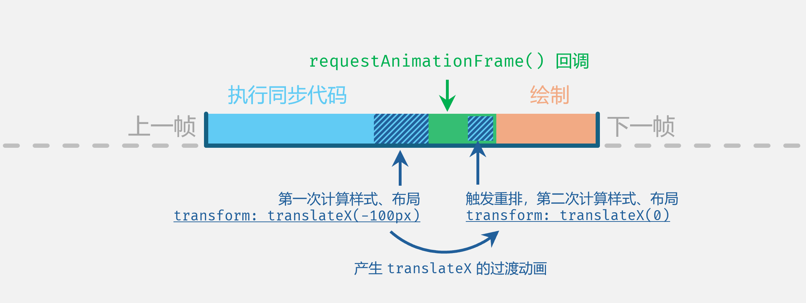

> 本文中，很多 Demo 精确到 “帧” 级别，运行这些 Demo 时建议禁用浏览器所有插件，或使用无痕模式测试。

Vue.js 2 的官方文档中，讲到组件过渡动画这一章时，有一个动画示例（[链接](https://v2.cn.vuejs.org/v2/guide/transitions.html#%E5%88%97%E8%A1%A8%E7%9A%84%E6%8E%92%E5%BA%8F%E8%BF%87%E6%B8%A1)）：


Vue 官方文档称这种过渡名为 “FLIP 动画”。有关 FLIP 动画的介绍，可以 [点击链接](https://aerotwist.com/blog/flip-your-animations/) 参考这篇 2015 年的文章。

浏览器原生无法实现这种动画，是因为我们会使用 `element.appendChild()` 等 API 来重新插入 DOM，此时元素瞬间移位，不可能有 CSS 过渡产生。

但是，无论 Vue 还是 React，在 DOM 发生变更时，工具的内部其实也是使用了 `element.appendChild()` 来操纵 DOM，那上图的效果是怎么实现的？

实际上，要想实现上述动画效果，即使使用了 Vue，也必须配合 Vue 的内置组件 `<TransitionGroup>` 来实现，这个组件专为一组 DOM 进行顺序变化的场合而设计，例如列表插入、列表移除、调整顺序等需求，它会在多个元素变动时调度元素的 CSS 属性，以此实现这种 FLIP 动画的效果。


# “FLIP” 的含义和原理

FLIP 这四个字母，分别表示四个单词：“First” 初始位置、“Last” 最终位置、“Invert” 反向、“Play” 播放。
用中文翻译和解释为：“反向播放从最终位置到初始位置的过渡”；从终点回到起点的过程，反向播放，于是负负得正，动画就是正常的从起点到终点。

你可能会有疑惑：为什么会有一个 “Invert” 反向？什么叫反向应用过渡？
实际上，理解这个 “Invert”，就几乎已经理解了 FLIP 动画的核心。我们先一步一步来。


## 理解 “Invert”

在 Vue 官方的实例中，我们用浏览器 F12 检查器查看 DOM 元素：


可以看到，点击按钮后，DOM 瞬间就完成了更新，并不是等到动画结束之后。

这也是 FLIP 动画的特点：**FLIP 动画是在元素的 DOM 变动完成后才开始播放的，此时元素已经位于终点了，所以播放的过渡动画其实是 “归位” 的过渡动画。**
也正是因为这个原因，即使去掉了 FLIP 动画，也只算没了 “归位” 的过渡，看上去比较突兀而已，不会出什么错误。

而且，即使过渡没有播放完毕就重新调整 DOM 的位置，元素也能正确运动而且移动到正确的位置，因为 FLIP 动画始终是等到元素移动到最终位置后播放 “归位” 动画，最终都是要回到正确位置。

如图，频繁点击按钮，元素始终可以回到正确的位置：


## 理解 “归位”

我们继续解释什么是 “归位”，当然这要和上面的 “反向” 相结合。

举个最简单的例子，假设某个元素出于某些原因， 接下来会出现在偏右 `100px` 的位置，我们想给这个过程加上动画：
通常的做法是这样的：给元素设置 `transition` 之后，只需要再加上 `transform: translateX(100px)` 就能使它向右移动了；

但是，“反向” 和 “归位” 的思路是这样的：
等到元素到右边后，先给它设置 `transform: translateX(-100px)` 使它向左反向回到原先的位置，**然后再给它设置 `transition` 属性，并取消掉元素的 `transform: translateX(-100px)` 属性**，这样元素就会实现一个 “归位” 的动作，同样也是从左向右运动 `100px`，最终到达目标位置。

> 取消掉元素的 `transform: translateX(-100px)` 属性，可以看做是设置成了 `transform: translateX(0)`。

你可以使用以下 HTML 来尝试：

```html
<!DOCTYPE html>
<html lang="zh-CN">
  <body>
    <div id="div" style="height: 100px; width: 100px; background-color: skyblue"></div>
    <button onclick="move()">移动</button>
    <script>
      function move() {
        const el = document.getElementById('div')

        // 通过其他方式使它移动到正确位置
        // 在 FLIP 中，有可能是元素的位置被调整了之类的，具体怎么调整不重要
        el.style.marginLeft = '100px'

        // 设置 “反向” 的偏移
        el.style.transform = 'translateX(-100px)'

        // 此时，再给元素加上过渡
        el.style.transition = 'transform 1s'

        // 然后移除掉偏移，让元素 “归位”
        el.style.transform = ''
      }
    </script>
  </body>
</html>
```

你可以试一下上面的代码，会发现无法实现动画，元素 “瞬移” 了。
原因很简单：我们在同步代码中多次设置了样式，**但浏览器会等待同步代码运行完后才会去计算样式**，所以对于 `transform` 属性，浏览器会以最后一次设定的值为准，这样自然没有动画产生。

解决方法也很简单，把最后两条样式操作改为异步即可：

```js
function move() {
  const el = document.getElementById('div')
  el.style.marginLeft = '100px'
  el.style.transform = 'translateX(-100px)'

  setTimeout(() => {
    el.style.transition = 'transform 1s'
    el.style.transform = ''
  }, 0)
}
```

运行网页并点击按钮，效果如图：


理解了这个 “归位” 的过程，那么你就离理解 FLIP 动画不远了。


## 理解 “Play”

这个问题是 FLIP 动画技术实现的核心原理，它涉及到浏览器的渲染机制，只有理解了它，才能正确的实现动画，尤其是在和 React 等库相配合的场景。

FLIP 动画做了这样的操作：

- 步骤 ①：假设一个元素需要从 A 位置移动到 B 位置，那么我们在移动之前，先计算出 A 位置的坐标并存储它；
- 步骤 ②：执行 DOM 变动；
- 步骤 ③：DOM 变动完成后，再记录下元素在 B 位置的坐标；
- 步骤 ④：计算从 B 到 A 的偏移，通过 CSS 样式 `transform: translate(x, y)` 来设置元素的位置，使它偏移回到原先的 A 位置，**注意这个过程需要用 JS 先屏蔽掉元素的 `transition` 属性，避免移回的过程中产生过渡动画**；
- 步骤 ⑤：使用 JS 恢复元素的 `transition` 属性，同时移除掉元素的 `transform: translate(x, y)` CSS 属性，这样元素就会回到 B 位置，播放从 A 到 B 的 “归位” 动画。

此时，相信你不免会有疑问：
疑问一：步骤 ④ 中元素从终点设置偏移到起点，这个过程用户是不是能看到元素的 “瞬移”？
疑问二：步骤 ⑤ 应如何激活过渡动画？

这就需要我们更进一步的了解浏览器的渲染机制了。


### 浏览器的渲染流程

我们通过 JS 或用户交互使得页面内容发生改变时，便会触发浏览器的相关机制，产生视觉效果。

这个过程可分为几个步骤：**“计算样式”**、**“布局”**、**“绘制”** 和 “合成”；而考虑到网页上会有各种交互元素，所以这这些步骤会很频繁的触发。

时间轴大致如下：


我们可以通过代码，来对渲染的流程进行介入：

- 增删 DOM、修改元素尺寸或边距、读取元素尺寸或坐标等操作，会触发浏览器的 “布局” 动作，使得浏览器重新 “计算样式”，得到元素的位置和尺寸，并重新 “布局”；这个过程也被称为 “重排” 或者 “回流”，运算开销较大；
- 仅修改文字颜色、背景色、透明度等样式属性，会触发浏览器的 “绘制” 动作，这也被称为 “重绘”，运算开销较小；
- 只要触发了 “重排”，这一帧就必定需要 “重绘”，在 “重绘” 之前可能会有过多次 “重排”；
- 到了 “绘制” 环节，网页内容就会输出到用户屏幕上，此时修改元素样式等操作都会到下一帧才生效了。

<br />

对于疑问一，可以发现，我们设置元素的样式让元素偏移回到原来的位置（对应上面的步骤 ④），**它的运行时机早于时间轴的 “绘制”，所以不会导致元素的 “瞬移”**。

浏览器的 F12 调试菜单中，有一个 “性能” 面板，左上角有一个录制按钮。 我们可以启动录制后，对网页进行操作，操作完毕后停止录制，然后浏览器就会为我们生成在录制期间 JS 所有的调用栈（这个又被称为 “火焰图”），每一帧的时间分配，以及浏览器的布局、绘制的时间线。

把代码修改为：

```js
function move() {
  const el = document.getElementById('div')
  el.style.marginLeft = '100px'
  el.style.transform = 'translateX(-100px)'

  console.timeStamp('样式设置完成')
}
```

然后，在 “性能” 面板点击录制，运行网页点击按钮，然后结束录制，查看性能时间线：


**可以发现，整个流程中只有一次重绘；而我们这些调整样式，都是在浏览器重绘画面之前做的，所以视觉上是不会有 “瞬移” 产生的。**

<br />

对于疑问二，解决方案是，**必须让浏览器在两次 “布局” 之间感知到元素的 `transform` 发生了变化，这样才会使得过渡能顺利产生。**

**代码中的 `el.style.transform = ''` 在同步代码中运行，在浏览器 “计算样式” 时，得到的是同步代码执行完后的最终结果，中间状态被覆盖掉了，浏览器感知不到任何 CSS 属性的变化，自然没有过渡动画；所以，我们需要把这段代码的执行时机推迟到在浏览器布局完成后，使其引发一次 “重排”，这样浏览器就能感知到了**。

我们先使用初版代码，无过渡动画的版本，查看性能时间线：


可以看到，初版代码虽然修改了两次 `transform`，但第二次修改只是单纯地覆盖了第一次设置的值，它并没有引起浏览器的重排。

使用 `setTimeout()` 把修改 `transform` 的代码放到异步任务中，过渡动画就可以正常产生了，我们查看它的时间线：


**可以看到，定时器的触发时机要晚于浏览器绘制的时机，所以修改 `transform` 至少也要等到下一帧开始才生效了，这样浏览器一定能检测到 `transform` 的变动，动画可以产生。**

原先的例子使用 `setTimeout()` 延后到下一轮事件循环，这可以满足我们的需要。
但是，浏览器提供了一个更好的 API，专门用于实现这种类似的过渡动画类的需求，它就是 [`requestAnimationFrame()`](https://developer.mozilla.org/zh-CN/docs/Web/API/Window/requestAnimationFrame)。


### `requestAnimationFrame()`

[`requestAnimationFrame()`](https://developer.mozilla.org/zh-CN/docs/Web/API/Window/requestAnimationFrame) 的中文名叫做 “请求动画帧”，通常被简称为 “raf”；它接受一个回调方法作为参数，这个回调将在浏览器下一次 “重绘” 之前执行。

注意，只要是处在前台的网页，因为它每时每刻都在输出画面，所以这个回调几乎每时每刻都能被触发；但网页切换到后台之后，浏览器暂停输出画面，此时这个回调也会停止。

一般而言，浏览器会根据用户显示器的刷新率来输出画面，例如 60Hz 刷新率的显示器，浏览器每秒钟就会重绘 60 次，也就是每秒都会有 60 个时机触发这个函数的回调，此时每一帧的持续时间大约 16.666 毫秒。

可以使用这段代码进行验证（建议禁用浏览器所有插件）：

```html
<!DOCTYPE html>
<html lang="zh-CN">
  <body>
    <script>
      function rafCallback() {
        console.log('raf')
        requestAnimationFrame(rafCallback)
      }
      rafCallback()

      let second = 0
      setInterval(() => {
        second += 1
        console.log(second + '秒')
      }, 1000)
    </script>
  </body>
</html>
```

运行这个网页，查看控制台的输出，例如我使用 160Hz 的显示器，输出如下：


可以看到，每一秒过去后，`requestAnimationFrame()` 都会执行大约 160 次，和我显示器的刷新率相等。

此时，可以把网页切换到后台等一段时间，可以发现切换到后台后，定时器还在读秒，但是 `requestAnimationFrame()` 回调的执行会暂停。

**如果当前帧时间内，JS 代码修改了元素的尺寸或样式，这会触发 “重新计算样式” 和 “布局”，此时我们调用 `requestAnimationFrame()`，那么回调将在当前帧默认的 “布局” 和 “绘制” 之间插入执行。**

时间轴大致如下：


所以，上面的步骤 ⑤，只需要在 `requestAnimationFrame()` 回调中运行，就能使浏览器在开始绘制之前触发重新计算样式和重排，从而让浏览器感知到样式上的变化，产生过渡动画。

使用它取代 `setTimeout()`：

```js
function move() {
  const el = document.getElementById('div')
  el.style.marginLeft = '100px'
  el.style.transform = 'translateX(-100px)'

  // 使用 requestAnimationFrame 取代 setTimeout
  requestAnimationFrame(() => {
    el.style.transition = 'transform 1s'
    el.style.transform = ''
  })
}
```

此时时间轴如下：



可以看出，重点在于让浏览器进行两次 “计算样式” 和 “重排” 动作，这样才能感知到元素属性的变更，从而产生过渡动画。

我们对新的代码使用浏览器 F12 的 “性能” 面板录制时间线：


印证了我们的想法。


## 理解 “First” 和 “Last”

为了计算元素的初始位置和终点位置，我们会使用 [`el.getBoundingClientRect()`](https://developer.mozilla.org/en-US/docs/Web/API/Element/getBoundingClientRect) 来获取元素的坐标，通过 JS 变量记录下来，并以此计算偏移量。

计算偏移量的方式：


这里给出一个练习题，你可以试一下：
假设存在以下网页：

```html
<!DOCTYPE html>	
<html lang="zh-CN">
  <head>
    <style>
      #container {
        display: flex;
      }

      #container > div {
        height: 100px;
        box-sizing: border-box;
        margin: 4px;
      }
    </style>
  </head>
  <body>
    <div id="container">
      <div id="div" style="width: 100px; background-color: skyblue; opacity: 0.8;"></div>
    </div>

    <button onclick="clickButton()" style="margin-top: 10px">随机插入元素</button>

    <script>
      // 请补全此方法，目的是使得蓝色的 div 元素实现 FLIP 动画
      function clickButton() {
        // ...
        changeDOM()
        // ...
      }

      function changeDOM() {
        // 生成一个 div
        const newDiv = document.createElement('div')
        // 宽度在 50~200px 之间随机
        newDiv.style.width = `${Math.floor(Math.random() * (200 - 50 + 1)) + 50}px`
        newDiv.style.border = '2px dashed grey'

        // 放入容器中
        document.getElementById('container').prepend(newDiv)
      }
    </script>
  </body>
</html>
```

每次点击按钮，必须调用 `changeDOM()` 向页面中插入一个随机宽度的空白元素，此时会导致蓝色方块发生移动。
效果如下：


这没有任何动画，观感很差。
请你补全 `clickButton()` 方法，想办法给蓝色方块加上 FLIP 动画。

<br />

答案如下：

```js
function clickButton() {
  const el = document.getElementById('div')
  // First: 记录蓝色方块的起始位置
  const start = el.getBoundingClientRect()

  changeDOM()

  // Last: 记录蓝色方块的最终位置
  const end = el.getBoundingClientRect()

  // Invert: 计算 “反向” 偏移量
  const deltaX = start.left - end.left
  const deltaY = start.top - end.top
  el.style.transition = ''
  el.style.transform = `translate(${deltaX}px, ${deltaY}px)`

  // Play: 播放动画应用变换
  requestAnimationFrame(() => {
    el.style.transition = 'transform 1s'
    el.style.transform = ''
  })
}
```

实现效果：


这便是 FLIP 动画中 “F”、“L” 的最直接的体现。


# 自己实现 FLIP 动画

首先，编写以下 HTML，展示几个 `<div>` 元素并实现随机乱序：

```html
<!DOCTYPE html>
<html lang="zh-CN">
  <head>
    <meta charset="UTF-8" />
    <meta name="viewport" content="width=device-width, initial-scale=1.0" />
    <title>FLIP 动画</title>
    <style>
      .box {
        width: 60px;
        height: 60px;
        background-color: skyblue;
        color: white;
        font-size: 30px;
        margin: 10px;
      }
    </style>
  </head>
  <body>
    <div class="container" style="display: flex">
      <div class="box" key="1">1</div>
      <div class="box" key="2">2</div>
      <div class="box" key="3">3</div>
      <div class="box" key="4">4</div>
      <div class="box" key="5">5</div>
    </div>
    <button onclick="shuffle()">打乱</button>

    <script>
      function shuffle() {
        const container = document.querySelector('.container')
        const boxes = Array.from(container.children)

        // 随机打乱盒子顺序，然后把打乱好的盒子放回 DOM
        boxes.sort(() => Math.random() - 0.5)
        boxes.forEach(box => container.appendChild(box))
      }
    </script>
  </body>
</html>
```

此时我们就实现了一个每次点击按钮都可以随机打乱顺序的测试页面。
如图：


<br />

然后，我们实现 FLIP 动画中的 “F” 和 “L”，即记录元素移动的开始位置、结束位置，也就是上面说的步骤 ①、③。

我们通过 `el.getBoundingClientRect()` 获取一个元素的上下左右四个方向相对于文档的偏移，使用此 API 即可实现需求。
代码如下：

```js
function shuffle() {
  const container = document.querySelector('.container')
  const boxes = Array.from(container.children)

  // First: 记录每个盒子的起始位置
  const startPositions = boxes.reduce(
    (result, box) => ({ ...result, [box.getAttribute('key')]: box.getBoundingClientRect() }),
    {}
  )
        
  // 随机打乱盒子顺序，然后把打乱好的盒子放回 DOM
  boxes.sort(() => Math.random() - 0.5)
  boxes.forEach(box => container.appendChild(box))

  // Last: 记录每个盒子的最终位置
  const endPositions = boxes.reduce(
    (result, box) => ({ ...result, [box.getAttribute('key')]: box.getBoundingClientRect() }),
    {}
  )
  
  console.log('初始位置：', startPositions)
  console.log('最终位置：', endPositions)
}
```

<br />

随后，我们需要为每个盒子计算出其初始位置相对于最终位置的偏移量，这一步也就是 FLIP 动画中的 “I”，对应上面的步骤 ④。
因为我们要把元素从最终位置移动到初始位置，所以算式应该为 “初始位置坐标” 减去 “最终位置坐标”。

代码如下：

```js
function shuffle() {
  const container = document.querySelector('.container')
  const boxes = Array.from(container.children)

  // First: 记录每个盒子的起始位置
  const startPositions = boxes.reduce(
    (result, box) => ({ ...result, [box.getAttribute('key')]: box.getBoundingClientRect() }),
    {}
  )

  // 随机打乱盒子顺序，然后把打乱好的盒子放回 DOM
  boxes.sort(() => Math.random() - 0.5)
  boxes.forEach(box => container.appendChild(box))

  // Last: 记录每个盒子的最终位置
  const endPositions = boxes.reduce(
    (result, box) => ({ ...result, [box.getAttribute('key')]: box.getBoundingClientRect() }),
    {}
  )

  // Invert: 计算 “反向” 偏移量
  boxes.forEach(box => {
    const key = box.getAttribute('key')
    const start = startPositions[key]
    const end = endPositions[key]

    // 注意，此时 DOM 已经处于最终位置，所以它的 translate 是 “反向” 的
    // 所以要用 start 来减去 end
    const deltaX = start.left - end.left
    const deltaY = start.top - end.top
    
    box.style.transform = `translate(${deltaX}px, ${deltaY}px)`
  })
}
```

此时，点击 “打乱” 按钮后，盒子的位置看上去没有发生变动，这是因为 DOM 变更后马上又通过 `transform` 把盒子偏移回到了原始的位置。接下来就是进行 “归位” 的操作了。

这里需要注意，如果元素默认带有 `transition`，这一步需要提前把这个 `transition` 屏蔽掉，或者至少不能让它针对 `transform` 属性生效。
简单一点，可以写成：

```js
box.style.transition = null // 简单屏蔽掉过渡，生产环境可不能这么写
```

通过 `transform` 设置偏移的代码就是这样：

```js
box.style.transition = null
box.style.transform = `translate(${deltaX}px, ${deltaY}px)`
```

这样就能使元素被设置到终点位置后，再通过 `transform` 偏移回到起点；而且因为这里是同步代码，浏览器全部执行完毕后才会计算样式、布局并绘制，所以看上去元素的位置没发生任何变化。

<br />

下一步就是 FLIP 动画的 “P” 步骤了。即播放过渡动画，对应上面的步骤 ⑤。

到目前这一步，所有元素已经处在最终的 DOM 位置上， 并已被设置了 `transform` 属性偏移到了起始位置；此时只需要为其加上 `transition` 属性，然后移除掉  `transform` 即可，这样这些元素就会自动 “归位”。

显而易见可以写出下面的代码：

```js
box.style.transition = null
box.style.transform = `translate(${deltaX}px, ${deltaY}px)`

box.style.transition = `transform 2s`
box.style.transform = ''
```

不能直接使用这段代码，我们要让它在第一次布局后、下一次绘制前执行，所以会写成：

```js
box.style.transition = null
box.style.transform = `translate(${deltaX}px, ${deltaY}px)`

requestAnimationFrame(() => {
  box.style.transition = `transform 2s`
  box.style.transform = ''
})
```

把上面这段代码加入上面的方法体尾部，我们得到的 FLIP 库粗略的实现：

```js
function shuffle() {
  const container = document.querySelector('.container')
  const boxes = Array.from(container.children)

  // First: 记录每个盒子的起始位置
  const startPositions = boxes.reduce(
    (result, box) => ({ ...result, [box.getAttribute('key')]: box.getBoundingClientRect() }),
    {}
  )

  // 随机打乱盒子顺序，然后把打乱好的盒子放回 DOM
  boxes.sort(() => Math.random() - 0.5)
  boxes.forEach(box => container.appendChild(box))

  // Last: 记录每个盒子的最终位置
  const endPositions = boxes.reduce(
    (result, box) => ({ ...result, [box.getAttribute('key')]: box.getBoundingClientRect() }),
    {}
  )

  // Invert: 计算 “反向” 偏移量
  boxes.forEach(box => {
    const key = box.getAttribute('key')
    const start = startPositions[key]
    const end = endPositions[key]

    // 注意，此时 DOM 已经处于最终位置，所以它的 translate 是 “反向” 的
    // 所以要用 start 来减去 end
    const deltaX = start.left - end.left
    const deltaY = start.top - end.top

    // 让元素通过 transform 偏移回到起点
    box.style.transition = null // 暂时屏蔽掉过渡，实际生产此处需完善
    box.style.transform = `translate(${deltaX}px, ${deltaY}px)`

    // Play: 在重绘之前，撤掉 transform 偏移，播放 “归位” 过渡动画
    requestAnimationFrame(() => {
      box.style.transition = `transform 2s`
      box.style.transform = ''
    })
  })
}
```

实现的效果如下：


<br />

为了让代码更加完善，我们还需要在 FLIP 动画播放完后，进行一些 “清理” 工作，去除掉多余的样式。

当一个元素执行完过渡动画后，会触发其 [`transitionend`](https://developer.mozilla.org/zh-CN/docs/Web/API/Element/transitionend_event) 事件，因此，我们把清理工作放在这个回调中执行：

```js
box.addEventListener('transitionend', () => {
  box.style.transition = null
  box.style.transform = null
})
```

但是，如果一个元素正好 “原地不动”，那么这个事件无法触发；
此时我们可以通过判断语句，只要判断元素没有发生移动，那么就直接跳过这个元素的 FLIP 动画：

```js
if (deltaX === 0 && deltaY === 0) {
  // ...
}
```

最终的代码如下：

```js
function shuffle() {
  const container = document.querySelector('.container')
  const boxes = Array.from(container.children)

  // First: 记录每个盒子的起始位置
  const startPositions = boxes.reduce(
    (result, box) => ({ ...result, [box.getAttribute('key')]: box.getBoundingClientRect() }),
    {}
  )

  // 随机打乱盒子顺序，然后把打乱好的盒子放回 DOM
  boxes.sort(() => Math.random() - 0.5)
  boxes.forEach(box => container.appendChild(box))

  // Last: 记录每个盒子的最终位置
  const endPositions = boxes.reduce(
    (result, box) => ({ ...result, [box.getAttribute('key')]: box.getBoundingClientRect() }),
    {}
  )

  // Invert: 计算 “反向” 偏移量
  boxes.forEach(box => {
    const key = box.getAttribute('key')
    const start = startPositions[key]
    const end = endPositions[key]

    // 注意，此时 DOM 已经处于最终位置，所以它的 translate 是 “反向” 的
    // 所以要用 first 来减去 last
    const deltaX = start.left - end.left
    const deltaY = start.top - end.top

    // 如果元素 “原地不动”，那么跳过后续流程
    if (deltaX === 0 && deltaY === 0) {
      return
    }

    // 让元素通过 transform 偏移回到起点
    box.style.transition = null // 暂时屏蔽掉过渡，实际生产此处需完善
    box.style.transform = `translate(${deltaX}px, ${deltaY}px)`

    // Play: 在重绘之前，撤掉 transform 偏移，播放 “归位” 过渡动画
    requestAnimationFrame(() => {
      box.style.transition = `transform 2s`
      box.style.transform = ''
    })
    
    // FLIP 动画完成后，清理残余样式
    box.addEventListener(
      'transitionend',
      () => {
        box.style.transition = null
        box.style.transform = null
      },
      { once: true }
    )
  })
}
```

这便是一个比较完整的 FLIP 动画的代码，你可以自己尝试一下。

不够在实际生产中，还需要做更精细的判断，不推荐把上面的示例代码用于生产。


## 使用 Web Animation API 实现动画

[Web Animation API](https://developer.mozilla.org/en-US/docs/Web/API/Web_Animations_API) 早在接近十年前就被提出了，后续数年大部分功能被加入、各大浏览器厂商跟进实现，现在已较为成熟，兼容性也到了可用的程度。点此在 CanIUse 上查看它的 [兼容情况](https://caniuse.com/mdn-api_element_animate)。

在上面的代码中，我们自己实现了 FLIP 动画的 Demo。但是，我们花费了大量的时间精力和代码量在非核心问题的处理上：

- 使用 `requestAnimationFrame()` 来多触发一次重排，使过渡动画得以产生；
- 偏移元素位置之前，还需要临时屏蔽掉元素自带的 `transition`，后续再恢复；
- 需要频繁设置元素的样式，甚至动画结束后，还要清理残余的样式设置。

所以，我们需要一种免于利用 CSS 样式来产生过渡动画的方式，而 Web Animation API 正好满足我们的需求，它提供了简单方便的 API 来在 DOM 上应用过渡动画，用以取代 CSS 的 `transition` 过渡动画。

最常用的用法就是 [`el.animate()`](https://developer.mozilla.org/en-US/docs/Web/API/Element/animate)，它用于在某个节点上应用动画。
和 CSS 动画一样，它使用了 “关键帧” 的概念，第一个参数是一个数组，接受多个 “关键帧” 的定义对象；第二个参数是一个配置对象。

接下来，我们基于上面的 Demo 代码，来看一看如何使用它简化代码实现：

原始代码的 “Invert” 和 “Play” 步骤：

```js
// Invert: 计算 “反向” 偏移量
boxes.forEach(box => {
  const key = box.getAttribute('key')
  const start = startPositions[key]
  const end = endPositions[key]

  // 注意，此时 DOM 已经处于最终位置，所以它的 transform 是 “反向” 的
  // 所以要用 first 来减去 last
  const deltaX = start.left - end.left
  const deltaY = start.top - end.top

  // 如果元素 “原地不动”，那么跳过后续流程
  if (deltaX === 0 && deltaY === 0) {
    return
  }

  // 将盒子通过 transform 移至初始位置
  box.style.transition = null
  box.style.transform = `translate(${deltaX}px, ${deltaY}px)`

  // Play: 播放动画应用变换
  requestAnimationFrame(() => {
    box.style.transition = `transform 2s`
    box.style.transform = ''
  })

  // FLIP 动画完成后，清理残余样式
  box.addEventListener(
    'transitionend',
    () => {
      box.style.transition = null
      box.style.transform = null
    },
    { once: true }
  )
})
```

<br />

使用 `.animate()` 简化后：

```js
// Invert: 计算 “反向” 偏移量
boxes.forEach(box => {
  const key = box.getAttribute('key')
  const start = startPositions[key]
  const end = endPositions[key]

  // 注意，此时 DOM 已经处于最终位置，所以它的 transform 是 “反向” 的
  // 所以要用 first 来减去 last
  const deltaX = start.left - end.left
  const deltaY = start.top - end.top

  // Play: 播放动画应用变换
  box.animate(
    [
      { transform: `translate(${deltaX}px, ${deltaY}px)` },
      { transform: 'translate(0px, 0px)' },
    ],
    { duration: 2000, easing: 'ease', fill: 'none', composite: 'accumulate' }
  )
})
```

是的，你没有看错，原来十几行的代码，用这样一个函数调用就能解决。
建议自己实践一下，把原来的代码替换成简化版的，体验一下这个 API 的强大。

第一个参数，是我们定义的两个 “关键帧”；第一帧元素被偏移到原始位置，第二帧元素处在原位，此时浏览器就会为这个元素应用过渡动画，实现 “归位” 的效果。

第二个参数是配置项，[`duration`](https://developer.mozilla.org/en-US/docs/Web/API/KeyframeEffect/KeyframeEffect#duration) 和 [`easing`](https://developer.mozilla.org/en-US/docs/Web/API/KeyframeEffect/KeyframeEffect#easing) 其实就是 CSS 的 `transition` 第二个和第三个属性，表示持续时间和缓动；
而这个 [`fill`](https://developer.mozilla.org/en-US/docs/Web/API/KeyframeEffect/KeyframeEffect#fill) 属性比较重要，它表示动画播放完成后，样式是否继续留存，我们设为 `'none'` 便可以消除留存的样式，做到无任何残留样式；[`composite`](https://developer.mozilla.org/en-US/docs/Web/API/KeyframeEffect/KeyframeEffect#composite) 属性也很重要，它表示如果同时生效了多个动画，应如何叠加，把它的值设为 `'accumulate'`（计算）或 `'add'`（叠加）都可以，但不能留空，留空的情况下，在前一个动画没播放完的情况下再点击按钮，动画会乱掉。

使用这个 API 播放动画， 甚至也不需要屏蔽掉元素自带的 `transition`，这不会对我们产生任何影响。

> 注意，通过 `el.animate()` 播放动画，不会触发元素上 `animationstart` 等事件，这些事件只能通过 CSS 动画来触发。


## 更多的 FLIP 过渡类型

上面的例子中，我们只演示了列表元素顺序调整而播放的动画。
实际上，FLIP 指的是 “反向播放从终点偏移到起点的过渡动画” 这一流程，只要是符合这种流程的过渡动画，都是 FLIP 动画，不仅限于列表顺序调整。

例如，某个 “预览图片” 的 Demo 的过渡样式：


这也是一种 FLIP 动画，源码如下：

```html
<!DOCTYPE html>
<html lang="zh-CN">
  <head>
    <meta charset="UTF-8" />
    <meta name="viewport" content="width=device-width, initial-scale=1.0" />
    <style>
      .box {
        width: 60px;
        height: 60px;
        color: white;
        font-size: 30px;
        margin: 10px;
        box-sizing: border-box;
        background-color: skyblue;
        border: 2px black solid;
        transition: width 500ms, height 500ms;
      }

      .scale {
        position: absolute;
        top: 90px;
        left: 10px;
        width: 120px;
        height: 120px;
        z-index: 10;
      }
    </style>
  </head>
  <body>
    <div class="container" style="display: flex">
      <div class="box" key="1">1</div>
      <div class="box" key="2">2</div>
      <div class="box" key="3">3</div>
      <div class="box" key="4">4</div>
      <div class="box" key="5">5</div>
    </div>

    <script>
      const container = document.querySelector('.container')
      const boxes = Array.from(container.children)

      boxes.forEach(box => {
        box.addEventListener('click', () => {
          // First: 记录每个盒子的起始位置
          const startPositions = boxes.reduce(
            (result, box) => ({
              ...result,
              [box.getAttribute('key')]: box.getBoundingClientRect(),
            }),
            {}
          )

          box.classList.toggle('scale')

          // Last: 记录每个盒子的最终位置
          const endPositions = boxes.reduce(
            (result, box) => ({
              ...result,
              [box.getAttribute('key')]: box.getBoundingClientRect(),
            }),
            {}
          )

          // Invert: 计算 “反向” 偏移量
          boxes.forEach(box => {
            const key = box.getAttribute('key')
            const start = startPositions[key]
            const end = endPositions[key]

            // 注意，此时 DOM 已经处于最终位置，所以它的 transform 是 “反向” 的
            // 所以要用 first 来减去 last
            const deltaX = start.left - end.left
            const deltaY = start.top - end.top

            // 如果元素 “原地不动”，那么跳过后续流程
            if (deltaX === 0 && deltaY === 0) {
              return
            }

            // 将盒子通过 transform 移至初始位置
            box.style.transition = ''
            box.style.transform = `translate(${deltaX}px, ${deltaY}px)`

            // Play: 播放动画应用变换
            requestAnimationFrame(() => {
              box.style.transition = `all 500ms`
              box.style.transform = ''
            })

            // FLIP 动画完成后，清理残余样式
            box.addEventListener(
              'transitionend',
              () => {
                box.style.transition = null
                box.style.transform = null
              },
              { once: true }
            )
          })
        })
      })
    </script>
  </body>
</html>
```

从这个例子可以看出，FLIP 动画并不局限于列表元素调换顺序，实际上可以实现很多种过渡动画类型。


# 封装一个 FLIP 动画库

了解了上面的流程后，我们可以封装一个实现 FLIP 动画的工具。

整体思路是：提供一个函数 `flip`，传入一个容器元素作为参数，对这个容器中的子元素应用 FLIP 动画。

<br />

我们来实现这个函数 `flip`，首先，它需要接受一个元素，获取其中所有子元素，并记录这些子元素的坐标信息。

这里，涉及到一个问题：元素可能被暂时移出 DOM 并插入回来，我们如何跟踪一个元素？
在之前的例子里，元素附带有 `key` 属性，可以使用 `key` 属性来标识并跟踪元素（你可能发现了，Vue、React 也使用 `key` 属性来跟踪元素）；而我们自己实现的这个函数，如果不要求用户使用 `key`，那么我们可以使用 [`WeakMap`](https://developer.mozilla.org/zh-CN/docs/Web/JavaScript/Reference/Global_Objects/WeakMap) 来跟踪元素，把 DOM 作为键即可。

实际上，[`WeakMap`](https://developer.mozilla.org/zh-CN/docs/Web/JavaScript/Reference/Global_Objects/WeakMap) 诞生的目的就是为了此类代码场景。

我们可以写出这样的代码：

```js
function flip(target) {
  const children = Array.from(target.children)

  // First: 记录每个元素的起始位置
  const startPositions = new WeakMap()
  children.forEach(el => void startPositions.set(el, el.getBoundingClientRect()))
}
```

这就解决了我们跟踪子元素的需求，而且也不需要用户给每个子元素加上 `key`。
此后，我们需要想办法监听 DOM 变动并触发动画。

那么如何才能监听 DOM 的变动？

<br />

浏览器提供这样一个 API： [`MutationObserver`](https://developer.mozilla.org/zh-CN/docs/Web/API/MutationObserver) ，它可以用于监听 DOM 的变化，并在变化发生后触发给定的回调。我们使用它来触发 FLIP 动画的代码。

具体而言，`MutationObserver` 是这样的：

- 它可以监听节点的增删、属性、字符串的变动，我们只需要使用它的子节点增删方面的监听即可；

- 监听到 DOM 变动后，会产生一个 [`MutationRecord`](https://developer.mozilla.org/zh-CN/docs/Web/API/MutationRecord) 记录，对于子元素的增删变化，它的 `type` 属性值为 `'childList'`，此时：

  - 如果是增加元素，它会有 `addedNodes` 属性数组表示被加入容器的元素；
  - 如果是移除元素，它会有 `removedNodes` 属性数组表示被移除的元素

  如果某个元素被移动了位置，但是没有离开容器节点，那么会同时产生一条移除记录和一条增加记录，且它们的上述属性指向同一个元素；
  DOM 变更后，所有变动元素产生的记录会合并为一个数组传给回调函数。

实现代码如下：

```js
function flip(target) {
  const children = Array.from(target.children)

  // First: 记录每个元素的起始位置
  const startPositions = new WeakMap()
  children.forEach(el => void startPositions.set(el, el.getBoundingClientRect()))

  // 监听子元素的变动
  const observer = new MutationObserver(domList => {
    // 提取出所有 addedNodes，并拼接起来（你可以用 Set 进行去重，此处略）
    const newElements = domList
      .map(item => Array.from(item.addedNodes))
      .reduce((result, subList) => result.concat(subList), [])

    newElements.forEach(el => {
      // Last: 记录每个元素的最终位置
      const end = el.getBoundingClientRect()
      const start = startPositions.get(el)

      // Invert: 计算 “反向” 偏移量
      const deltaX = start.left - end.left
      const deltaY = start.top - end.top

      // 此时，需要更新元素的位置，设置到 startPositions 里面
      startPositions.set(el, end)

      // 如果元素 “原地不动”，那么跳过后续流程
      if (deltaX === 0 && deltaY === 0) {
        return
      }

      el.style.transition = null
      el.style.transform = `translate(${deltaX}px, ${deltaY}px)`

      // Play: 播放动画应用变换
      requestAnimationFrame(() => {
        el.style.transition = `transform 2s`
        el.style.transform = ''
      })

      // FLIP 动画完成后，清理残余样式
      el.addEventListener(
        'transitionend',
        () => {
          el.style.transition = null
          el.style.transform = null
        },
        { once: true }
      )
    })
  })
  observer.observe(target, { childList: true })
}
```

这样我们的代码实现就完成了。

<br />

接下来测试运行。
使用以下测试用例：

```html
<!DOCTYPE html>
<html lang="zh-CN">
  <head>
    <meta charset="UTF-8" />
    <meta name="viewport" content="width=device-width, initial-scale=1.0" />
    <title>FLIP 动画</title>
    <style>
      .box {
        width: 60px;
        height: 60px;
        background-color: skyblue;
        color: white;
        font-size: 30px;
        margin: 10px;
      }
    </style>
  </head>
  <body>
    <div class="container" style="display: flex">
      <div class="box" key="1">1</div>
      <div class="box" key="2">2</div>
      <div class="box" key="3">3</div>
      <div class="box" key="4">4</div>
      <div class="box" key="5">5</div>
    </div>
    <button onclick="shuffle()">打乱</button>

    <script>
      function shuffle() {
        const container = document.querySelector('.container')
        const boxes = Array.from(container.children)

        // 随机打乱盒子顺序，然后把打乱好的盒子放回 DOM
        boxes.sort(() => Math.random() - 0.5)
        boxes.forEach(box => container.appendChild(box))
      }
      
      // 【请把 flip 函数代码复制粘贴到这里】
      
      flip(document.querySelector('.container'))
    </script>
  </body>
</html>
```

请将上面 `flip()` 函数代码正确粘贴到指定位置，然后保存即可。

在浏览器中运行网页，我们点击 “打乱” 按钮后，可以看到正确的实现了 FLIP 动画：


-----

**存在的问题：**

你可能已经发现了，这种实现方式，如果在上一个动画没播放完之前就再次点击按钮，动画会出现问题：


这是因为，我们先前的实现方式，记录 `startPositions` 时始终以元素当前位置为基准，所以动画不会出问题。

而封装后的 `flip()` 函数通过 `MutationObserver` 来触发 FLIP 动画，这个回调**在 DOM 变更后才触发**， 此时元素已经被放置到了终点，虽然我们可以直接获得终点的坐标，但是起点坐标就只能从 `WeakMap` 中来获取了；**可是我们不会实时向 `WeakMap` 中记录元素位置**，所以在前一个过渡动画未完成时节点还处在 “半路上”，这时计算出的偏移距离就不正确了，这也导致了过渡动画出现问题。

解决方法是，采取一种方式跟踪元素的坐标并持续记录，即持续更新 `startPositions` 中的坐标值。
如何持续跟踪元素的坐标？

这又要用到 [`requestAnimationFrame()`](https://developer.mozilla.org/zh-CN/docs/Web/API/Window/requestAnimationFrame) 的回调，它可以利用每一帧的空闲时间，在浏览器布局后、绘制前运行代码；例如：设备是 60Hz 刷新率的屏幕，此时每一帧大约 16.666 毫秒的运行时间，浏览器运行 JS、布局、绘制是肯定用不到这么长时间，会有空闲时间段，而 `requestAnimationFrame()` 的代码就可以在这个空闲时间段中运行。

而且还有一个 [`cancelAnimationFrame()`](https://developer.mozilla.org/zh-CN/docs/Web/API/Window/cancelAnimationFrame) 可以取消前者的回调，避免无线循环记录元素坐标，导致性能的浪费，用法和 `setTimeout` 相似。

尝试编写一个持续跟踪元素坐标的函数：

```js
let pos

function trace(target) {
  let cancelId = -1

  function update() {
    pos = target.getBoundingClientRect()
    cancelId = requestAnimationFrame(update)
  }
  requestAnimationFrame(update)
}

// 以后需要停止跟踪：
cancelAnimationFrame(cancelId)
```

上述函数 `trace()` 接受一个节点作为参数，只要开始执行，就会触发 `update()` 方法，记录下元素的坐标；此后，函数继续调用 `requestAnimationFrame(update)`，这样在下一帧还会继续保持记录，如此反复，直到调用 `cancelAnimationFrame()` 清除回调。

这是一个无限循环执行的函数，但是因为使用了 `requestAnimationFrame()`，所以它不会导致页面阻塞或卡顿。

我们使用这个思路，来持续跟踪元素的位置，修改后的代码如下：

```js
function flip(target) {
  const children = Array.from(target.children)

  // First: 记录每个元素的起始位置
  const startPositions = new WeakMap()

  children.forEach(el => {
    startPositions.set(el, el.getBoundingClientRect())
    
    // ★ 以下是新增的代码，只要过渡开始，就持续跟踪元素的位置，直到过渡结束
    let cancelId = -1
    function update() {
      startPositions.set(el, el.getBoundingClientRect())
      cancelId = requestAnimationFrame(update)
    }

    el.addEventListener('transitionstart', () => { cancelId = requestAnimationFrame(update) })
    el.addEventListener('transitionend', () => void cancelAnimationFrame(cancelId))
    el.addEventListener('transitioncancel', () => void cancelAnimationFrame(cancelId))
  })

  // 监听子元素的变动
  const observer = new MutationObserver(domList => {
    // 提取出所有 addedNodes，并拼接起来（你可以用 Set 进行去重，此处略）
    const newElements = domList
      .map(item => Array.from(item.addedNodes))
      .reduce((result, subList) => result.concat(subList), [])

    // Invert: 计算 “反向” 偏移量
    newElements.forEach(el => {
      // Last: 记录每个元素的最终位置
      const end = el.getBoundingClientRect()
      const start = startPositions.get(el)

      const deltaX = start.left - end.left
      const deltaY = start.top - end.top

      // ★ 下面这一行也不需要了
      // startPositions.set(el, end)

      // 如果元素 “原地不动”，那么跳过后续流程
      if (deltaX === 0 && deltaY === 0) {
        return
      }

      el.style.transition = null
      el.style.transform = `translate(${deltaX}px, ${deltaY}px)`

      // Play: 播放动画应用变换
      requestAnimationFrame(() => {
        el.style.transition = `transform 2s`
        el.style.transform = ''
      })

      // FLIP 动画完成后，清理残余样式
      el.addEventListener(
        'transitionend',
        () => {
          el.style.transition = null
          el.style.transform = null
        },
        { once: true }
      )
    })
  })
  observer.observe(target, { childList: true })
}
```

使用上面的 `flip()` 函数代码后，我们便改造出了一个相对 “完善” 的 FLIP 动画工具。
此时，即使频繁点击按钮，也能正常播放动画：


# Vue 与 FLIP 动画

Vue 内置组件 [`<TransitionGroup>`](https://cn.vuejs.org/guide/built-ins/transition-group.html) 已经实现了 FLIP 动画。

先写一个原始的显示列表元素的组件：

```html
<template>
  <div style="display: flex">
    <div class="box" v-for="item of list" :key="item">
      {{ item }}
    </div>
  </div>
  <button @click="shuffle">打乱</button>
</template>

<script setup>
import { reactive } from 'vue'

const list = reactive([1, 2, 3, 4, 5])
const shuffle = () => void list.sort(() => Math.random() - 0.5)
</script>

<style scoped>
.box {
  width: 60px;
  height: 60px;
  background-color: skyblue;
  color: white;
  font-size: 30px;
  margin: 10px;
}
</style>
```

此时没有任何过渡动画，每次点击后元素的顺序瞬间变换，如下图：


<br />

我们需要使用 `<TransitionGroup>` 组件来作为容器，包裹住这些 `<div>`：

```html
<template>
  <TransitionGroup style="display: flex" name="flip" tag="div">
    <div class="box" v-for="item of list" :key="item">
      {{ item }}
    </div>
  </TransitionGroup>
  <button @click="shuffle">打乱</button>
</template>
```

因为容器原来是个 `<div>` 元素，因此这里的参数 `tag` 提供 `"div"`，而 `style` 属性照搬即可；

注意 `name` 属性，它可以取任意值，我们这里取名 `"flip"`；这个属性直接作为组件在过渡动画期间的类名前缀；如果不提供 `name` 属性，那么类名前缀默认为 `"v"`；
具体而言，在过渡期间，Vue 会根据阶段为子元素附加各种类名，例如 `<前缀>-enter-active`、`<前缀>-leave-to` 等，具体有 8 种，可以在 [`<Transition>` 组件文档](https://cn.vuejs.org/guide/built-ins/transition.html#css-based-transitions) 查看全部；注意 `<TransitionGroup>` 组件额外增加了一个 `<前缀>-move` 类名，因为它专用于为子组件实现过渡动画，在过渡动画过程中此类名会被附加到每个子组件。

我们这里为组件提供参数 `name="flip"`，所以在过渡过程中，子组件会附带 `"flip-move"` 类名。
此时，我们添加一条样式：

```css
.flip-move {
  transition: all 2s;
}
```

这样一来，组件 FLIP 动画就可以生效了，点击按钮后就可以看到效果：


此时，连续点击按钮，动画也不会出错，因为虚拟 DOM 变化时，实际 DOM 还没变，Vue 可以提前计算出正确的偏移量；我们之前的自己手写 `flip()` 的例子则只能在真实 DOM 变动后才触发。

<br />

你可能会有疑问：为什么这个 `transition` 样式需要单独写在 `.flip-move{}` 里面？

回顾一下 FLIP 动画的流程：DOM 变动后，计算出元素的偏移并设置 `transform`，**这个动作瞬间完成，这期间都是不能带有 `transition` 过渡的**，此后再设置元素的 `transition`，然后移除掉元素的 `transform`，来播放 “归位” 过渡动画。

实际上，`<TransitionGroup>` 也会为子组件做类似的流程，在 DOM 变动后，Vue 会暂时屏蔽掉子组件上面的过渡 CSS 样式，在计算偏移量、设置 `transform` 后，Vue 会解除对过渡样式的屏蔽，并为组件附加 `<前缀>-move` 类名直到播放完毕（也就是触发 `transitionend` 事件，Vue 内部会监听此事件），所以我们把 `transition` 属性放置在这个类名下，确保过渡只在正确的时机生效。

你可以试一试直接把 `transition: all 2s;` 写在 `.box{}` 里面，此时动画仍然能生效，但是在前一个动画没播放完就连续点击按钮时，动画会出问题。

同样，使用 `<TransitionGroup>` 组件必须保证子组件具有 `key` 属性并设为唯一的值，它用于跟踪组件的坐标变化。


# 使用 React 封装 FLIP 组件

React 并没有内置类似 `<TransitionGroup>` 的组件，我们可以尝试封装一个 FLIP 组件。

先用 React 来实现一个没有动画的列表：

```tsx
import { useState } from 'react'

function FlipDemo() {
  const [list, setList] = useState([1, 2, 3, 4, 5])

  const shuffle = () => {
    setList([...list.sort(() => Math.random() - 0.5)])
  }

  return (
    <div>
      <div style={{ display: 'flex' }}>
        {list.map(item => (
          <div
            style={{
              width: 60,
              height: 60,
              backgroundColor: 'skyblue',
              color: 'white',
              fontSize: '30px',
              margin: 10,
            }}
            key={item}
          >
            {item}
          </div>
        ))}
      </div>

      <button onClick={shuffle}>打乱</button>
    </div>
  )
}
```

接下来，我们尝试写一个能提供 FLIP 动画的容器组件 `<Flip>`；预期效果是使子组件产生 FLIP 动画。

<br />

回想一下 React 中列表渲染的方式：

```tsx
{list.map(item => <div key={item}>{item}</div>)}
```

如果把它放在一个组件里，假设是 `<Flip>` 组件，会是这种形式：

```tsx
<Flip>
  {list.map(item => <div key={item}>{item}</div>)}
</Flip>
```

此时，对于这个组件而言，它接受的 `children` 参数的格式是 `React.ReactElement[]` 格式；使用这个 `children` 数组，针对其中的每一个元素，我们可以使用 `React.cloneElement()` 来克隆元素，它还能接受第二个参数用于覆写属性。

<br />

在 React 中，如果我们需要访问某个组件的实际 DOM，可以使用 `ref` 属性，例如：

```tsx
function Demo() {
  const domRef = useRef(null)

  // 代码中可以使用 domRef.current 来访问节点

  return <div ref={domRef}>...</div>
}
```

但是，如果子节点是一个数组，此时我们无法直接使用上面这种方式；
下面的代码是行不通的：

```tsx
function Demo1() {
  const domRefs = useRef([])

  return (
    <div>
      {list.map((item, index) => <div ref={domRefs[index]} key={item}>{item}</div>)}
    </div>
  )
}
```

上述代码无法运行，就算把 `ref={divRefs[index]}` 改成 `ref={divRefs.current[index]}` 也不行。

此时，我们要用到 React 的一个非常冷门的用法：[`ref` 回调](https://zh-hans.react.dev/reference/react-dom/components/common#ref-callback)。
组件的 `ref` 可以接受一个回调函数，每当组件的 DOM 在网页上被放置时，React 就会调用这个回调，并把组件自身作为第一个参数传给这个回调函数；此时我们就可以在代码中访问和储存 DOM 对象了。

示例代码：

```tsx
function Demo2() {
  const domRefs = useRef({})

  return (
    <div>
      {list.map((item, index) => (
        <div key={item} ref={node => {
          // 这里给 ref 提供一个函数，函数中将节点存入对象
          if(node) { // node 可能为空，需做判空处理
            domRefs.current[item.key] = node
          }
        }}>{item}</div>
      ))}
    </div>
  )
}
```

这样，我们就解决了多个子组件如何使用 `ref` 来跟踪 DOM 对象的问题。

<br />

接下来，我们需要监听子组件的变动，以此来触发 FLIP 动画。

这里不需要使用原生 JS 的 `MutationObserver`，React 可以监听 `children` 的变动并应用 `useEffect()` 等 hooks。
但是，React 中使用了虚拟 DOM 管理元素，虚拟 DOM 只是存储在 JS 变量中的一个描述组件状态的对象，在特定的 “提交” 时机才会被应用到真实 DOM 中，这个问题可能会导致我们的动画无法正常生效。

回顾一下 “归位” 动画实现的两个步骤：第一步先暂时屏蔽 `transition` 并设置 `transform`；第二步设置 `transition` 并清空 `transform`；为了确保第二步在第一步完成之后再执行过渡，我们还需要使用 `requestAnimationFrame()` 使得第二步能正常生效。

代码是这样的：

```ts
// 第一步
el.style.transition = null
el.style.transform = `translate(${deltaX}px, ${deltaY}px)`

// 第二步
requestAnimationFrame(() => {
  el.style.transition = `transform 2s`
  el.style.transform = ''
})
```

但是在 React 的 `useEffect()` 中，却不能直接这么写。

这是因为，React 始终会在前一帧的 “绘制” 完成后的某个时机触发 `useEffect()` 的回调，但回调执行的时机由 React 内部调度，可能会依据用户的交互行为（官方文档是 [这样说的](https://zh-hans.react.dev/reference/react/useEffect#caveats)），**很有可能同样也是在下一帧的 `requestAnimationFrame()` 时机执行 `useEffect()` 的回调，此时两个动作被放在了同一时机执行，CSS 被设置一次之后立马又被改写了，动画无法产生**。

这里给出一张简易的时间轴：


解决方式有以下三种：

第一种方式，是使用 `useLayoutEffect()` 取代 `useEffect()`，因为它会在 DOM 变动后同步触发，此时浏览器预备的第一次 “布局” 还没有开始，设置好偏移后，然后在 `requestAnimationFrame()` 的回调中修改属性，也就是图中的绿色区域，引发一次 “重排”，这样过渡就能正常生效了。

第二种方式，是把上面的第一步放在下一次重绘前、第二步放在下下次重绘前，这样 CSS 的过渡总能生效；
伪代码如下：

```ts
requestAnimationFrame(() => {
  el.style.transition = null
	el.style.transform = `translate(${deltaX}px, ${deltaY}px)`
  
  requestAnimationFrame(() => {
    el.style.transition = `transform 2s`
    el.style.transform = ''
  })
})
```

第三种方式，是直接使用 [Web Animation API](https://developer.mozilla.org/en-US/docs/Web/API/Web_Animations_API) 来启动动画，不使用 CSS。

<br />

我们使用上述的第一种方法，组织代码：

```tsx
import {
  CSSProperties,
  ReactElement,
  cloneElement,
  useLayoutEffect,
  useRef,
  useState,
} from 'react'

interface IFlipProps {
  children: ReactElement[]
}

function Flip(props: IFlipProps) {
  const { children } = props

  const domMapRef = useRef({} as Record<string, Element>)
  const startPositionsRef = useRef({} as Record<string, DOMRect>)

  const [styleMap, setStyleMap] = useState({} as Record<string, CSSProperties>)
  const [eventMap, setEventMap] = useState({} as Record<string, Function>)

  useLayoutEffect(() => {
    children.forEach(child => {
      const key = child.key!

      // 计算原位置相对于新位置的偏移量
      const start = startPositionsRef.current[key]
      const end = domMapRef.current[key].getBoundingClientRect()
      const deltaX = start.left - end.left
      const deltaY = start.top - end.top

      // 如果元素 “原地不动”，那么跳过后续流程
      if (deltaX === 0 && deltaY === 0) {
        return
      }

      // 记录新位置，为下一轮动画做准备
      startPositionsRef.current[key] = domMapRef.current[key].getBoundingClientRect()

      // 关闭 transition，将元素通过 transform 偏移至初始位置
      setStyleMap(data => ({
        ...data,
        [key]: { transition: '', transform: `translate(${deltaX}px, ${deltaY}px)` },
      }))

      // 开启 transition 并移除 transform，使元素 “归位”
      requestAnimationFrame(() => {
        setStyleMap(data => ({
          ...data,
          [key]: { transition: 'transform 2s', transform: '' },
        }))
      })

      // FLIP 动画完成后，清理残余样式
      setEventMap(events => ({
        ...events,
        [key]: () => {
          setStyleMap(data => ({ ...data, [key]: { transition: '', transform: '' } }))
        },
      }))
    })
  }, [children])

  return (
    <>
      {children.map(child =>
        cloneElement(child, {
          key: child.key,
          ref: (node: Element | null) => {
            // node 可能为空，需判空；还需要避免节点被重复设置，影响坐标的判断
            if (node && !domMapRef.current[child.key!]) {
              domMapRef.current[child.key!] = node
              startPositionsRef.current[child.key!] = node.getBoundingClientRect()
            }
          },
          style: { ...child.props.style, ...styleMap[child.key!] },
          onTransitionEnd: eventMap[child.key!],
        })
      )}
    </>
  )
}
```

使用这个组件包裹列表内容：

```tsx
<Flip>
  {/* map 语句放在这里面 */}
</Flip>
```

就能发现组件已经支持 FLIP 动画，点击按钮后效果如图：


<br />

这个组件的实现仍然不完善，在前一次 FLIP 动画未播放完之前再次点击按钮，动画播放就会出问题。这可以算得上是 “老问题” 了。
经过上面的实践，你可能马上就能想到原因：因为元素的坐标并不会被持续写入 `startPositionsRef`，无法实时获取坐标，所以元素处在中间态时计算偏移距离是错误的。

在 React 中，使用 `useEffect()` 或 `useLayoutEffect()` 指定依赖数据后，在依赖数据变更后导致虚拟 DOM 变动，然后 React 执行 DOM API 将虚拟 DOM 设置为真实 DOM，在这步骤之后才会触发 hook 中的回调；所以，没有一个时机可以在数据变动时且 DOM 未变动时就直接触发。

此时可以采取之前提到的使用 `requestAnimationFrame()` 来持续跟踪元素坐标的方案，你可以自行实践。

> 你可能想到使用 `useMemo()` 来对 `children` 做一个 “tap” 操作，在这个操作中来获取并记录子元素的坐标。
> 这是可行的，但是，`useMemo()` 和 `useLayoutEffect()` 之间很可能会跳帧，而且循环访问 DOM 坐标的操作比较耗时，这会导致组件出现阻塞、动画出现移位等问题，实际上并不能完美解决我们的诉求。

在 React 中使用 FLIP 动画，我们推荐使用例如 `react-flip-toolkit` 这样的库。


# 工具 `react-flip-toolkit`

[`react-flip-toolkit`](https://www.npmjs.com/package/react-flip-toolkit) 是一个用于实现组件 FLIP 动画的 React 库，在它的 [GitHub 页](https://github.com/aholachek/react-flip-toolkit) 可以看到它与其他同类产品的比对，可以看出它的优势在于体积小巧、更新迅速、功能强大。

我们来实践一下， 安装它：

```bash
yarn add react-flip-toolkit
```

它导出两个组件，其中 `Flipper` 是容器组件，`Flipped` 是需要应用 FLIP 动画的个体的包裹器：

```tsx
import { Flipper, Flipped } from 'react-flip-toolkit'
```

<br />

使用时，我们需要用 `<Flipped>` 组件把我们要展示的列表项包裹起来，它还需要一个 `flipId` 属性作为表示，一般设置为和 `key` 一样即可：

```tsx
<Flipped key={id} flipId={id}>
  {/* 你的组件 */}
</Flipped>
```

容器组件使用 `<Flipper>`，需要提供子组件 ID 的序列，作为 `flipKey` 参数传递，一般来说，直接把子组件 ID 数组做一次 `.join('')` 操作即可：

```tsx
<Flipper flipKey={ids.join('')}>
  {/* 子组件... */}
</Flipper>
```

这样，组件便具备了 FLIP 动画。

这里给出使用此工具的测试用例：

```tsx
import { useState } from 'react'
import { Flipper, Flipped } from 'react-flip-toolkit'

function FlipDemo() {
  const [list, setList] = useState([1, 2, 3, 4, 5])

  const shuffle = () => {
    setList([...list.sort(() => Math.random() - 0.5)])
  }

  return (
    <div>
      <Flipper flipKey={list.join('')}>
        <div style={{ display: 'flex' }}>
          {list.map(item => (
            <Flipped key={item} flipId={item}>
              <div
                style={{
                  width: 60,
                  height: 60,
                  backgroundColor: 'skyblue',
                  color: 'white',
                  fontSize: '30px',
                  margin: 10,
                }}
              >
                {item}
              </div>
            </Flipped>
          ))}
        </div>
      </Flipper>

      <button onClick={shuffle}>打乱</button>
    </div>
  )
}

export default FlipDemo
```

在浏览器中运行，效果如下：


可以看到，默认的动画速度是非常快的。

`react-flip-toolkit` 使用一种名为 `spring` 的配置参数来控制动画，它的功能更完善，可以实现类似于 “弹簧” 一样的回弹效果。
例如，给 `<Flipper>` 组件添加 `spring="gentle"` 属性，它的动画效果会变为：


这种动画带有一点回弹，观感会更好。

不过，`react-flip-toolkit` 不支持直接配置过渡动画的持续时间，而是要根据需要的时间计算 `stiffness`、`damping` 两个参数（可以使用 [这个网站](https://codepen.io/aholachek/full/bKmZbV/) 进行可视化的参数调节），合并成对象传递给 `spring` 参数，实际使用时可能会有点麻烦。

