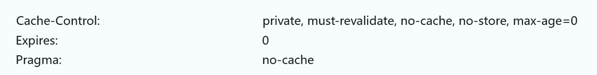
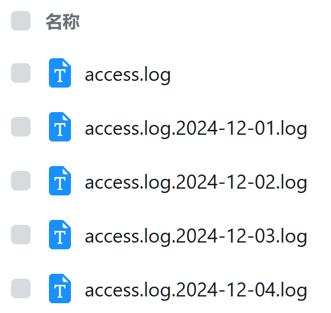
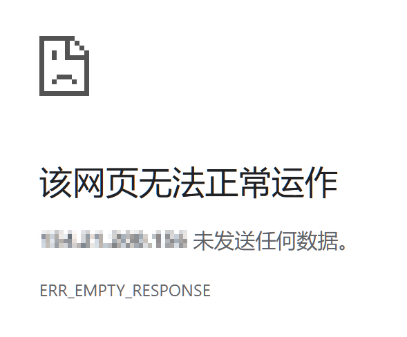

在之前的 [《Nginx 配置模板与解读》](https://paperplane.cc/p/ffc833d8cdcc/) 中，有提到 Nginx 常用的配置。那篇博文主要列出常用的配置项，以实现基础需求和备忘为主，本文则尝试利用 Nginx 更多的功能，实现进阶的需求。


# 通用配置抽离

利用 Nginx 的 `include` 语法，可以将多个地方通用的代码抽离出来。

可以参考我的做法：
首先，在和 `nginx.conf` 文件同级的位置，创建一个 `shared` 目录：

```bash
mkdir shared
```

可以把通用的配置放在这里面，例如文件 `example.conf`，其他文件这样来引入它：

```nginx
include shared/example.conf;
```

这句语句就形同将配置文件内的代码原样搬到 `include` 的地方一样。

接下来介绍常用的几种通用配置。


## 配置 HTTPS 的 443 端口

这段配置使用安全的 TLS 配置对外暴露 443 端口，便于通过 HTTPS 访问。为了优化性能和体验，配置默认使用 HTTP2；为了安全性，还开启了 HSTS 和 OCSP 装订。

文件名：`ssl.conf`，引入语句：`include shared/ssl.conf;`
配置片段：

```nginx
listen 443 ssl;
listen [::]:443 ssl;
http2 on;

# 如果网站有多个域名，需要不同的证书，那下面这两行可以不放在这里
ssl_certificate /path-to-your/fullchain.pem;
ssl_certificate_key /path-to-your/key.pem;

ssl_ciphers EECDH+CHACHA20:EECDH+CHACHA20-draft:EECDH+AES128:RSA+AES128:EECDH+AES256:RSA+AES256:EECDH+3DES:RSA+3DES:!MD5;
ssl_protocols TLSv1 TLSv1.1 TLSv1.2;
ssl_stapling on;
ssl_stapling_verify on;

add_header Strict-Transport-Security "max-age=31536000; includeSubDomains; preload";
```

示例使用方式：

```nginx
server {
  server_name example.com;

  include shared/ssl.conf;
}
```

如果网站只使用一个域名，像上面例子一样把 `ssl_certificate` 相关的配置也放在 `ssl.conf` 里面。


## proxy_pass 通用配置

将请求路由到服务时，一般也需要配置几个头，所以可以把这几段抽离出来方便使用。

文件名：`proxy.conf`，引入语句：`include shared/proxy.conf;`
配置片段：

```nginx
proxy_set_header Host $host;
proxy_set_header X-Real-IP $remote_addr;
proxy_set_header X-Forwarded-For $proxy_add_x_forwarded_for;
proxy_set_header X-Forwarded-Proto $scheme;
```

如果你想要所有 `proxy_pass` 都支持 WebSocket，也可以把以下两行也加进去：

```nginx
proxy_set_header Upgrade $http_upgrade;
proxy_set_header Connection "upgrade";
```

示例使用方式：

```nginx
location / {
  proxy_pass http://localhost:8888;

  include shared/proxy.conf;
}
```

这样就避免了配置条目的冗余。


## 禁用 `index.html` 的缓存

SPA 网站，编译后静态部署，需要禁用 `index.html` 的缓存。
本段配置基于之前那篇 [博文](https://paperplane.cc/p/ffc833d8cdcc/)，禁用缓存配置参考了知乎、腾讯云等网站的首页响应头。

文件名：`nocache.conf`，引入语句：`include shared/nocache.conf;`
配置片段：

```nginx
add_header Cache-Control "private, no-cache, no-store, max-age=0";
add_header Pragma "no-cache";
add_header Expires "0";
```

示例使用方式：

```nginx
location /subpath/ {
  alias /path-to-index-html/;
  try_files $uri @website-name;
  index index.html;
}

location @website-name {
  root /path-to-index-html/;
  try_files /index.html =404;

  include shared/nocache.conf;
}
```

顺带贴出知乎使用的响应头：




## robots.txt 配置

`robots.txt` 用于限制爬虫的行为，一般我们的源代码管理、内网管理入口等都不希望被爬虫访问，此时可以将这部分配置抽离出来作为公共部分，方便在各处使用。

在 `shared` 同级目录创建一个 `robots` 目录，新建 `disallow-all.txt` 文件，用于禁用所有机器人；
配置如下：

```ini
User-agent: *
Disallow: /
```

然后，在 `shared` 下创建文件 `disallow-robots.conf`，填入内容：

```nginx
alias /etc/nginx/robots/disallow-all.txt;
# 注意这里的路径按照你服务器上实际文件路径来填，仅作为示例
```

这样即可。

此后，对于有需求禁用爬虫的网站，可以这样使用：

```nginx
location /robots.txt {
  include shared/disallow-robots.conf;
}
```


# 日志管理

本章节预设 Nginx 部署于 Docker 中。

Nginx 运行时，会记录所有访问动作，你可以通过 `docker logs nginx` 来查看实时打印的日志。

此外，Nginx 还可以把日志输出到文件，默认情况下是这样的：
正常的访问，记录于 `/var/log/nginx/access.log`；
出错的访问，记录于 `/var/log/nginx/error.log`。

<br />

这就引发一个问题：Nginx 很可能一启动就是运行几个月甚至一年时间，日志非常长，而且日志看起来很乱，不方便定位问题。
我们需要一种方式来管理 Nginx 的日志。

本章节基于这个问题，分别提供了格式上的优化，以及日志分段管理。


## 日志格式优化

编辑 `/etc/nginx/nginx.conf`，可以找到这样一段内容：

```nginx
log_format main
  '$remote_addr - $remote_user [$time_local] "$request" '
  '$status $body_bytes_sent "$http_referer" '
  '"$http_user_agent" "$http_x_forwarded_for"';

access_log /var/log/nginx/access.log main;
```

这就是 Nginx 主日志的格式和存储文件位置。日志格式中各个占位符的定义，建议参考 Nginx [官方文档](https://nginx.org/en/docs/http/ngx_http_log_module.html)。

这里提供一个我自己使用的日志格式，你可以根据需求调整并选用：

```nginx
log_format main
  '时间:[$time_local] 来自:[$remote_addr] 状态:[$status] 域名:[$host] 路径:[$request] 引荐:[$http_referer] '
  'UA:[$http_user_agent] 转发:[$http_x_forwarded_for]';
```

<br />

如果是 Docker 中运行 Nginx，需要把容器中的 `/var/log/nginx/` 挂载出来，便于持久化保留日志。

注意，挂载出日志目录后，`docker logs nginx` 可能不再持续打印日志输出了；
这可能会带来不便，可以这样修改：

```nginx
access_log /var/log/nginx/access.log main; # 这一行保持不变
access_log /dev/stdout main;
error_log  /var/log/nginx/error.log warn;
error_log  /dev/stderr warn;
```

这样会把日志同时写入到文件并打印在 `docker logs` 中。


## 日志分段管理

常见的 Linux 发行版中，一般都会预装 [`logrotate`](https://linux.die.net/man/8/logrotate) 这个日志管理工具，Linux 系统内部的各种日志也都是由它来管理的。

你可以执行以下指令查看系统日志：

```bash
cd /var/log
ls -l
```

体验一下这个工具对日志的管理能力。

<br />

`logrotate` 的配置文件位于 `/etc/logrotate.d` 目录下。
来到这个目录，可以看到有一些系统预设的日志管理，我们新建一个 `nginx` 文件，并填入以下内容：

```
/path-to-you-nginx-log-dir/access.log
/path-to-you-nginx-log-dir/error.log
{
  daily
  rotate 30
  dateext
  dateformat .%Y-%m-%d.log
  missingok
  create 644 root root
  postrotate
    docker exec nginx nginx -s reopen
  endscript
}
```

上面的路径请换成你 Nginx 日志的路径，默认是 `/var/log/nginx`，不过考虑到 Nginx 如果安装在 Docker 里，那么日志路径就不一定了。

简单解释一下这段配置的作用：

- `daily` 表示是每日运行的，还可以配置成按周、按月等方式；
- `rotate 30` 表示存储多少份，这里配置 `30` 就是说一个月之前的日志就被删掉了；
- `dateext` 表示启用日期扩展名，`dateformat .%Y-%m-%d.log` 是对往期日志的重命名格式，前一天以及更早的日志，会被分割成单独的文件，并按照这个格式命名，参考下图；
  如果不启用日期扩展名，那么后缀就是 `.1`、`.2` 这种格式了；
- `missingok` 表示日志不存在时不报错，继续执行；
- `postrotate` 和 `endscript` 之间的语句，会在每次执行完日志处理后运行，这里提供一个重新打开日志文件的指令给 Nginx，而不用重启服务。

正确配置后，从次日开始，你就可以看到 Nginx 日志像这样被分段存储了：



我的配置会在文件名最后再追加一个 `.log` 尾缀，方便工具快速预览。

此外，`logrotate` 还可以对往期日志进行压缩，使用 `compress` 配置可以使往期日志自动压缩成 `.gz` 格式，使用 `delaycompress` 配置则表示延迟压缩，对最近处理的日志文件暂不压缩。

`logrotate` 也可以运行在 Docker 中，以达到最好的隔离性，我这里并没有这样做，是为了方便运行 `docker exec nginx nginx -s reopen` 命令来让 Nginx 重新打开日志。

> 你可能对 `logrotate` 的这个 `daily` 有疑惑，它到底是每天的几点钟运行？
>
> 实际上，`logrotate` 的 `daily`、`weekly`、`monthly` 也都是利用 Linux 自身 `crontab` 定时任务来触发的，例如 `/etc/cron.daily/logrotate` 文件就是每日运行的启动脚本；
> 而 `crontab` 执行 `daily` 任务的确切时间，可以通过 `cat /etc/crontab` 来查看，一般来说是早上 6:25 这个时间。


# 内置特殊状态码

有的网站，打开后会显示成这样：



一般可能认为是网站挂掉了，或是服务器处于离线状态。

实际上还真不一定，因为 Nginx 也能实现这种效果，而且配置非常简单：

```nginx
return 444;
```

只需要返回 `444` 这个状态码，浏览器访问时就会提示 “未发送任何数据”；
这里的 `444` 状态码并不是标准的 HTTP 状态码，它是 Nginx 内部使用的一个标识，表示不回应客户端发送的数据，这会直接中断连接。

如果你的网站使用负载均衡，或其他措施避免暴露真实 IP，此时你应该这样配置 Nginx：

```nginx
server {
  server_name _;

  listen 80 default_server;
  listen [::]:80 default_server;

  return 444;
}
```

这样对于通过 IP 访问的请求，Nginx 会拒绝回应，避免真实 IP 被网上各种批量扫描发现；
如果返回 `403`、`502` 等状态码，可能会被标记为 Web 服务器，引来后续攻击，直接拒绝回应是最好的做法。

<br />

Nginx 内部存在着多个这种状态码，可以 [点击链接](https://redirect.li/http/status/nginx/) 查询；
不过，我们能在配置文件中使用的，应该就只有 `444` 这一个，其他的状态码都是 Nginx 遇到特殊情况记录在日志中，向用户反馈特殊请求场合的。


# 扩展知识：隐藏版本号

Nginx 会在响应头中加上 `Server: nginx/<版本号>` 这个信息，这个头无法去除，这可能会导致暴露我们的 Nginx 版本，从而引发安全问题。

编辑 `nginx.conf`，添加以下内容：

```nginx
http {
  # ...
  server_tokens off;
  # ...
}
```

这样就可以消除 Nginx 版本号了，但是这个响应头还是无法直接去除的。

