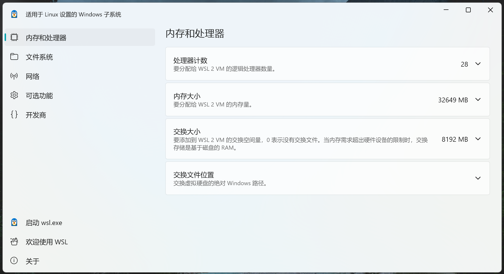
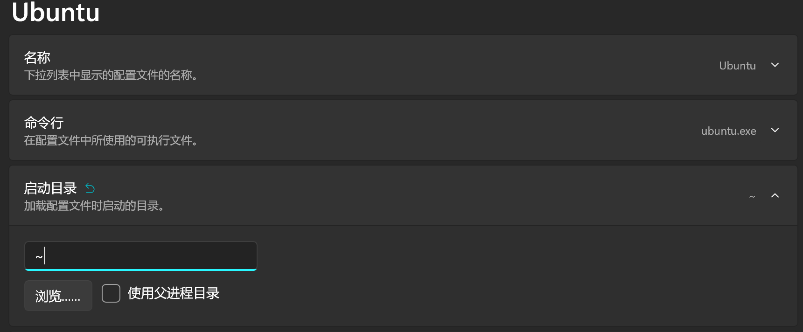

持续更新 WSL 相关的问题。注意本文所提到的 WSL 实际上都是 WSL2，它和 WSL1 的区别可见文末；此外，本文默认使用 Ubuntu 作为 WSL 实例，它可以从 [Microsoft 商店](https://www.microsoft.com/store/productId/9PDXGNCFSCZV?ocid=pdpshare) 中直接下载安装。

推荐使用微软的官方文档来进行 WSL 的 [安装](https://learn.microsoft.com/zh-cn/windows/wsl/install) 和 [配置](https://learn.microsoft.com/zh-cn/windows/wsl/wsl-config)，这个配置页面建议使用英文版本，因为中文版会把一些指令、配置关键字也机翻成英文。


# 运行报错解决

此部分内容提到的问题都是我自己实践证实的。

-----

下面前两条转载自 [名实合为](https://blog.mjyai.com/)，原文链接：https://blog.mjyai.com/2020/06/01/win10-wsl2-ubuntu/ （作者：mjy）。

**报错：WslRegisterDistribution failed with error: 0x800706ba 解决：**

首次运行 Ubuntu 时报错：

```
Installing, this may take a few minutes...
WslRegisterDistribution failed with error: 0x800706ba
Error: 0x800706ba The RPC server is unavailable.

Press any key to continue...
```

产生此错误可能有两个原因：

**原因1，LxssManager 服务未正常运行：**

此时以管理员身份运行终端，重启服务：

```bash
sc stop LxssManager
sc start LxssManager

# 然后可以通过下面这个指令检查服务运行状态
sc query LxssManager
```

**原因2，也可能是 DNS Client 服务未运行：**

运行 `service.msc` 查看此服务，如果没有开启，则将它开启。
如果此服务启动按钮为灰色不可点击，此时需要修改注册表：

运行 `regedit`，找到 `HKEY_LOCAL_MACHINE\SYSTEM\CurrentControlSet\services\Dnscache` 目录，将 `Start` 值从 `4`（禁用）改为 `2`（自动），然后重启电脑。

-----

**报错：参考的对象类型不支持尝试的操作（The attempted operation is not supported for the type of object referenced.）：**

以管理员身份运行终端：

```bash
netsh winsock reset
```

这个问题的原因是，WSL 通讯和 Proxifier 通过 Winsock LSP 抓取 TCP 连接产生冲突。
如果重置 Winsock 后 WSL 正常，但是 Proxifier 无法工作，可以参考 [Proxifier 作者提供的方案](https://github.com/microsoft/WSL/issues/4177#issuecomment-597736482)：
下载 http://www.proxifier.com/tmp/Test20200228/NoLsp.exe，然后用管理员权限的终端运行它，参数：.

```bash
NoLsp.exe c:\windows\system32\wsl.exe
```

这可以使 WSL 绕开 Proxifier 修改过的 LSP。

-----

以下内容转载自 GitHub 上的 [这个 Issue 讨论](https://github.com/microsoft/WSL/issues/11697#issuecomment-2168104220)，本文仅作转载记录。

**报错：Could not write value to key
\SOFTWARE\Classes\Directory\shell\WSL.Verify that
you have sufficient access to that key, or contact your
support personnel：**

打开运行输入 `regedit` 启动注册表编辑器，修改重命名以下条目：

- `计算机\HKEY_LOCAL_MACHINE\SOFTWARE\Classes\Drive\shell\WSL`
- `计算机\HKEY_LOCAL_MACHINE\SOFTWARE\Classes\Directory\background\shell\WSL`
- `计算机\HKEY_LOCAL_MACHINE\SOFTWARE\Classes\Directory\shell\WSL`

将以上三个条目，右键重命名，把 `WSL` 重命名为 `WSL_bak` 即可。

我在操作时遇到了没权限编辑注册表的问题，根据后续讨论，提供两种思路：

- 重命名第一项时提示没权限，不管它，只修改后两条也能解决问题；
- 或，使用 [RunAsTrustedInstaller](https://github.com/fafalone/RunAsTrustedInstaller) 这个工具以最高权限编辑注册表，此时就没有权限问题了。

另外，执行以上操作后，如果命令行运行 `wsl` 还提示报错，可能需要重启电脑；
如果 `wsl` 命令一直启动不了，可以去 GitHub 的 [WSL 发布页](https://github.com/microsoft/WSL/releases/)  下载最新的 .msi 格式安装包重装，重装 WSL 不会影响 Linux 系统。


# 配置文件

我们可以创建一个 `%userprofile%\.wslconfig` 配置文件，格式为常规的 ini 配置格式，它会成为当前电脑上所有 WSL 实例的公用全局配置，具体参考 [微软官方文档](https://learn.microsoft.com/zh-cn/windows/wsl/wsl-config)（建议切换英文版，中文版会把关键字也给机翻了）。
（更新这个配置文件，建议重启计算机）

此外，每个 WSL 实例下的 `/etc/wsl.conf` 是实例的本地配置，这里面的字段优先级更高，格式和上面的相同，文档也在同一个页面，但可用的字段和上面的不同。
（更新这些配置文件，需要重启 WSL 实例来生效）

这两种配置文件，推荐的使用方式是：

- 前者 `%userprofile%\.wslconfig` 有一些宿主机相关的配置，可以通过它来限制 WSL 实例享受的硬盘、内存、CPU 等硬件资源，这些也只能在这里配置；
- 后者 `/etc/wsl.conf` 用于具体的 WSL 实例的配置，例如文件系统和网络与宿主机的互访问性，且配置在各个实例之间互不干扰，实例相关的配置推荐使用这个文件。

-----

2025 更新：
现在 Windows 系统更新了，提供 WSL Settings 这个工具，可以用于快速配置 WSL，在开始菜单中可以找到它：


运行之后：



图形界面简单直观，比之前好用太多了。


# WSL2 “镜像” 网络模式

WSL 默认是 NAT 网络模式，也就是说 WSL 的操作系统运行在一个单独的网段，而我们的 Windows 系统充当子系统的 “网关”，此时两个系统之间的互访问会比较麻烦；
如果是 WSL 中运行 Jellyfin 等场合，在不同的网段会导致 DLNA 等网络发现服务无法正常工作，带来很大的不便。

在 2025 年，WSL2 推出了 “镜像” 网络模式，在这个模式下，宿主机上的接口会 “镜像” 到 WSL 上，提高两者的互访问性。
这里附带上 [官网文档](https://learn.microsoft.com/zh-cn/windows/wsl/networking)。

使用 `.wslconfig` 配置时，添加以下配置项：

```ini
[wsl2]
networkingMode = mirrored
```

为了提高互访问性，还需要添加配置：

```ini
[experimental]
hostAddressLoopback = true
```

这样便可以在宿主机或子系统的任意一方使用 `localhost` 来访问另一方的服务。


# 安装位置移出 C 盘

WSL 默认安装目录在 C 盘，如果想移动到别的目录，可以通过这个流程：
首先检查 WSL 运行的实例，如果有运行中的实例，需要先停止：

```bash
# 列出所有 WSL 实例和运行状态
wsl --list -v

# 停止 Ubuntu 实例的运行
wsl -t Ubuntu
```

使用 `wsl export` 指令将 WSL 导出成压缩包，导出到任意临时目录即可：

```bash
wsl --export Ubuntu "D:\wsl_export\ubuntu-export.tar"
```

从系统中取消注册 WSL 实例：

```bash
wsl --unregister Ubuntu
```

使用 `wsl import` 重新导入和激活 WSL 实例：

```bash
# 注意这里第一个 D:\wsl_new_directory\ubuntu 目录就是转移之后 WSL 实例的目录
wsl --import Ubuntu "D:\wsl_new_directory\ubuntu" "D:\wsl_export\ubuntu-export.tar"
```

然后就可以删掉之前导出的压缩包了。


# 默认用户改为 ubuntu

WSL 安装后，如果默认登录用户是 root，可以改为 ubuntu，有两种方式：

第一种方法，在 Windows 管理员终端中执行：

```bash
ubuntu config --default-user ubuntu
```

这种方式简单直接，如果你只有一个 WSL 实例，这个方式非常适合；

第二种方法，进入 WSL 实例，创建 `/etc/wsl.conf` 文件并填写：

```ini
[user]
default = ubuntu
```

这种方法可以为每个 WSL 实例单独设置默认用户，且它的优先级更高，会覆盖第一种方式。


# 默认起始路径改为 `~`

每次进入 WSL，默认的路径均为 `/mnt/c/Users/用户名`，通常我们都想直接进入用户目录 `~`。

简单的方式，就是修改 Windows 终端的启动目录，新版 Windows 11 的终端可以配置，如图所示：



这样通过 Windows 终端进入 WSL，启动目录就是 `~` 了。

但是如果不是使用 Windows 终端，比如使用 cmd 或者 PowerShell，或是旧版的 Windows 系统没有这个终端应用，这个配置便不起效，此时进入 WSL 时的起始目录还是原来的目录。

<br />

**不推荐**使用这种方式：
在 WSL 实例中编辑 `~/.bashrc`，在其内容最尾部添加：

```bash
cd ~
```

这样每次启动 WSL 实例的终端，就会自动进入到 `~` 目录。
**但是，从 VSCode 等终端打开项目，也会强制进入 Home 目录，会很不方便。**


# 与 Docker 协作

可以参考微软的 [官方中文文档](https://learn.microsoft.com/zh-cn/windows/wsl/tutorials/wsl-containers) 和 [Docker 官方的文档](https://docs.docker.com/desktop/wsl/)。

安装 Docker Desktop 时，便会提示是否使用 WSL 引擎来运行 Docker，推荐使用。Docker 使用 WSL 引擎时，即使终端全部关闭，WSL 也会处于运行的状态；用户主动自己关闭或重启 WSL 时，也会使 Docker 一起关闭或重启，此时 Docker Desktop 会弹出警告。

使用 WSL 作为 Docker 引擎后，执行 `wsl --list -v` 便可以看到多了 2 个实例：

```
  NAME                   STATE           VERSION
* Ubuntu                 Running         2
  docker-desktop         Running         2
  docker-desktop-data    Running         2
```

这里的 `docker-desktop` 用于运行 Docker 引擎（dockerd），而 `docker-desktop-data` 用于存储容器和镜像。

即使在安装时没有选用 WSL，也可以后续在 Docker Desktop 设置页面找到 “Use the WSL 2 based engine” 复选框修改设置。
如果你已有运行了的 WSL 的实例，也可以在 Docker Desktop 设置页面的 Resources > WSL integration 页面找到各个 WSL 实例，并配置允许哪些实例访问 Docker，在这些实例里面可以直接执行例如 `docker ps` 等命令。

-----

如果你运行 WSL 实例后不会自动开启 Docker，可以编辑 WSL 实例的 `/etc/wsl.conf`，添加以下配置：

```ini
[boot]
command = service docker start
```


# 与 VS Code 协作

可以参考微软的 [官方中文文档](https://learn.microsoft.com/zh-cn/windows/wsl/tutorials/wsl-containers#develop-in-remote-containers-using-vs-code)。

安装 VS Code 的远程开发扩展后，需要对 WSL 实例做一些操作：
首先，需要在 WSL 实例中安装 Git、Vim 等常用工具：

```bash
sudo apt-get update
sudo apt-get install -y git vim
```

然后，推荐把宿主机的 SSH 公钥拷贝过来直接使用：

```bash
cp -r /mnt/c/Users/用户名/.ssh ~/.ssh

# （重要）一定要改好权限，SSH 对密钥文件的权限很敏感
chmod 700 ~/.ssh
chmod 600 ~/.ssh/*
```

SSH 的密钥权限尽量设置为 `600`（也就是 `-rw-------`），过高的权限会导致 SSH 报错提示。

在 WSL 实例里开发，可以直接在 WSL 的实例中安装 Node.js 等环境；
更推荐的做法是，把运行环境放在 Docker 镜像里，随项目提供 Docker Compose 配置和 Dockerfile，这样在 VS Code 连接 WSL 后，可以直接运行 `docker compose up` （此时不需要 `-d` 参数）来启动项目。目前 PaperPlane 的大部分项目均使用这种开发方式。


# WSL 1 和 2 的区别

WSL1 和 2 的实现原理不同，因此它们之间有很大的区别：

- WSL1 使用转发适配层对 Linux 提供支持，因此它的性能较差、程序无法直接访问硬件（影响较大），而且存在兼容性问题，例如 Docker 就无法在 WSL1 中运行（这一点很致命）；
- 相比之下，WSL2 可以做到对 Linux 的完全兼容，可以运行 Docker 等多种大型软件，程序也可以访问硬件；
- WSL1 也并不是完全没有优点，它占用的资源少、启动速度快；而 WSL2 需求最低 Windows 10 版本并开启 Hyper-V 功能、需求 CPU 支持硬件虚拟化，对计算机软硬件要求比较高；
- 此外，WSL1 的文件系统直接使用 NTFS，而 WSL2 使用的是 ext4 文件系统，所以必须通过网络地址来访问 WSL 内部的文件，这使得 WSL2 的文件系统性能不佳，例如在 Windows 中修改文件后，WSL2 中的程序很久才能监听到文件变动。

可以看出 WSL2 有更优秀的特性，以后 WSL2 也势必会成为主力发展和流行的版本。
现在安装 WSL 已经默认都是 WSL2 版本了。在早期版本，可能需要执行 `wsl --set-default-version 2` 指令来手动切换。
