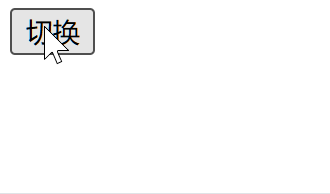
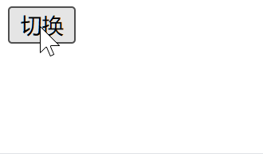

建议先阅读 [《FLIP 动画与实现原理》](https://paperplane.cc/p/3539b7731629/) 这篇博文。

本文从实战开发入手，分析在 React 中控制过渡动画的 “调度” 操作。
下文还会介绍 `react-transition-group` 库，它用于**组织**过渡动画；以及 Ant Motion 的几个 `rc-` 开头的库，这些库可以**实现**过渡动画。


# 用 React 简单实现模态框

我在 [《CSS 开发的优良习惯、技巧与避坑》](https://paperplane.cc/p/841100bcbf06/) 这篇博文中提到一个 “完善” 的模态框应该是怎样的。本文只考虑过渡动画这方面，不考虑其他功能是否完善。

先提出需求——一个模态框，要有蒙层，且点击蒙层可以关闭模态框。

组件代码：

```tsx
interface IDialogProps {
  show?: boolean
  onClose?: () => void
  children?: ReactNode
}

/** 模态框组件 */
function Dialog(props: IDialogProps) {
  const { show, onClose, children } = props

  const component = (
    <div className="mask" onClick={onClose}>
      <div className="dialog">{children}</div>
    </div>
  )

  return createPortal(show ? component : null, document.body)
}
```

配套的样式代码：

```css
.mask {
  position: fixed;
  top: 0;
  bottom: 0;
  left: 0;
  right: 0;
  background-color: rgba(0, 0, 0, 0.5);
  display: flex;
  align-items: center;
  justify-content: center;
}

.dialog {
  display: inline-block;
  background-color: white;
  padding: 10px 20px;
  border-radius: 10px;
}
```

组件代码中，使用两层 DOM 分别管理蒙层和模态框内容，这是推荐的做法；还使用 `createPortal()` 将组件 DOM 发送到 `<body>` 内显示，这样可以避免层级覆盖问题。

使用以下这个代码测试使用此组件：

```tsx
export default function App() {
  const [show, setShow] = useState(false)

  return (
    <div>
      <Dialog show={show} onClose={() => void setShow(false)}>
        我是模态框内容
      </Dialog>

      <button onClick={() => void setShow(t => !t)}>切换</button>
    </div>
  )
}
```

效果如下：


这样我们成功实现了模态框的切换显示，但是，这个过程太突兀，没有任何过渡动画。
接下来，我们可以尝试给组件加上过渡动画。

模态框的状态只有 “显示” 和 “隐藏” 两种，似乎没法设置过渡，最容易想到的就是 `opacity` 透明度了，我们可以让模态框在出现和消失时，执行一个缓慢的 “渐变” 的动画。

我们给外层的蒙层元素加上 CSS 过渡：

```css
.mask {
  transition: opacity 500ms;
  opacity: 1;
}
```

你可以尝试一下，这样并不会使得元素出现过渡动画。

这是因为，组件需要经历 `opacity` 从 `0` 到 `1`（或者反过来）这个过程，才能应用过渡；
而我们模态框的出现和隐藏，是直接附加和移除 DOM，这个过程完全不存在没有 `opacity` 的变动。

<br />

我们可以提供一组隐藏状态下的样式：

```css
.hide {
  opacity: 0;
  visibility: hidden;
}
```

这里必须加上 `visibility: hidden`，不然即使组件处在隐藏状态时，透明度为 `0` 但蒙层还是盖在页面上的，会导致页面无法点击。

此后，通过 JS 控制这个类名：

```tsx
function Dialog(props: IDialogProps) {
  const { show, onClose, children } = props

  const component = (
    <div className={'mask' + (show ? '' : ' hide')} onClick={onClose}>
      <div className="dialog">{children}</div>
    </div>
  )

  //                  ↓ 这里有改动，没有三目运算符
  return createPortal(component, document.body)
}
```

注意这里去掉了三目运算符，把 `component` 的 DOM 持久输出了，不再会简单粗暴的移除 DOM，也正因此，`opacity` 的过渡可以正常完整显示了。

运行后的效果：



可以看到，模态框出现时候有渐变过渡动画，但是，**没有消失动画**。

这是因为，模态框设为隐藏后，`visibility: hidden` 瞬间被附加上，组件立即被隐藏，**没有一个时间区间用来播完这 500ms 的过渡动画**。
有一种方法，就是使用两个变量来控制样式，另一个样式延迟 500ms 生效。

代码如下：

```tsx
function Dialog(props: IDialogProps) {
  const { show, onClose, children } = props

  const [delayedShow, setDelayedShow] = useState(!!show)

  // 状态 setDelayedShow 和 show 联动
  // 他们会同时开启，但关闭时 setDelayedShow 会延迟 500ms
  useEffect(() => {
    if (show) {
      setDelayedShow(true)
    } else {
      setTimeout(() => void setDelayedShow(false), 500)
    }
  }, [show])

  const component = (
    <div
      className="mask"
      onClick={onClose}
      style={{
        // 透明度是随组件显示切换的
        opacity: show ? 1 : 0,
        // 但可见状态会在组件关闭后延迟 500ms 后关闭
        visibility: delayedShow ? 'visible' : 'hidden',
      }}
    >
      <div className="dialog">{children}</div>
    </div>
  )

  return createPortal(component, document.body)
}
```

这样做之后，`visibility` 会等待 500ms 到 `opacity` 变成 `0` 再设为 `hidden`，过渡动画就可以产生了。

运行代码，效果是这样的：



这样显示和隐藏的动画就都能显示了。
此后，我们可以把 CSS 中的 `.hide` 移除掉，它不再会被用到了。

<br />

这种方式，模态框设为隐藏状态后，DOM 还是留存状态的。
更好（也是必须）的做法，是在模态框隐藏后，就移除掉它的 DOM，也就是把 `component` 改为 `null`。

我们把最后一行代码修改为：

```tsx
  return createPortal(delayedShow ? component : null, document.body)
```

这样改之后，在组件的 `visibility` 设为 `hidden` 后，DOM 会被移除掉；
但是，实践之后我们会发现，动画并没有产生。

如果读过我之前那篇博文，那么你一定能反应过来，**原因是 `useEffect()` 回调的触发时机，实际上是在 DOM 变更之后才生效的**；
因此，`delayedShow` 变成 `true` 的时间点很晚，也就是 `opacity` 变成 `1` 之后，`visibility` 才移除掉 `hidden`，自然没有过渡动画。

<br />

解决方式很简单，我们可以让 `opacity` 的切换比 `delayedShow` 更晚即可。

将代码调整为：

```tsx
function Dialog(props: IDialogProps) {
  const { show, onClose, children } = props

  const [delayedShow, setDelayedShow] = useState(!!show)
  // 此处仅仅是简化代码行数
  useEffect(() => void setTimeout(() => void setDelayedShow(!!show), show ? 0 : 500), [show])

  const component = (
    <div
      className="mask"
      onClick={onClose}
      style={{
        // 注意这里的 opacity 采用“且”关系
        opacity: show && delayedShow ? 1 : 0,
        // visibility 的控制代码可以直接删除了
      }}
    >
      <div className="dialog">{children}</div>
    </div>
  )

  // 注意这里组件 DOM 的显示，采用“或”关系
  return createPortal(delayedShow || show ? component : null, document.body)
}
```

注意 `opacity` 处必须使用 “且” 关系来设置开启状态，因为 `useEffect()` 的回调始终在 DOM 变更后才触发，所以 `delayedShow` 变成开启状态始终会 “慢一步” 生效，而此时必须让它的生效比 `component` 更慢，使用 “且” 就能实现对变量 `delayedShow` 开启的 “等待” 操作。

也正因如此，`component` 处必须使用 “或” 关系，这样它的开启触发时机和 `show` 一样，会更早一些，它的生效时机才能够 “容纳” 上面的 `opacity` 的时机。

经过这样的调整，模态框的显示和隐藏动画就正常了：


而且我们这个模态框的实现相对比较 “完善”，在关闭时，DOM 也会被移除，不会有残留。


# 封装一个过渡调度 hook

根据上面的逻辑，我们可以为模态框组件封装一个 hook，用以管理组件 DOM 和过渡样式的变换。

我们可以封装一个 `useToggleTransitionState()` 用来管理模态框的组件状态，它接受一个布尔参数、以及一个表示延迟毫秒数的参数，然后它会返回 “过渡状态” 和 “DOM 状态”，后者始终会等待前者变完之后才会跟着变动。

其中，切换为开时，“过渡状态” 仅仅比 “DOM 状态” 慢一帧，这样在 DOM 出现后播放渐变动画；
切换为关时，“过渡状态” 在第二个参数的延迟毫秒数之后切换，为 “消失动画” 预留出播放时间。

代码如下：

```ts
function useToggleTransitionState(toggleState: boolean, delay: number) {
  const [delayedState, setDelayedState] = useState(!!toggleState)

  useEffect(() => {
    const timerId = setTimeout(() => void setDelayedState(toggleState), toggleState ? 0 : delay)
    return () => void clearTimeout(timerId)
  }, [toggleState, delay])

  const transitionState = toggleState && delayedState
  const domState = toggleState || delayedState

  return [transitionState, domState]
}
```

此后，可以使用这个 hook 来包装表示模态框显示与否的 `show` 状态：

```tsx
function Dialog(props: IDialogProps) {
  const { show, onClose, children } = props

  // 第一个参数用于“过渡状态”，第二个参数用于“DOM 状态”
  const [transitionState, domState] = useToggleTransitionState(!!show, 500)

  const component = (
    //                                                        ↓ 此处是“过渡状态”
    <div className="mask" onClick={onClose} style={{ opacity: transitionState ? 1 : 0 }}>
      <div className="dialog">{children}</div>
    </div>
  )

  //                  ↓ 此处是“DOM 状态”
  return createPortal(domState ? component : null, document.body)
}
```

运行时的效果如下：


这样一来，模态框的过渡状态得以完美生效，且代码组织也非常简单，只需要引入这个 hook 即可。

这就是一种对状态过渡的 “调度”，也是本文的核心要点之一。


# 封装一个过渡调度的组件

我们还可以让封装的工具 “更进一步”，直接提供一个组件来接管模态框。

提供一个组件 `<ToggleTransition>`，可以用于包裹模态框等需要切换过渡状态的组件。
代码如下：

```tsx
interface IToggleTransitionProps {
  state?: boolean
  activeStyle?: CSSProperties
  inactiveStyle?: CSSProperties
  transition?: CSSProperties['transition']
  children?: ReactElement
}

const noop = () => {}

function ToggleTransition(props: IToggleTransitionProps) {
  const { state, activeStyle, inactiveStyle, transition, children } = props

  const [transitionState, setTransitionState] = useState(!!state)
  const [domState, setDomState] = useState(!!state)
  const [transitionEndCallback, setTransitionEndCallback] = useState(() => noop)
  
  // 此处需使用 useLayoutEffect
  useLayoutEffect(() => {
    if (state) {
      // 立即放置 DOM
      setDomState(true)
      // 从下一帧开始，设置开启状态
      requestAnimationFrame(() => void setTransitionState(true))
      // 清除回调
      setTransitionEndCallback(() => noop)
    } else {
      // 立即设为关闭状态
      setTransitionState(false)
      // 设置回调，它将动画播放完毕后触发，移除子组件 DOM 并清空回调
      setTransitionEndCallback(() => () => {
        setDomState(false)
        setTransitionEndCallback(() => noop)
      })
    }
  }, [state])

  if (!children || !domState) {
    return null
  }

  return cloneElement(children, {
    // 合并样式
    style: {
      ...children.props.style,
      transition,
      ...(transitionState ? activeStyle : inactiveStyle),
    },
    onTransitionEnd: transitionEndCallback,
  })
}
```

从代码中可以看出，我们把样式提取为参数并单独传入，然后在组件内控制 DOM 和过渡样式的应用。
这也是一种利用组件对过渡动画进行 “调度” 的操作。

此处也利用了 [`transitionend`](https://developer.mozilla.org/en-US/docs/Web/API/Element/transitionend_event) 事件，它会在过渡动画完成后触发，这样就不需要我们手动设置 `delay` 参数了。

使用这个组件后，我们可以从 CSS 文件中 `.mask` 样式中移除掉 `transition` 和 `opacity`，改为使用组件属性来提供这些样式。
只需要把模态框放置于组件中，代码如下：

```tsx
function Dialog(props: IDialogProps) {
  const { show, onClose, children } = props

  return createPortal(
    <ToggleTransition
      state={show}
      transition="opacity 500ms"
      inactiveStyle={{ opacity: 0 }}
    >
      <div className="mask" onClick={onClose}>
        <div className="dialog">{children}</div>
      </div>
    </ToggleTransition>,
    document.body
  )
}
```

此处设置了 `transition` 过渡为 `"opacity 500ms"`，视同于设置这一条样式，为透明度的变化设置 500ms 的过渡；然后我们指定了 `inactiveStyle`，它表示组件即将消失时候透明度变成 `0`。

这样，组件便会根据 `state` 的值来显示或隐藏子元素，并应用过渡动画。
组件会自动调度过渡，使得 DOM 和过渡动画完美协调。

效果如下：


# Vue 的 `<Transition>` 和 `<TransitionGroup>`

以下内容基于 Vue 3。Vue 提供了这两个内置组件，它们可以用于调度过渡动画。

[`<Transition>`](https://cn.vuejs.org/guide/built-ins/transition.html) 组件用于调度单个组件的过渡样式，方式是控制组件的 `class` 类名，在特定的时机切换类名，它的做法和我们上面的代码类似；
[`<TransitionGroup>`](https://cn.vuejs.org/guide/built-ins/transition-group.html) 组件用于对一系列元素进行过渡，可以实现 FLIP 动画、排队动画等效果。

-----

我们用 Vue 来实现上面的模态框的需求，先来一个最基础版本的：

```html
<template>
  <div v-if="props.show" className="mask" @click="close">
    <div className="dialog">
      <slot></slot>
    </div>
  </div>
</template>

<script setup>
const props = defineProps({ show: Boolean })

const emit = defineEmits(['close'])

const close = () => {
  emit('close')
}
</script>

<style scoped>
.mask {
  position: fixed;
  top: 0;
  bottom: 0;
  left: 0;
  right: 0;
  background-color: rgba(0, 0, 0, 0.5);
  display: flex;
  justify-content: center;
  align-items: center;
}

.dialog {
  display: inline-block;
  background-color: white;
  padding: 10px 20px;
  border-radius: 10px;
}
</style>
```

使用这个组件的测试代码：

```html
<template>
  <button @click="toggle">切换</button>
  <Dialog :show="show" @close="close"> 我是模态框内容 </Dialog>
</template>

<script setup>
import { ref } from 'vue'
import Dialog from './components/Dialog.vue'

const show = ref(false)

const toggle = () => {
  show.value = !show.value
}

const close = () => {
  show.value = false
}
</script>
```

效果如下：


<br />

然后，我们使用组件 `<Transition>` 来调度组件的过渡。

它的使用非常简单，只需要用此组件包裹模态框的模板代码即可：

```html
<template>
  <Transition>
    <div v-if="props.show" className="mask" @click="close">
      <div className="dialog">
        <slot></slot>
      </div>
    </div>
  </Transition>
</template>
```

然后，添加样式：

```html
<style scoped>
.v-enter-active,
.v-leave-active {
  transition: opacity 500ms;
}

.v-enter-from,
.v-leave-to {
  opacity: 0;
}
</style>
```

注意这里的样式类名，这几个类名都是特定的格式，不能写错；
Vue 的 `<Transition>` 组件会根据子组件的 `v-if` 的显示与否，自动为我们调度这些类名的附加与否，实现对组件样式过渡的调度控制。

具体而言，在元素的 DOM 被插入期间，Vue 会分析组件的过渡动画设置，从节点插入的**前一帧**开始到插入完成的**后一帧**结束，这期间 `v-enter-active` 类名会被持续附加；
而移除节点时也是一样，过渡期间 `v-leave-active` 类名会被持续附加。

而组件被插入时，会应用 `v-enter-from` 类名直到插入 DOM 后的下一帧；
组件被移除时，会应用 `v-leave-to` 类名直到移除 DOM 后的下一帧。
所以我们给这两个类名附加 `opacity: 0` 的样式，因为这个时机模态框是隐藏的状态，浏览器会自动播放透明度在 `0` 和 `1` 之间补间的渐出过渡动画。

这样，组件的过渡动画就会生效：


<br />

可以看出，Vue 的 `<Transition>` 组件和我们自己实现的组件功能上非常相似，只不过，我们自己实现的组件是基于 `style` 来控制样式，而这个组件是基于 `class` 类名的。

-----

以上是 `<Transition>` 组件的用法，下面来讲一讲 `<TransitionGroup>` 组件。
再次建议阅读 [《FLIP 动画与实现原理》](https://paperplane.cc/p/3539b7731629/) 这篇博文。

这个组件用于对**一组元素**添加动画，实现元素的排序、插入移出等动画，Vue 会自动计算 DOM 移动的位置并给组件加上样式，来达到 “FLIP 动画” 的效果，使得过渡看上去非常直观和协调。

给出一个随机打乱列表元素的示例：

```html
<template>
  <TransitionGroup style="display: flex" tag="div">
    <div class="box" v-for="item of list" :key="item">
      {{ item }}
    </div>
  </TransitionGroup>
  <button @click="shuffle">打乱</button>
</template>

<script setup>
import { reactive } from 'vue'

const list = reactive([1, 2, 3, 4, 5])
const shuffle = () => void list.sort(() => Math.random() - 0.5)
</script>

<style scoped>
.box {
  width: 60px;
  height: 60px;
  background-color: skyblue;
  color: white;
  font-size: 30px;
  margin: 10px;
}
.v-move {
  transition: all 2s;
}
</style>
```

实现上述样式后，Vue 会自动对子元素应用 FLIP 动画，最终效果如下：


# 使用 `react-transition-group` 组织过渡动画

Vue 的 `<Transition>` 和 `<TransitionGroup>` 内置组件固然好用，但如果我们选用 React 来作为开发工具，就无法利用这些组件。

推荐使用 [`react-transition-group`](https://reactcommunity.org/react-transition-group/) 这个包。
它是专为 React 准备、用于调度 CSS 过渡动画而开发的，作用和 Vue 上述两个内置组件相似。

```bash
yarn add react-transition-group
yarn add -D @types/react-transition-group
```

<br />

它提供了四个组件：

- **[`<Transition>`](https://reactcommunity.org/react-transition-group/transition)**
  提供对组件显示与否的状态值的高级包装，可以基于此回调参数来更精细的控制组件的渲染和过渡；
- **[`<CSSTransition>`](https://reactcommunity.org/react-transition-group/css-transition)**
  类似于 Vue 的 `<Transition>`，通过类名 `className` 的方式跟踪并调度组件的过渡动画；
- **[`<SwitchTransition>`](https://reactcommunity.org/react-transition-group/switch-transition)**
  它实现了 Vue 的 `<Transition>` 的 `mode` 属性的功能，用于在子元素切换时编排过渡动画的顺序；
- **[`<TransitionGroup>`](https://reactcommunity.org/react-transition-group/transition-group)**
  类似于 Vue 的 `<TransitionGroup>`，对多个元素的动画进行调度和编排，也支持 FLIP 动画。

在下文中，我们将继续使用上面模态框的 Demo 代码，对这些组件进行介绍。


## 组件 `<Transition>`

这个组件类似于我们上面自己实现的 `<ToggleTransition>` 组件，它基于一个布尔值状态，并包装为一个更高级的状态。

具体而言，它把组件的过渡分为了 **“渐入”**、**“渐出”** 这两种情况，通过一个参数 `in` 来切换。
（我们自己写的组件则是叫 `show` 属性）

然后，它的子组件是一个回调函数，其参数 `state` 可取值为：

- 渐入中 `"entering"`：属性 `in` 变为 `true` 后，过渡动画播放期间为此值；
- 已渐入 `"entered"`：在上一条的过渡动画播放完毕后，下一帧开始一直保持此值；
- 渐出中 `"exiting"`：属性 `in` 变为 `false` 后，过渡动画播放期间为此值；
- 已渐出 `"exited"`：在上一条的过渡动画播放完毕后，下一帧开始一直保持此值。

开发者需要根据这个 `state` 属性来写判断条件，手动设置组件的样式。
（我们自己写的组件通过 `cloneElement()` 来自动设置子组件的样式）

开发者需要指定 `nodeRef` 指向子组件的 DOM 元素。
（我们自己写的组件直接通过 `props.children` 访问子元素）

开发者需要提供使用 `timeout` 参数来指定过渡的持续时间（毫秒数），它还支持 [对象格式](https://reactcommunity.org/react-transition-group/transition#Transition-prop-timeout)；
或者额外提供一个 `addEndListener` 方法属性，参数签名 `(done: Function) => void`，这样我们可以自己写代码，使用 `transitionend` 等事件来监听子元素的过渡动画完成，然后调用 `done()` 告诉组件过渡完成了。
（我们自己写的组件直接通过 `transitionend` 事件自动监听过渡的结束，无需其他配置）

和我们写组件不同的是，这个组件默认不会在 `in` 参数切换后移除或附加 DOM，需要手动配置：

- 默认情况下，组件初次渲染时，即使 `in` 参数为关闭，子组件 DOM 也是会被附加的；
  此外，子组件初次挂载时也是不会执行 “渐入” 过渡的；
- `appear` 开启此属性，则子组件初次挂载时也会执行 “渐入” 过渡；
- `mountOnEnter` 开启此属性，组件初次渲染时如果 `in` 参数关闭，那么 DOM 就不再会附加；
- `unmountOnExit` 开启此属性，`in` 参数关闭后，在过渡播放完的下一帧后子组件 DOM 会移除。

<br />

我们使用这个组件来包装之前写的模态框组件，先去 CSS中删掉 `opacity` 和 `transition` 相关属性；
然后，将组件代码改写为：

```tsx
import { Transition } from 'react-transition-group'

function Dialog(props: IDialogProps) {
  const { show, onClose, children } = props

  const nodeRef = useRef(null)

  return createPortal(
    <Transition nodeRef={nodeRef} in={show} timeout={500} mountOnEnter unmountOnExit>
      {state => (
        <div
          ref={nodeRef}
          className="mask"
          onClick={onClose}
          style={{
            // 这里来区分组件的“显示状态”
            opacity: state === 'exiting' || state === 'exited' ? 0 : undefined,
            // 这里来区分组件是否处于“过渡中”
            transition: state === 'entering' || state === 'exiting' ? 'opacity 500ms' : undefined,
          }}
        >
          <div className="dialog">{children}</div>
        </div>
      )}
    </Transition>,
    document.body
  )
}
```

保存代码后，页面中的模态框组件就可以正确应用过渡动画了：


<br />

除了上面提到的参数，`<Transition>` 组件还有一些事件：

- `onEnter`、`onEntering`、`onEntered`：分别在组件 “渐入前”、“渐入中”、“渐入后” 触发的事件；
  回调签名有一个布尔值参数，表示子组件是否是首次出现；
- `onExit`、`onExiting`、`onExited`：分别在组件 “渐出钱”、“渐出中”、“渐出后” 触发的事件。


## 组件 `<CSSTransition>`

这个组件基于上面的 `<Transition>` 组件，继承了所有参数和用法，重复的参数就不赘述了；
此组件非常类似于 Vue 的内置组件 [`<Transition>`](https://cn.vuejs.org/guide/built-ins/transition)，它通过调度 **类名** 来调度 CSS 过渡。

最重要的就是 `classNames` 参数，注意最后有一个字母 `s`；这个参数和 Vue 内置组件 `<Transition>` 的 `name` 的含义相同，用于设置一个类名的前缀，后续附加类名时都会使用这个前缀。

此组件会根据处在过渡动画的不同阶段，对子组件附加不同的 `className` 类名；
具体规则如下：

- 在 `in` 被开启时，在浏览器绘制前为子组件附加 `<前缀>-enter` 类名，从浏览器开始绘制后会附加 `<前缀>-enter-active` 类名，这两个类名持续到过渡动画完成后才会被移除；
  过渡动画完成后会持续附加 `<前缀>-enter-done` 类名；
- 在 `in` 被关闭时，在浏览器绘制前会为子组件附加 `<前缀>-exit` 类名，从浏览器开始绘制后会附加 `<前缀>-exit-active` 类名，这两个类名持续到过渡动画完成后才会被移除；
  过渡动画完成后会持续附加 `<前缀>-exit-done` 类名；
- 如果子元素是首次出现，那么出现时是 `<前缀>-appear`，过渡中是 `<前缀>-appear-active` 类名，过渡完成后是 `<前缀>-appear-done` 类名；
  注意 `<前缀>-appear-done` 会和 `<前缀>-enter-done` 同时生效。

此外，它还有 [对象格式](https://reactcommunity.org/react-transition-group/css-transition#CSSTransition-prop-classNames) 的配置方式，可以通过对象精确地定义每一种情形使用的类名。

<br />

**坑点：**

你可能注意到了，`<前缀>-enter` 和 `<前缀>-exit` 这两个类名，在过渡开始时到结束前都是持续附加的，所以它和 Vue 不同，并没有提供一个类似于 Vue 的 `v-enter-from` 和 `v-leave-from` 这种只在绘制前生效一瞬间的类名。

然而，这两个类名却很重要，很多过渡动画的生效都依赖于这个时间点；
实际开发时，可能需要通过类似于 `.<前缀>-enter:not(.<前缀>-enter-active)` 这种写法，来模拟 `v-enter-from` 这种时机。

<br />

我们使用此组件来改写模态框组件，代码改为：

```tsx
import { CSSTransition } from 'react-transition-group'

function Dialog(props: IDialogProps) {
  const { show, onClose, children } = props

  const nodeRef = useRef(null)

  return createPortal(
    <CSSTransition
      nodeRef={nodeRef}
      in={show}
      timeout={500}
      classNames="dialog"
      mountOnEnter
      unmountOnExit
    >
      <div ref={nodeRef} className="mask" onClick={onClose}>
        <div className="dialog">{children}</div>
      </div>
    </CSSTransition>,
    document.body
  )
}
```

因为这个组件是通过类名来控制组件样式的，而我们提供的前缀叫 `"dialog"`；
编辑 CSS 文件，设置以下样式：

```css
/* 段落 ① */
.dialog-enter-active,
.dialog-exit-active {
  transition: opacity 500ms;
}

/* 段落 ② */
.dialog-enter {
  opacity: 0;
}
.dialog-enter-active {
  opacity: 1;
}

/* 段落 ③ */
.dialog-exit-active {
  opacity: 0;
}
```

先来看段落 ①：在过渡动画期间，也就是两个 `-active` 后缀的类名期间，需要设置过渡动画属性 `transition`，这一点不难理解。

段落 ②：
在组件 DOM 被挂载后、浏览器绘制前，也就是 `-enter` 这个类名所对应的时机，附加 `opacity: 0`，因为浏览器开始绘制时如果 `opacity` 已经变成 `1` 默认值了，那么透明度的过渡动画也就不会产生了；
浏览器开始绘制后，从下一帧开始，也就是 `-enter-active` 这个类名所对应的时机，使用 `opacity: 1` 让组件显现。

**此时上面讲到的 “坑点” 体现出来了，我们必须设置 `-enter` 和 `-enter-active` 这两个类名，分别对应绘制前和开始绘制后，因为是用后者覆盖前者，顺序还必须写对。**
你可以换一种写法，段落 ② 可以用一条规则替换：

```css
/* 段落 ② */
.dialog-enter:not(.dialog-enter-active) {
  opacity: 0;
}
```

<br />

段落 ③：组件准备隐藏前，在这个时机设置 `opacity: 0` 使得组件开始渐出的动画；
这里不能使用 `.dialog-exit`，因为它生效的时机早于 `transition` 生效的时机，所以必须用 `-active` 的后缀，否则过渡动画无法产生。


## 组件 `<SwitchTransition>`

如果子组件需要在多种内容之间切换，例如通过三目运算符来控制切换，使用此组件包裹后，可以调度组件在切换时的过渡动画。

这个组件专门用于实现类似于 Vue 的 `<Transition>` 的 [`mode`](https://cn.vuejs.org/guide/built-ins/transition#transition-modes) 属性的功能，它们的参数取值也类似：

- `"out-in"`：旧组件先展示 “渐出” 动画，然后新来的组件展示 “渐入” 动画；
- `"in-out"`：新来的组件展示 “渐入” 动画，然后旧组件展示 “渐出” 动画，也就是说会过渡动画的时段两个组件都会显示在页面上。


## 组件 `<TransitionGroup>`


# Ant Motion 过渡动画库