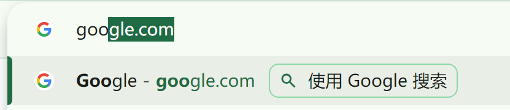
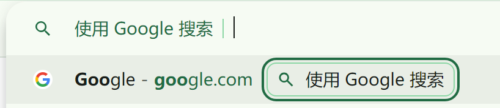
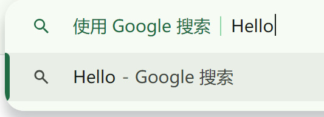
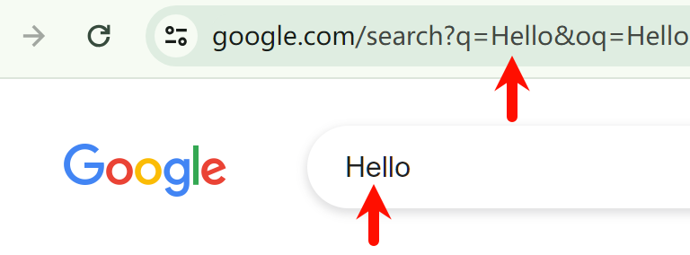
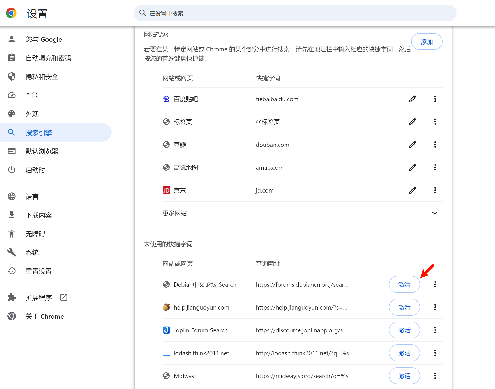
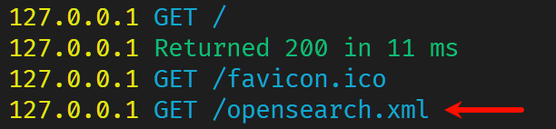
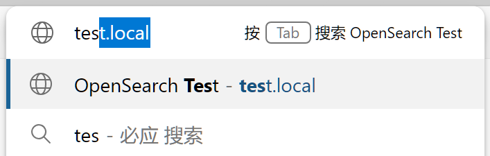
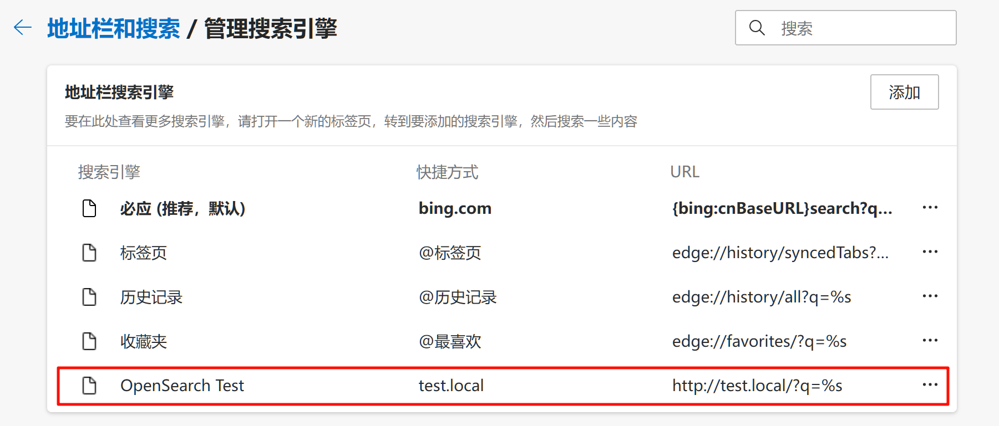
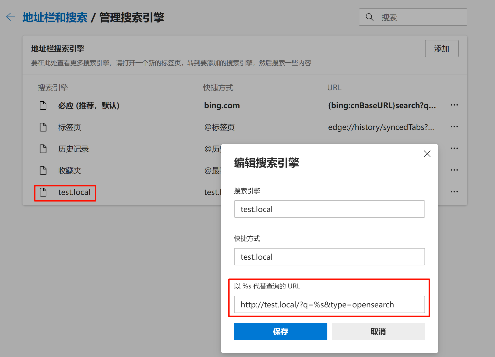

本文首发于 2020 年，于 2023 年增补和修订。

这里的 OpenSearch 指的是浏览器的 “Tab 键搜索” 或者叫 “快捷短语搜索”。

这个规范是由 Amazon 的子公司 A9 于 2005 年推出的一个标准，旨在为网站提供从浏览器地址栏中快速启动搜索功能的通用规范，目前它已被广泛应用了十余年。**注意：2021 年亚马逊推出了一个名字同样也叫 OpenSearch 的搜索引擎项目，与本文的浏览器 OpenSearch 规范没有任何关系，使用互联网搜索时也请注意。**


# Tab 键搜索

浏览器的地址栏中，很多网站只需要输入网址（的开头），地址栏下拉框便会显示一个 “使用 ... 搜索” 的提示，如图：



此时按下 TAB 键盘，即可使用这个网站来进行搜索，如图：



我们输入任何搜索词后：



按下回车键，即可看到已经启动了搜索：



这个功能，一般被称之为 “Tab 键搜索”。

-----

不同的网站，搜索时使用的 url 和查询参数互不相同，例如：谷歌搜索使用的是 `/search?q=关键词`，而百度是 `/s?wd=关键词`，所以网站的开发者必须通过一些约定，把搜索功能的规则传递给浏览器，才能使得这个功能生效。

**也就是说，你至少需要访问某个网站一次，浏览器才能载入它的搜索规则定义。**
现在的浏览器通常会为常用的搜索网站例如百度、谷歌、必应等预置搜索规则，安装好浏览器即可直接用。但是除了这些搜索引擎网站之外，如 Github、Youtube 等平台网站都会提供这个功能，方便用户使用。


# 为什么我试了不行

阅读本篇内容前，建议你打开 Edge 浏览器，因为 Chrome 浏览器做了一些限制，下文会提到。

你可能有疑问，为什么我明明访问过很多有搜索栏的网站，但是现在地址栏还是不能激活 Tab 键搜索功能？

-----

**首先，网站必须实现了 OpenSearch。**

你访问的网站即使有搜索栏，它也必须得实现 OpenSearch，才能开启 Tab 键搜索功能。
举个例子，淘宝、npm、Github 均实现了 OpenSearch，但是京东、Bilibili 没有实现 OpenSearch，所以这些网站没有 Tab 键搜索功能。

有的网站会在门户页部署大量内容，尤其是电商，因为这关系到广告点击收入，所以这些网站可能会不提供 OpenSearch，从而 “迫使” 用户必须从首页进入搜索，增加广告的曝光量。

当然，OpenSearch 规范也是需要严格遵守的，知乎无法使用 Tab 键搜索，但它部署了 OpenSearch 的 xml 文件，我认为是配置文件内容有误，导致知乎的 OpenSearch 不被浏览器读取。

-----

**其次，如果你使用 Chrome，需要自行前往设置页面开启搜索引擎，Edge 则不用。**

Chrome 现在即使访问过实现 OpenSearch 的网站，也不会默认添加搜索功能，必须用户手动激活。
你需要按照 “设置” > “搜索引擎” > “管理搜索引擎和网站搜索” 来找到页面，如下图所示：



可以看到快捷搜索字词被分为了两部分，上面的是已激活的，下面的是未激活的。
访问的网站需要点击 “激活” 按钮后才能使用。

Edge 浏览器则没有这个问题，所有网站是默认激活的。别的浏览器我没有测试，可能情况不一。

这是因为，在 2022 年 3 月，Chrome 开发团队认为（[原推文链接](https://twitter.com/googlechrome/status/1504858912692084745)）：浏览器如果一直自动把网站搜索添加快捷搜索到地址栏中，有可能会让用户因为网站太多而导致搜索地址栏过于混乱，所以改为了需手动激活。之前已添加的网站不受影响。Edge 没有部署这项改动。


# “显式” 实现 OpenSearch

OpenSearch 规定，如果一个网站想实现快捷搜索功能，需要在 `<head>` 标签内放置如下一个标签：

```html
<link type="application/opensearchdescription+xml" rel="search" href="定义文件的地址"/>
```

例如，百度的标签是这样的：

```html
<link rel="search" type="application/opensearchdescription+xml" href="/content-search.xml" title="百度" />
```

其 `href` 属性指向一个 OpenSearch 规则的 xml 描述文件的地址。

这个 xml 描述文件的格式如下：

```xml
<?xml version="1.0"?>
<OpenSearchDescription xmlns="http://a9.com/-/spec/opensearch/1.1/">
  <ShortName>网站名</ShortName>
  <Description>网站介绍</Description>
  <Url type="text/html" method="get" template="https://网址/?搜索参数={searchTerms}"/>
</OpenSearchDescription>
```

注意最重要的便是 `Url` 字段，需要按照网站输入搜索词后的提交方式来编辑，用户输入的搜索词使用 `{searchTerms}` 作为占位符，实际搜索时搜索词会被自动 URL 编码。

如果格式正确，在用户首次访问网站后，浏览器便会记住这个描述文件中的定义，下次用户在地址栏中输入网址时，地址栏中就会提示 “使用 XX 搜索”，这个 XX 就是 `ShortName` 字段的值。

很多网站会在这里给出多余的字段，实际上大部分浏览器只会用到一部分，可以写的比较精简。例如，百度的这个 xml 文件内容为：

```xml
<?xml version="1.0" encoding="UTF-8"?> 
<OpenSearchDescription xmlns="http://a9.com/-/spec/opensearch/1.1/">
    <ShortName>百度搜索</ShortName>
    <Url type="text/html" template="https://www.baidu.com/s?wd={searchTerms}"/> 
</OpenSearchDescription>
```

对于这些配置，可参考官方文档 [Chromium 的 “Tab 键搜索” 文档](https://www.chromium.org/tab-to-search/) 其中编号为 1 的项，对于这个 xml 文件支持的所有键值配置，可以参考 [OpenSearch 描述文件 1.1 版本草案](https://github.com/dewitt/opensearch/blob/master/opensearch-1-1-draft-6.md)。

此外，只有用户访问不带子路径的网址（通常就是首页，例如 `example.com` 而不是 `example.com/xxx`）时，浏览器才会为其激活快捷搜索，如果用户从来没有访问过首页，那么就无法激活快捷搜索。

-----

**自己实践：**

**请使用 Edge 浏览器来实践，Chrome 需要手动激活快捷搜索，很不方便。**

创建一个 `index.html`，填入以下内容：

```html
<!DOCTYPE html>
<html lang="zh-CN">
  <head>
    <meta charset="UTF-8" />
    <title>OpenSearch Test</title>
    <link type="application/opensearchdescription+xml" rel="search" href="/opensearch.xml" />
  </head>
  <body>
    TEST
  </body>
</html>
```

然后创建一个 `opensearch.xml` 文件，填入以下内容：

```xml
<?xml version="1.0"?>
<OpenSearchDescription xmlns="http://a9.com/-/spec/opensearch/1.1/">
  <ShortName>PaperPlane</ShortName>
  <Description>我是描述</Description>
  <Url type="text/html" method="get" template="http://test.local/?q={searchTerms}"/>
</OpenSearchDescription>
```

之后，执行 `npm i serve` 安装 `serve`，用于开启一个 HTTP 服务器，部署网页；
安装完成后，执行 `npx serve -p 80` 开启服务器，将网页部署于 80 端口。

然后，修改 hosts 文件，添加以下一行：

```
127.0.0.1 test.local
```

我们使用 `test.local` 来代替 `localhost` 域名，因为后者会被浏览器特殊处理，无法激活快捷搜索。
之后使用 Edge 浏览器访问 `http://test.local` 即可。

通过 `serve` 的控制台输出，可以看出浏览器自动读取了 OpenSearch 的描述文件：



只要访问这一次，后续在浏览器的地址栏中只要输入网址的开头，便会激活 Tab 键搜索，如图：



输入搜索词后，按下回车，网址便会变成 `http://test.local/?q=编码后的搜索词`，与模板一致；
查看设置里面的搜索引擎页面，也可以看到：



快捷搜索规则被成功添加了。


# “隐式” 实现 OpenSearch

有的网站没有部署上面的 xml 描述文件，但是仍能支持 OpenSearch，例如谷歌搜索、淘宝。

实际上，OpenSearch 还支持一种 “隐式” 的实现，只要网页的 HTML 符合一定格式，**并且用户访问后实际进行了一次搜索提交动作（这是必须的动作）**，也可以让 OpenSearch 生效。

HTML 结构要求是这样的：

- 网页中有且只有一个 `<form>`，它的 `method` 必须为 `get`，必须提供完整地址的 `action`（推荐用 `://` 开头），必须不能注册 `onsubmit` 事件；
- 这个 `<form>` 内中只有一个 `<input type="text"/>` 的输入框，且不能包含任何密码输入框、文件输入框、`<textarea>`，且如果包含其他输入控件，这些输入控件必须处于默认状态（毕竟浏览器地址栏里只能打出文本）。

**只要用户提交过一次搜索，并完成了页面跳转**，浏览器就会记住这个 HTML 结构，按照以下方式创建快捷搜索规则：

- 使用 `<form>` 的 `action` 作为地址；
- `<form>` 中唯一的 `type="text"` 输入控件的 `name` 作为搜索词的键，用户输入的值会被作为 `{searchTerms}`，转化为 URL 参数；
- `<form>` 中所有其他的输入控件的 `name` 和 `value` 转化为 URL 参数。

最终形成一个 URL 模板，以此添加为快捷引擎规则。
这种方法添加的搜索项没有名称，也就是上一种方法的 `ShortName`，浏览器会使用域名作为名字。

官网文档可参考 [Chromium 的 “Tab 键搜索” 文档](https://www.chromium.org/tab-to-search/) 其中编号为 2 的项。

此外，只有用户访问不带子路径的网址（通常就是首页，例如 `example.com` 而不是 `example.com/xxx`）时，浏览器才会为其激活快捷搜索，如果用户从来没有访问过首页，那么就无法使用快捷激活。

-----

**自己实践：**

**请使用 Edge 浏览器来实践，Chrome 需要手动激活快捷搜索，很不方便。**
记得将上一步设置的快捷搜索规则先删掉。

编辑 `index.html`，将内容改为：

```html
<!DOCTYPE html>
<html lang="zh-CN">
  <head>
    <meta charset="UTF-8" />
    <title>OpenSearch Test</title>
  </head>
  <body>
    搜索词：
    <form action="//test.local">
      <input name="q" />
      <input type="hidden" name="type" value="opensearch" />
      <input type="submit" value="搜索" />
    </form>
  </body>
</html>
```

访问 `http://test.local`，可以看到网页中有个输入框，随便输入内容点击 “搜索” 按钮后即可。
后续在浏览器地址栏中输入 `test.local` 就可以按 TAB 键来搜索。

创建的快捷搜索规则如图：



快捷搜索规则被成功添加了；不过这种方式添加的搜索引擎，不能指定名称，浏览器会使用域名来作为其名称。
