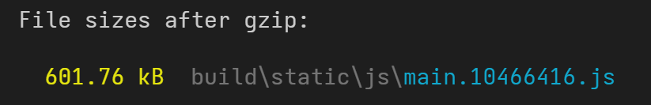
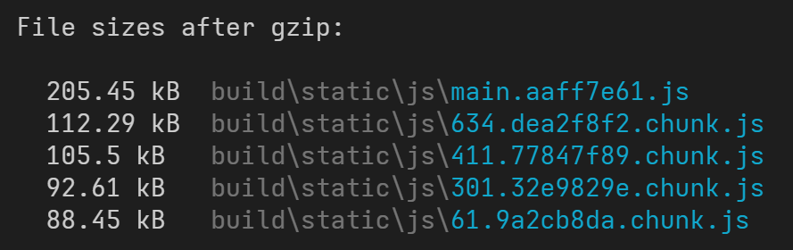
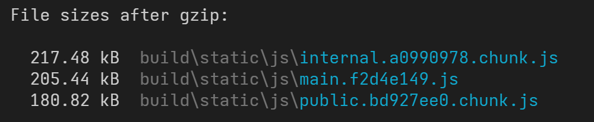
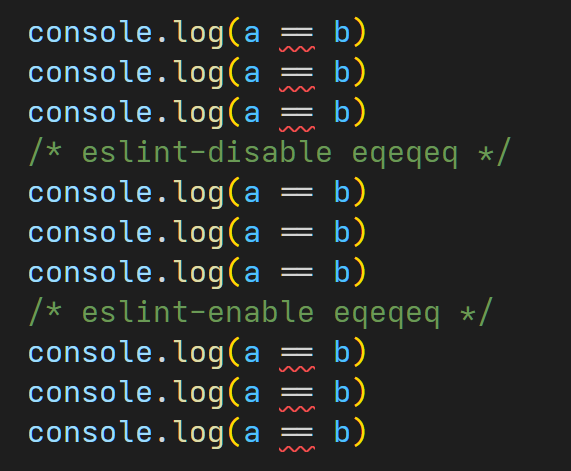
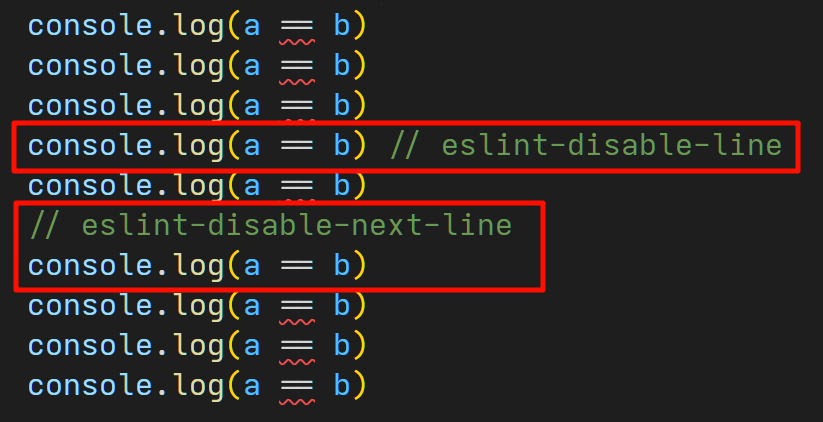

在项目开发过程中，我们经常能看到各种特殊格式的代码注释（“注释” 不是 “注解”），例如可能会以 `@` 开头，或者是格式很复杂，甚至编辑器还会给这些注释加上代码高亮。

这些就是被称为 “Magic comment”（魔法注释）的特殊注释。这些注释一般不会对代码本身的运行产生影响，但是，编译工具或 IDE 则会读取它们，并产生一些帮助或优化。


# JSDoc 注释

经常能见到的注释格式，例如：

```typescript
/**
 * 拉取指定用户的信息
 *
 * @param userId 用户 ID
 * @return 用户信息对象
 */
function fetchUserInfoApi(userId: string): IUserInfo {
  return {}
}
```

JSDoc 注释很常见，它通常写在函数上方，标注了函数的参数、返回值等信息，还会有一些文本介绍。
通常来说，库的作者都会提供尽可能详细的注释，便于使用者理解。

想要用键盘输入这种注释，只需要输入 `/**` 开头，并按下回车键，编辑器就会自动帮我们生成注释。

我们还可以注意到，这种注释也有文本高亮，所以是一种具有特定格式的注释：


打出这种注释后，我们在其他地方想要使用这个函数，在输入的时候，编辑器也会自动给我们提示：


<br />

这种注释的名称叫 [JSDoc](https://jsdoc.app/)。

JavaScript 开发者们约定使用这种特殊格式的注释，用于标记一个函数的参数、返回值等信息，而编辑器、IDE 也会集成解析 JSDoc 的功能，在我们调用函数时展示出相关的提示。

这里有两点需要特别注意：

- 只有 `/**` 开头的注释会被识别为 JSDoc 注释，JSDoc 注释即使只有一行也是可以的，但以 `//` 和 `/*` 开头的都不行；
- JSDoc 的语法支持 Markdown 格式，VSCode 可以正确解析和显示。

JSDoc 的结构看上去很直观，开头一段是介绍文本，然后是很多行由 `@params` 这种开头格式的标识符，用于标识一个函数的参数、返回类型等。JSDoc 不仅可以给函数用，也可以给对象、类、变量使用，它也支持很多种标识符，具体可以前往 [官方文档](https://jsdoc.app/) 查看和参考。

-----

如果你的项目没有使用 TypeScript，那么可以写成这种格式，加一个花括号 `{}` 来标注参数的类型：

```javascript
/**
 * 拉取指定用户的信息
 *
 * @param {string} userId 用户 ID
 * @return {Object} 用户信息对象
 */
function fetchUserInfoApi(userId) {
  return user
}
```


## JSDoc 示例

这里给出几段 JSDoc 用法示例：

下面是一个构造函数的 JSDoc 用法，其中用到了构造函数的标识 `@constructor`，这个函数的 `country` 参数是可选的，JSDoc 中表示为方括号包裹起来 `[country]` 这种形式：

```javascript
/**
 * 构造一个 Person 对象
 *
 * @constructor
 * @param {string} name 名字
 * @param {number} age 年龄
 * @param {string} [country] 国家（可选）
 */
function Person(name, age, country) {
    this.name = name;
    this.age = age;
    this.country = country || 'Unknown';
}
```

-----

下面是一个带有使用示例的 JSDoc，使用 `@example` 提供示例，使用 `@see` 关联其他相关函数：

```javascript
/**
 * 计算两个数的和
 *
 * @param {number} a 加数
 * @param {number} b 被加数
 * @returns {number} 计算出的结果
 * @see minus
 * @example
 * // 得到结果： 7
 * sum(3, 4)
 */
function sum(a, b) {
  return a + b;
}
```

-----

下面是一个使用对象作为参数的 JSDoc 示例：

```javascript
/**
 * 提交用户信息
 *
 * @param {Object} userInfo 提交的用户对象
 * @param {string} userInfo.name 用户的姓名
 * @param {number} userInfo.age 用户的年龄
 * @param {Date} userInfo.createAt 用户的创建日期
 */
function submitUserApi(userInfo) {}
```

使用这种格式，在调用函数时候，编辑器也能正确的给出格式提示：


-----

下面是一个使用复杂类型参数的 JSDoc 示例：

```javascript
/**
 * 我是复杂参数的函数
 *
 * @param {string[]} arrayParam 我是字符串数组
 * @param {(string|number)} mixedParam 我可以是数字或字符串
 * @param {*} anyParam 我可以是任何类型
 */
function test(arrayParam, mixedParam, anyParam) {}
```

在调用这个函数时，编辑器可以从 JSDoc 中推导出参数的类型，从而给我们提供提示：


## TSDoc

还有一种升级版的 JSDoc，叫 [TSDoc](https://tsdoc.org/)，VSCode 等开发工具也是原生支持的。
在用户已经使用了 TypeScript 时，便可以减少 JSDoc 中啰嗦的类型标注，格式有所变化。

这里给出一个 TSDoc 的片段示例：

```typescript
/**
 * 用 `<div>` 包裹元素
 * 
 * @param {import("react").ReactNode} input 提供的节点
 * @returns {import("react").ReactNode} 返回被包裹的节点
 */
function wrapperDiv(input) {
  return <div>{input}</div>
}
```

可以看到，因为 `ReactNode` 不是 JavaScript 原生的类型，因此这里使用 `import()` 来从外部库导入类型。
此外，TSDoc 还支持如 `@typedef`、`@template` 等多种标注。

<br />

TSDoc 通常用在 `.js` 结尾的项目配置文件中，例如 Next.js、ESLint 等工具的配置文件，因为一般直接导出一个配置对象，所以我们需要给导出的对象提供文本提示，此时就可以使用 TSDoc；
不过，现在很多工具也提供了 `defineConfig()` 函数，使用它则可以直接获得 TypeScript 的类型和注释提示，这也是一种可行的方法。

例如 `tailwind.config.js` （v4 版本）配置：

```js
/** @type {import('tailwindcss').Config} */
export default {
  content: ['./src/**/*.{js,jsx,ts,tsx}'],
  theme: {},
  plugins: [],
}

```

例如 `next.config.js` 配置：

```js
/** @type {import('next').NextConfig} */
const nextConfig = {}

module.exports = nextConfig
```

这样以来，在书写配置文件时，便可以享受到 TypeScript 的类型提示，以及看到配置工具作者写的注释。

<br />

如果配置文件支持 TypeScript，可以直接使用这些工具的 `defineConfig()` 来定义配置，这样也能获得类型提示。
例如 `vite.config.ts` 配置：

```typescript
import { defineConfig } from 'vite'

export default defineConfig({
  // ...
})
```


# TypeScript 的 `@ts-` 注释

这些注释只在 TypeScript 项目中起作用；以下的几个注释均支持 `//` 或 `/* */` 这两种注释格式；
对于 React 等项目而言，也支持在 JSX 中使用，写成这种格式即可： `{/* @ts-ignore */}`。


## `// @ts-ignore`

此注释取消下一行代码的 TypeScript 类型检查错误提示。
这个是最常用的，如果下一行代码出于某些原因类型问题暂时无法解决，可以使用此方式来取消类型检查提示。


## `// @ts-expect-error`

此注释预期下一行代码存在至少一个错误，因此先在此标记一下，暂时不要提示。
这个功能和上面的 `// @ts-ignore` 类似，但是相比来说，这个显然更好一点，因为语义更加明确，并且如果未来代码更新了，下一行语句的错误不存在了，编辑器会把这个注释标红，便于我们及时获知代码的变动。


可以看到，因为不存在错误了，所以 `// @ts-expect-error` 出现了红色波浪线提示，因此它其实是 `// @ts-ignore` 的更好的替代。


## `// @ts-nocheck` 和 `// @ts-check`

这两个注释必须放置在文件首行，它对整个文件起作用。

`// @ts-nocheck` 表示不对此文件进行类型检查。
一般来说，在 TypeScript 项目中引入 JS 的文件（最常见的场景是引入 JS 的 SDK），通常这会导致整个文件有一大堆报错，使用这个注释，便可以让此文件的错误不再显示。

`// @ts-check` 则一般用于 .js 的文件，表示为此文件开启类型检查。


# TreeShaking 与 `/*#__PURE__*/` 注释

首先明确一下，`/*#__PURE__*/` 注释是由 Webpack 调用相关工具（主要是 TypeScript 和 Babel）在编译构建过程中添加的，用于给其它工具（主要是 Terser）提供代码标注，以更好的处理代码。这个注释并不需要由开发者来写。

Terser 读取这个注释后，会进行 “TreeShaking”（有时也被称为 “除屑优化” 或 “摇树优化”） 并压缩代码，最终输出的代码也是不包含这个注释的。
可以把这个注释当做代码打包编译阶段的 “中间产物”。

> 在 Webpack 4 以及之前的版本，TreeShaking 由 [Uglify.js](https://github.com/mishoo/UglifyJS) 来实施，而不是 Terser。


## 什么是 TreeShaking

例如常用的 UI 组件库，里面包含了上百个组件，但我们只用到了几个，此时不可能想把所有代码都打包进来；而 TreeShaking 可以帮我们把未用到的组件代码删除，大幅减小打包后的代码体积。

示例代码，文件 `func.ts`，假设它是一个库或者工具函数套件：

```typescript
export function unused() {
  return 'unused!!!'
}

export function used() {
  return 'used!!!'
}
```

入口：

```typescript
import { used } from './func'

console.log(used())
```

这种情况下，`unused()` 函数完全没被使用，它不会被打包进产物中，这是最简单的场景。
这个例子看不出 `/*#__PURE__*/` 的用处，我们继续往下看第二个例子。

<br />

一个稍微复杂些的例子，假设被打包的入口文件改为：

```typescript
import { unused, used } from './func'

const result1 = unused()
const result2 = used()

console.log(result2)
```

此时，虽然 `unused()` 被调用，但它的结果并未被使用，那么 TreeShaking 是否要把它包含到最终产物中？
结果是——`unused()` 函数并不会被打包到产物中。

这个例子体现出 TreeShaking 所需的 “源码分析” 能力。工具链检测到，`unused()` 是一个 “无副作用” 的函数，它只会接收输入、返回输出，期间不会对外部环境作出任何修改，便会给 `unused()` 的调用加上一个 `/*#__PURE__*/` 注释，表明它是一个 “无副作用” 的调用。

在代码传递给 Terser 时，会被改成这样：

```typescript
import { unused, used } from './func'

const result1 = /*#__PURE__*/ unused()
const result2 = /*#__PURE__*/ used()
// 实际上这两个函数可能被内联进来，此处仅作示例

console.log(result2)
```

这里的 `/*#__PURE__*/` 注明这些函数的调用没有副作用，Terser 检测到只有 `result2` 被使用，便会删除 `result1` 相关代码，并直接删除 `unused()` 的代码内联。

即使代码中调用了 `unused()` 函数，甚至返回值也被存为变量，但这不对代码运行结果产生任何影响，所以部分代码可被安全地删除。

<br />

我们进一步修改 `func.ts`，现在使 `unused()` 函数变得 “有副作用”：

```typescript
export function unused() {
  console.log('unused!!!')

  return 'unused!!!'
}

export function used() {
  return 'used!!!'
}
```

此时，工具检测到 `unused()` 会对外部环境产生影响，它不再是无副作用的，此时即使 `unused()` 的返回值未被用到，也不能把它去除。

在代码传递给 Terser 时，会被改成这样：

```typescript
import { unused, used } from './func'

const result1 = unused()
const result2 = /*#__PURE__*/ used()
// 实际上这两个函数可能被内联进来，此处仅作示例

console.log(result2)
```

这样后续代码处理便不会去动 `unused()`，避免了代码运行不符合预期。

<br />

由此可见，`/*#__PURE__*/` 注释可以标注函数调用是 “纯净的”、“无副作用” 的。
被此注释标注的函数调用，如果它的返回值没有被使用，那么这些语句便可以被 TreeShaking 删除。

此外 `/*#__PURE__*/` 也可以写成 `/*@__PURE__*/` 的格式，Terser 的注释支持符号 `#` 和 `@` 开头。


## 其它 Terser 魔法注释

此外，Terser 还支持以下几种注释（开头的 `#` 也都可以换成 `@`），可在 [官方文档](https://github.com/terser/terser#annotations) 处查看：

**注释 `/*#__INLINE__*/`：**标注一个函数调用，确保此函数被内联；
**注释 `/*#__NOINLINE__*/`：**标注一个函数调用，确保此函数不被内联。

Terser 中具备变量和函数的 “内联” 的功能，配置项 `compress.inline` 便是控制此行为的（[文档](https://terser.org/docs/api-reference#compress-options)），此配置项取值：

- `0` 或 `false` 表示关闭内联；
- `1` 表示只内联简单的函数；
- `2` 表示内联函数和参数（这也是 `create-react-app` 的默认配置）；
- `3` 或 `true` 表示内联函数和参数以及变量（这也是 Terser 的默认值）。

以 `create-react-app` 创建的默认项目为例，页面文件：

```jsx
function addOne(input: number) {
  return input + 1
}

function addTwo(input: number) {
  return input + 2
}

function App() {
  console.log(addOne(111))
  
  console.log(addTwo(222))
  console.log(addTwo(333))

  return null
}

export default App
```

然后运行 `yarn build` 打包；
在打包后的产物中搜索 `111`、`222`，可以看到如下代码：

```javascript
function r(e) {
  return e + 2
}
var l = function () {
  return console.log(111 + 1), console.log(r(222)), console.log(r(333))
}
```

可以看到，在构建产物中，如果函数只被用过一次，那么函数代码将被直接 “内联” 到调用方，也就是第一段 `console.log(111 + 1)`，这里直接把 `addOne` 的源代码复制到此处了；而 `addTwo` 函数被多次使用，它没有被 “内联”。

如果将上述代码修改为：

```typescript
function addOne(input: number) {
  return input + 1
}

function addTwo(input: number) {
  return input + 2
}

function App() {
  console.log(/*#__NOINLINE__*/ addOne(111))
  
  console.log(/*#__INLINE__*/ addTwo(222))
  console.log(/*#__INLINE__*/ addTwo(333))

  return null
}

export default App
```

打包后的产物中，可以找到这一段代码：

```javascript
function r(e) {
  return e + 1
}
var l = function () {
  return (
    console.log(r(111)),
    console.log(222 + 2),
    console.log(
      (function (e) {
        return e + 2
      })(333)
    ),
    null
  )
}
```

可以看到，原来的 `addOne` 被 `/*#__NOINLINE__*/` 给强制禁用内联了，虽然它只被调用了一次，但是也必须在外部声明函数；
而原来的 `addTwo` 被 `/*#__INLINE__*/` 给强制开启内联了，每次调用都需要把函数里的代码搬过来完整执行一遍，只不过为了避免变量重名，从第二次开始每次调用都会把函数代码包在一个 IIFE 函数里面。

-----

**注释 `/*#__KEY__*/`：**
一般用于标注字符串，此字符串将被视为某个对象的 “属性名”，当对象的属性名被压缩时，此字符串也会一同改为对应的值，使用示例：

```typescript
import _ from 'lodash'

_.get({ propA: 123 }, /*#__KEY__*/ 'propA')
```


## Rollup 的 `/*#__NO_SIDE_EFFECTS__*/` 注释

Rollup 还额外有一种 `#__NO_SIDE_EFFECTS__` 注释（开头的 `#` 可以换成 `@`），与 `/*#__PURE__*/` 不同的是，这个注释用于标注函数；源码分析阶段工具会检测没有副作用的函数，并为其添加这个注释。


# TypeScript 的 `///` 三斜杠指令

可以在 TypeScript [官网手册](https://www.typescriptlang.org/docs/handbook/triple-slash-directives.html) 查阅相关介绍。

如果你使用 `create-react-app` 创建 TypeScript 项目，你可以在 `react-app-env.d.ts` 文件中看到以下内容：

```typescript
/// <reference types="react-scripts" />
```

如果是 Vite 创建的项目，同样也有一个 `vite-env.d.ts` 文件，其内容：

```typescript
/// <reference types="vite/client" />
```

可以看出，这是一个 TypeScript 专用的特殊魔法注释（或者叫 “指令”）。实际上，三斜杠指令就是用于通知 TypeScript 类型系统，从外部加入额外的类型，便于开发。

**三斜杠指令必须放在文件开头，在它之前只能有注释或者是其他三斜杠指令。三斜杠指令只对当前文件生效，但绝大多数情况下，三斜杠指令都被用在全局生效的 `.d.ts` 文件中，产生全局的效果。**

-----

以下是常见的三斜杠指令：


## `/// <reference types="..." />`

声明对某个 npm 包的类型的依赖，基本和 `import` 这个包的效果等价。

例如，代码中使用 `process.env` 会提示类型错误，此时加入 `/// <reference types="node" />` 指令即可避免类型错误；这行命令的效果和导入 `@types/node/index.d.ts` 类似。

你还可以当做是 `tsconfig.json` 中进行了如下配置：

```json
{
  "compilerOptions": {
    "types": ["node"]
  }
}
```


## `/// <reference path="..." />`

同上，只不过这种写法是从项目中的某个相对路径导入类型。


## `/// <reference lib="..." />`

声明依赖某个内置库，例如 `es2020` 等，写法形如 `/// <reference lib="es2020" />`。

如果项目全局依赖某个内置库，可以在 `tsconfig.json` 中直接把用到的内置库加入到 `compilerOptions.lib`，例如：

```json
{
  "compilerOptions": {
    "lib": ["es2020", "dom", "dom.iterable"]
  }
}
```


## `/// <reference no-default-lib="true"/>`

作为开发者我们一般用不到这个指令，它表示当前文件被作为默认库，一般 TypeScript 内置类型库才会用这个指令。

使用这个指令后，TypeScript 便会在这个文件中忽略掉原始的默认库，行为等价于 `tsconfig.json` 配置中的 [`noLib`](https://www.typescriptlang.org/tsconfig/#noLib)。


# Webpack 的 `webpack*:` 注释

Webpack 支持使用代码中的 “魔法注释（Magic Comments）” 来定义编译构建时的行为，可以参考 [官方文档](https://webpack.docschina.org/api/module-methods/#magic-comments) 上的说明。
其实日常开发中，我们最常见最常用的还是 `/* webpackChunkName: "chunk名" */` 这种用法。

**注意：这些注释都是用于 “导入解析” 的场合，也就是我们常说的 “动态导入”，也就是 `import()` 这种写法。如果你用不到这种导入方式，那么可以直接跳过这个章节。**

**此章节中所有注释都需要放置在 `import()` 的括号中。**


## `webpackChunkName`

`/* webpackChunkName: "chunk名" */`：在 Webpack 进行代码分割时，使相同的 chunkName 的代码合并打包到同一个文件里，并使用你提供的 chunkName 作为文件名。
这个是最常见最常用的注释，它用于在 Web 项目中，在使用 `import()` 来实现代码分割的同时来指定分割后的代码文件的名称。

> 介绍一下什么是代码分割：
>
> 现在 Web 项目通常都包含数十个甚至上百个页面，其中还会使用大量的图片、CSS、JS 等资源。而 SPA 单页站点会把资源打包整合成一个文件，一次性加载所有资源，此时网络带宽将直接影响到网页的加载速度，有可能导致长时间的白屏，最终影响到用户体验。
>
> 解决方案就是使用 Webpack 提供的 “代码分割” 功能，把项目代码分为几块，例如作为一个电商网站，可以把首页、商品详情页两个最频繁访问的页面放在一起首屏就加载，而其他页面单独放在其他的文件里，用户访问到时再去加载；甚至可以再极端一点，除了首页，其他所有页面都做成访问时再加载。

Webpack 提供的代码分割功能需要我们使用 ES Module 规定的 `import()` 函数来导入模块，打包时遇到这种代码，Webpack 便会将导入的模块拆分开，放在另一个 JS 文件中。一般来说，我们会在路由配置文件中来做这一步。

先给出一个不使用任何 chunk 分割的项目代码示例：

```typescript
import { createBrowserRouter, RouteObject, RouterProvider } from 'react-router-dom'

import HomePage from './pages/HomePage'
import FeedsPage from './pages/FeedsPage'
import UserPage from './pages/UserPage'
import SettingPage from './pages/SettingPage'
import AboutPage from './pages/AboutPage'

const routerConfig: RouteObject[] = [
  { path: '/', element: <HomePage /> },
  { path: '/feeds', element: <FeedsPage /> },
  { path: '/user', element: <UserPage /> },
  { path: '/setting', element: <SettingPage /> },
  { path: '/about', element: <AboutPage /> },
]
   
const router = createBrowserRouter(routerConfig, { basename: process.env.PUBLIC_URL })

export default function RouterEntry() {
  return <RouterProvider router={router} />
}
```

这样做，所有页面代码被打包成一个文件，有很大可能会导致网站首次加载很慢，白屏时间久。
查看打包后的产物，如下图：



整个网站只有一个文件，代码体积很大。如果用户的网速不理想，加载这么大一个文件一定会引起长时间的白屏。

<br />

下面给出使用 chunk 分割且懒加载路由的项目代码示例：

```typescript
import loadable from '@loadable/component'
import { createBrowserRouter, RouteObject, RouterProvider } from 'react-router-dom'

import HomePage from './pages/HomePage'

// 下面这些页面，都是通过 import() 来导入的
const FeedsPage = loadable(() => import('./pages/FeedsPage'))
const UserPage = loadable(() => import('./pages/UserPage'))
const SettingPage = loadable(() => import('./pages/SettingPage'))
const AboutPage = loadable(() => import('./pages/AboutPage'))

const routerConfig: RouteObject[] = [
  { path: '/', element: <HomePage /> },
  { path: '/feeds', element: <FeedsPage /> },
  { path: '/user', element: <UserPage /> },
  { path: '/setting', element: <SettingPage /> },
  { path: '/about', element: <AboutPage /> },
]

const router = createBrowserRouter(routerConfig, { basename: process.env.PUBLIC_URL })

export default function RouterEntry() {
  return <RouterProvider router={router} />
}
```

更新后，除了首页之外，其他页面都是使用 `import()` 导入的，这样我们的项目便实现了代码分割。
如果用户访问我们的站点首页，那么只会加载首页 `HomePage` 的代码，其他页面的代码不会立刻加载，而是等到用户访问对应页面的时候再去加载。

我们可以运行编译构建，查看一下构建产物：



可以看到代码被拆分开了，有四个独立的分块，因此这里也是多出了四个文件，文件名称开头的数字是分块的 ID 编号。

<br />

介绍完了代码分割，接下来介绍这个 `/* webpackChunkName: "chunk名" */` 注释的作用：
这个魔法注释可以指定分块的名称，它需要配合 `import()` 函数来使用，具备相同名称的分块将合并在一个文件里。

例如，修改上文的示例代码为：

```typescript
const FeedsPage = loadable(() => import(/* webpackChunkName: "public" */ './pages/FeedsPage'))
const AboutPage = loadable(() => import(/* webpackChunkName: "public" */ './pages/AboutPage'))

const UserPage = loadable(() => import(/* webpackChunkName: "internal" */ './pages/UserPage'))
const SettingPage = loadable(() => import(/* webpackChunkName: "internal" */ './pages/SettingPage'))
```

这里我们把 `/feeds` 和 `/about` 两个公共页面合并到一个名为 `"public"` 的分块中，另外 `/user` 和 `/setting` 合并到一个名为 `"internal"` 的分块中。

打包代码，输出如下：



此时代码便会按照我们的需求，根据提供的 chunkName 进行合并和命名。

此外，如果你的 `import()` 使用了字符串拼接的方式，也就是动态导入，Webpack 提供了两个占位符 `[request]` 和 `[index]` 供我们在 chunkName 中使用，它们分别表示 “文件实际的名称” 和 “自增的数字”。示例：

```typescript
const animalName = 'cat'
import(/* webpackChunkName: "[request]" */ `./animals/${animalName}`)
```

在 Webpack 打包时，这里的 `[request]` 会被替换成目录 `./animals/` 下的每个文件的实际名称。


## `webpackPrefetch`

请阅读 PaperPlane 另一篇博文：[《性能优化之 preload、prefetch、preconnect》](https://paperplane.cc/p/fb632d00a194/)。


## `webpackInclude`

`/* webpackInclude: /^正则$/ */` 和 `/* webpackExclude: /^正则$/ */`：
通常用于批量导入文件，分别用于指定哪些文件需要被包含、哪些文件需要被排除，需要提供一个正则表达式，用来匹配文件路径和文件名。

注意这个正则表达式是匹配被导入文件的完整路径的，你可以理解成从 `/src` 开始的完整路径。

举一个简单的例子即可说明：

```typescript
const animalName = userInput

// 导入 ./animals/ 目录下的文件，但是，以 dog 开头的除外
import(/* webpackExclude: /\/dog/ */ `./animals/${animalName}.png`)
```

以上示例中，Webpack 会把 `./animals/` 目录下所有 `.png` 结尾的文件都作为资源文件，但排除了任何以 `dog` 开头的文件。
用户输入一个名称，便会寻找对应名字的图片加载，找不到时会报错。

注意：如果资源是一个数组格式，并且通过 `forEach`、`map` 等方式全部加载，使用这个注释会导致被排除的资源加载失败并报错，因此需要也在代码里控制，跳过被这个注释排除掉的资源文件的使用。举例：

```jsx
import { useEffect, useState } from 'react'

// 注意，这里的文件列表里有一个 "aaa" 文件
const imageNameList = ['aaa', 'bbb', 'ccc']

function App() {
  const [images, setImages] = useState<string[]>([])

  useEffect(() => {
    Promise.all(
      // 注意，下面的注释在打包时排除了 aaa 文件，所以这个函数一定会报错
      imageNameList.map(imageName =>
        import(/* webpackExclude: /aaa/ */ `./images/${imageName}.jpg`)
          .then(fileInfo => fileInfo.default)
      )
    ).then(setImages)
  }, [])

  return (
    <div>
      {images.map(image => (
        
      ))}
    </div>
  )
}

export default App
```

如果代码中需要引入的某些文件被 `/* webpackExclude: /^正则$/ */` 注释排除了，代码是一定会报加载资源失败的报错的，需要妥善处理。


## `webpackMode`

`/* webpackMode: "模式" */`：指定 Webpack 在加载模块时的模式。它支持以下值：

- `"lazy"`（默认值）：为模块单独分割出一个 chunk 文件，可以延迟加载；
- `"lazy-once"`：一般用于动态引入的场合，生成一份可以 “一次性满足所有导入” 的 chunk，可以延迟加载，你可以理解为组合所有导出仅生成一份文件，举个例子：做国际化多语言支持，每个国家的语言都是一份 JS 或者 JSON 配置，通过动态 `import()` 来导入语言文件，如果这些语言文件使用 `"lazy-once"` 来导入的话，那么切换语言时候可以秒切不需要等加载；
- `"eager"`：避免被导入的模块生成额外的 chunk，也就是说代码分割是无效的；
- `"weak"`：使用 “弱依赖” 模式，一般用于 SSR + 代码分割的场景。此 `import()` 函数仍然返回一个 `Promise`，但只会在当前已加载了此模块时，才会 `resolve` 此模块，否则此 `Promise` 直接 `reject` 而并不去加载 JS 文件。一般来说，这个注释可以避免代码在 SSR 场景下，代码在服务端和客户端各运行一次而引发问题。


## `webpackIgnore`

`/* webpackIgnore: true */`：
导入时禁用导入解析，注意此时也不会运作代码分割，一般用于引入静态部署的 JS 文件；
禁用导入解析意味着被导入的文件不会被一起打包，也不会被工具压缩代码和重命名文件。

举例：

```typescript
import(/* webpackIgnore: true */ './lib/mylib')
```

这样运行，浏览器会直接尝试加载 `http://localhost:3000/static/js/lib/mylib` 这个文件，既不会给 url 添加 `.js` 后缀，也不会加上哈希值，这个文件同样也没有被打包。


## `webpackExports`

`/* webpackExports: ["需要导入的变量或函数名"] */`：这个需要 `webpack@5` 版本才能用，注意只有在打包构建时才能产生效果，如果一个模块导出了很多个函数和变量，而我们只需要用到其中几个，那么可以用这个来指定打包时只保留哪些函数和变量。

<br />

-----

以上所有的 Webpack 魔法注释都可以组合使用，使用逗号 `,` 分隔即可，例如 `/* webpackMode: "lazy-once", webpackChunkName: "app-utils" */` 这样一次应用两个规则。


# Vite 的 `@vite-ignore` 魔法注释

Vite 目前仅支持这一个魔法注释，且没有在文档中给出解释。

此注释 `@vite-ignore` 和上面的 Webpack 魔法注释一样，只能用于 `import()` 动态导入；它的作用是：告知 Vite 这个导入不需要进行导入解析，并避免运行时产生警告。

下面是使用示例：

```typescript
const module1 = await import(/* @vite-ignore */ 'https://cdn.example.com/lib.js');
const module2 = await import(/* @vite-ignore */ `./locales/${lang}.js`);
```

以上两种方式分别是来自外部 URL 和运行时动态输入的路径来加载资源，因为 Vite 不能正常解析这些资源，所以需要使用这个魔法注释来标注出来。


# ESLint 注释

ESLint 的注释也是比较常见的，它们主要用于令 ESLint 跳过某一行代码的检查；
更多信息，可以参考 [官方文档](https://zh-hans.eslint.org/docs/latest/use/configure/rules)。

使用 ESLint 注释时，需要遵循规则：

- 必须以 `eslint` 字符串开头，否则会识别不到；
- 建议使用星号 `/* */` 格式的注释，只有少数规则支持双斜杠 `//` 注释；
- 在 ESLint 注释后面接上空格和两个连续的横杠 `--`，便可以写自己的注释了，两个横杠后面的内容会被 ESLint 忽略。

例如预期某一行代码不符合 ESLint 规则，但是必须这么写，那么我们可以写一行：

```typescript
// eslint-disable-next-line
```

这样 ESLint 读取到这个注释，便会跳过下一行的这个规则检查，避免代码被标红。

-----

这里列出常用的 ESLint 注释格式：


## `/* eslint-disable */` 和 `/* eslint-enable */`

`/* eslint-disable */`：在当前文件中从此处开始，跳过 ESLint 的语法检查；
`/* eslint-enable */`：在当前文件中从此处开始，开启 ESLint 的语法检查。

注意这两个注释不支持写成 `//` 双斜杠格式。

例如文件中有大段内容都不遵循 ESLint 的规则，但又不方便改动，便可以用这个注释让 ESLint 忽略某一大段。

上面这两个注释，还支持仅针对特定的规则生效；
例如：`/* eslint-disable no-console */` 表示在当前文件中，从下一行开始，仅跳过 `no-console` 这条规则检查；
也可以指定多个规则，用逗号分隔。




## `// eslint-disable-line` 和 `// eslint-disable-next-line`

`// eslint-disable-line`：跳过这一行的语法检查；
`// eslint-disable-next-line`：跳过下一行的语法检查。

这是最常用的 ESLint 注释了，不多解释。
这两个注释也支持写成 `/* */` 格式，虽然这么写的不常见。

这个注释也支持仅针对特定的规则生效，例如：`// eslint-disable-next-line no-console` 表示在下一行仅跳过 `no-console` 这条规则检查；也可以同时指定多个规则，用逗号分隔。




## `/* eslint <规则:级别>*/`

`/* eslint <规则:级别> */`：
在当前整个文件中覆写特定的 ESLint 规则配置；规则可以使用数字、`"off"` 甚至数组等格式，也可以一次覆写多个规则，用逗号分隔。
注意这个注释不支持写成 `//` 双斜杠格式。

举个例子：

```typescript
/* eslint eqeqeq: 0 */
```

这个注释会在当前文件中，将 `eqeqeq` 这个规则覆写为 `0`，也就是关闭。

如果在某个文件中，大量用到某个不符合 ESLint 检查规则的语法，但又不方便改，那么可以使用这个注释，在这个文件范围内覆写 ESLint 的规则。

