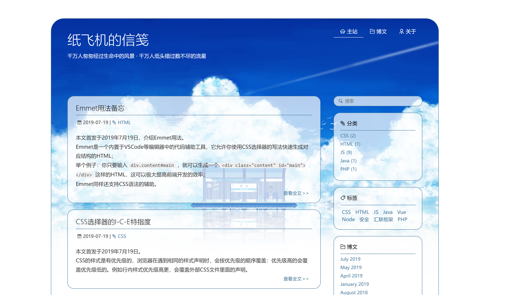
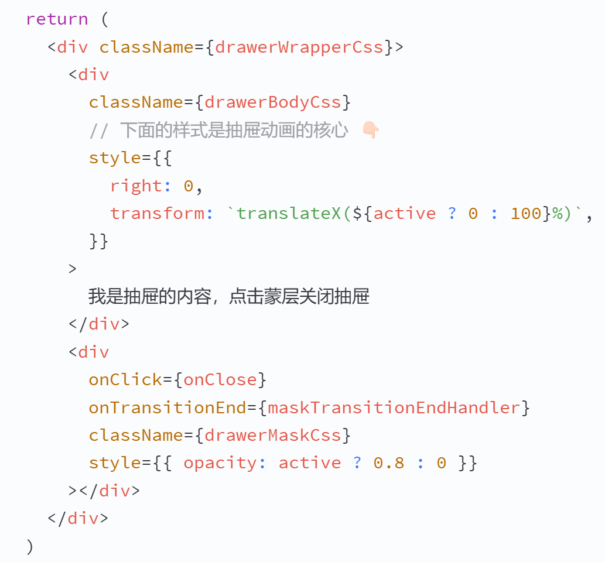
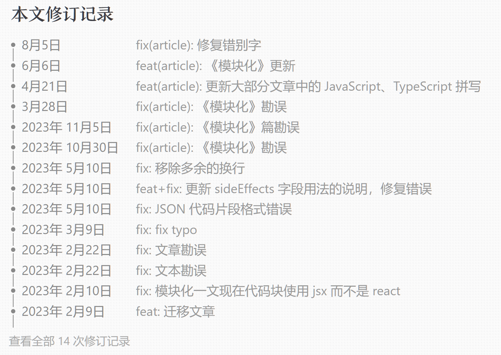

回忆杀，先来张博客 2019 年的截图：



当时使用的是自己修改过的 [BlueLake](https://github.com/chaooo/hexo-theme-BlueLake) 主题，源码现在还在，不过那个时候毕竟刚毕业，没把精力放在这个上面。
（实际上还要早一两年我就在搞这个了，早期的源码丢了，Web Archive 也没索引到，没有截图）

再来张现在的：


新版以实用为主，没有花里胡哨的装饰，但技术含量却要远高于老版。

其实，我的博客 “纸飞机的信笺 PaperPlane.cc” 在近两年做了多次较大的更新改版，现在的外观和体验已经是我比较满意的了。
在更新的过程中，为了各种细节和体验，使用了很多前端、Node.js 以及运维的技能，不过预计以后可能没时间再去更新了，正好趁着年末，做一下 2024 年更新改版总结。

更新：现在又变样了，以最新页面外观为准，2025 年可能还会继续调整样式。


# 博客系统与主题与样式

博客使用 [Hexo](https://hexo.io/) 博客系统，主题是我自己基于默认主题 [landscape](https://github.com/hexojs/hexo-theme-landscape) 修改的，当然改幅度非常大，样式几乎全部重写了。

这里可以说一下选型的目的：
默认的 landscape 主题对响应式、i18n、可访问性等支持都很好，标签具有语义性，就算不直接使用它，用它来作为基础款进行定制，也是很方便的；Hexo 的主题非常多，不过大多数我觉得太过花里胡哨，且和我网站的名字不匹配，最终还是考虑自己实现一套主题。

我对 landscape 主题的主要改动：

- 使用 “归档 Archives” 页面作为主页，因为它就是纯粹的文章列表，不需显示文章预览；
  首页不分页，所有文章在同一页面显示（`per_page: 1000`）；
- 不使用侧边栏，改成底边栏模式（`sidebar: bottom`），并修改源码不显示它；
- 暂不提供搜索功能，关掉了 RSS 功能，不使用 “关于 About” 页面。

这个网站使用了一些较为先进的技术和功能。

举个例子，你有没有注意到，网站标题上的星空图案是可以动的：


它是 Windows 11 新版表示 “流星” 的 emoji 表情，但你使用右键保存后，发现它其实是一张 .png 的图片，这是因为它是一张 APNG 技术的图片，这种格式目的就是为了支持动图，浏览器和大部分系统已经支持了，不过也有一小部分软件比如 QQ 是无法显示为动图的。
（有关各个平台 emoji 的高清图片，建议前往 [EmojiPedia](https://emojipedia.org/)）

更新：这个 Logo 有点抢眼，越来越看不惯，现在已经去掉了。

接下来会讲一下我认为在样式和用户体验方面做的几个比较亮眼的优化。


## 外观

博客外观由我全新设计，有固定悬挂的顶部导航栏，文章列表页和文章页面都使用了类似 “信笺” 的边框，背景使用了类似 “信纸” 的背景图，为了营造出氛围感。

这种 “信纸” 的质感，来源于一张背景图：


我在博客中使用是纯白背景，这里为了看清纹理使用了纯黑背景；它来自于 https://www.transparenttextures.com/ 这个网站。
这种图叫 “pattern” 或者 “循环图”，网上也有不少这种图片库，很适合选取用来当网页背景。

而 “信笺” 边框线，则取自《CSS 揭秘》书中讲到的 CSS 渐变边框技巧，我对它进行了改良和调整，使它看起来非常协调，配色也和信笺很像；
书中的原文：


当然，最沉浸的体验还来源于我博客中常使用的 “衬线字体”，请继续看下一小节。


## 字体

我的博客中，标题文本使用了一种像楷体一样的字体，这种衬线字体看起来和 “信笺” 的主题很匹配，也非常美观，不过考虑到阅读体验没有在正文中使用。

其中：

- 中文字体使用 “[方正颜宋](https://www.foundertype.com/index.php/FontInfo/index/id/214)”（准粗体）；
- 英文字体使用 “[Swift](https://www.foundertype.com/index.php/FontInfo/index/id/3915)”（400）；
- 代码等宽字体使用 “[Source Code Pro](https://fonts.google.com/specimen/Source+Code+Pro)”；
- 正文字体使用 “[霞鹜文楷](https://github.com/lxgw/LxgwWenKai)”。

中文字体有很多好看的衬线体，例如：方正报宋、方正新书宋、方正博雅宋、方正清刻本悦宋体，这些我在 PPT 和网站设计中也都有使用过。

英文字体 Swift 是一种带有衬线且字高几乎相等的字体，阅读体验较好，且衬线字形也方正颜宋非常契合，所以我将其一同使用；
字体特点如下图所示：


有关这部分的字体选择，建议参考知乎字体话题优质用户 “[阿卡林](https://www.zhihu.com/people/a-ka-lin)” 的 [这一篇回答](https://www.zhihu.com/question/28541284/answer/41229062)。

代码字体则是使用一款中规中矩的字体 Source Code Pro，我没有使用自己常用的 Fira Code，因为它过于激进。
有个例子：[`dumi`](https://d.umijs.org/zh-CN) 的文档中，代码字体使用的是 Fira Code，可以自行前往找个组件展开代码看一下效果。

2025 年更新：现在正文字体使用了 “霞鹜文楷” 的 Lite 版本，观感很不错，不过这个字体天生偏小偏细，后续可能会继续调整。

<br />

此外，在博客中使用了若干种文字样式，如下图所示：


在大部分带有背景色的场景，文字均带有 `text-shadow` 并带有白边，体现出 “凸出” 的立体感，优化阅读体验。


## 代码高亮

Hexo 提供两种代码高亮：[Highlight.js](https://highlightjs.org/) 和 [Prism.js](https://prismjs.com/)，可以任选其一。
曾经，我使用 Highlight.js 作为代码高亮，但后来发现，它对 JSX 等语言的支持存在 bug，于是便改用了 Prism.js。

我使用的 Prism.js 代码高亮是 “预处理” 模式，也就是编译阶段就已经把代码文本划分为各个 `<span>` 了，只需要载入样式就能生效；这样的优点显而易见，不需要在浏览器运行任何 JS，都可以正常显示高亮的代码。

在 Hexo 的配置文件中可以定制代码高亮，这里给出我的配置：

```yaml
prismjs:
  enable: true
  preprocess: true
  line_number: false
  tab_replace: ''
  line_threshold: 0
```

不过需要注意的是，Prism.js 不能使用 `vue` 作为语言名，而是只能使用 `html`。

<br />

注意：默认的 Highlight.js 配色，对 JSX 的支持似乎有问题，我在 2022 年就发现了这个问题，到今天依然存在。

这里给出一个 antd 官方文档的 [链接](https://ant-design.antgroup.com/components/upload-cn)，你可以自行前往并展开代码看一下，可以看到其中 JSX 部分显示不对劲，标签名、属性名、属性值，都是同一种颜色。
如图：


实际上，这些地方的 token 是有做区分的，可以通过修改 CSS 来解决这个问题；
我自己就写过 CSS 修正了这个问题，修正后是这样的：



是不是明显比 antd 官方使用的默认 Highlight.js 主题样式要好看多了。

用于修正 Hightlight.js 对 JSX 着色的样式文件，请 [点此链接](https://git.paperplane.cc/chiskat/paperplane-blog/src/commit/8b72493ad9d5b4961ec3d6290d4a54a3bc18f3a2/themes/landscape/source/css/_partial/highlight.styl) 查看。


## 正文段落样式

博客所有文字大小、行距均经过了多次调整，确保提供最佳的阅读体验。

你可能发现了，博客正文的字体偏大，比很多网站都要大，文本和背景的对比度不高，也很少使用纯黑 `#000` 作为颜色；这些都是为了阅读体验，避免视觉疲劳。
我还尝试过调整字间距 `letter-space`，后来发现怎么调都不合适，最后还是使用了默认值。

此外，landscape 主题默认的正文段落是存在问题的：文本、列表、代码块、图片、`-----` 分割线等几种元素，两两之间存在着一些间距不正确的组合；我在实践中发现了部分间距错误，在样式中予以修复了。
可以 [点此链接](https://git.paperplane.cc/chiskat/paperplane-blog/src/branch/main/themes/landscape/source/css/_partial/article.styl) 查看本博客正文部分的样式修复代码。


## 响应式

得益于 landscape 自带的响应式，我只简单的调整了一下样式即可支持小尺寸设备。
考虑到受众，博客目前只提供 PC、平板电脑、手机这三种尺寸作为断点，在非 PC 场景下，会简单粗暴的隐藏很多功能区块。


放一张图吧，可以看到手机模式下，标题居中且导航链接被隐藏，而且日期和标题分成两行显示。


# 细节和用户体验

网站中存在一些细节设计，为了尽可能照顾到最后 1% 的用户体验。


## 大标题返回

首页文章链接是不带 `target="_blank"` 属性的，所以点击后，会直接前往文章正文页面，而不是新开标签；
而在正文页面，点击网站大标题，返回首页后，**仍然能保持在首页时的滚动位置**。

这是因为，网站大标题并不是一个简单的 `<a>`，我为它加上了 JS 代码：

```js
document.getElementById('header-title-txt').addEventListener('click', e => {
  if (window.location.pathname === '/') {
    return
  }

  const referrer = document.referrer || ''
  if (referrer.startsWith(window.location.origin) && history.length > 1) {
    e.preventDefault()
    history.go(-1)
  }
})
```

点击大标题后，会通过 [`document.referrer`](https://developer.mozilla.org/en-US/docs/Web/API/Document/referrer) 这个属性，来判断当前页面的 “来源页”，如果来源页正好是首页，那么会把动作修改为 `history.go(-1)` 也就是 “返回上一页”，这样自然可以保持原先的滚动位置。


## 滚动跳转

点击博文正文页面的 “回信” 和 “修订”，以及页面右侧的目录，可以快速滚动到对应的位置，而不是像锚点跳转一样瞬间跳过去。
原因也很简单，我使用 JS 定制了它们的行为。

实际上，它们的 `<a>` 标签也是带有锚点的，这是为了在完全禁用 JS 的情况下也能正常运行。

以 “修订” 按钮点击后直达页尾的修订记录为例，它的代码如下：

```js
document.querySelector('.article-history-link').addEventListener('click', function (e) {
  e.preventDefault()
  document.querySelector('#history').scrollIntoView({ behavior: 'smooth' });
})
```

这里使用到了 [element.scrollIntoView()](https://developer.mozilla.org/en-US/docs/Web/API/Element/scrollIntoView) 这个 API，注意参数 `behavior: 'smooth'`，使用它可以实现平滑滚动。

你可能有疑问：网站顶部有一个 `fixed` 悬挂的导航栏，如果需要滚动到某个元素的位置，这个元素不是正好被顶部导航栏挡住吗？
就像这样：


为什么我的博客不会有这个问题，甚至禁用 JS 后依然能准确滚动？

你可以在浏览器 F12 调试时选中修订记录区块，可以看到：


这里给它加上了 `scroll-margin-top: 100px;` 这个属性，而这个 `100px` 就是网页顶部导航栏的高度。

滚动到某个元素时，如果需要滚动到的位置和它自身的区域不匹配，可以使用 [`scroll-margin-top`](https://developer.mozilla.org/en-US/docs/Web/CSS/scroll-margin-top) 这个属性来定制。
例如网站本身有 `fixed` 悬挂的导航栏，或是滚动的目标元素本身有脱离文档流的额外尺寸，那么就可以给这个元素加上 `scroll-margin-top`。


## 首页年份数字

此外，博客首页上的年份数字，也是利用了 CSS 的 `position: sticky` 布局，实现了年份的动态悬挂：


这个样式已经出来有一段时间了，目前已经得到了广泛支持；以后如果想要这种效果，可以少写很多 JS 代码了。


# CDN

博客现在已经开启了全站资源上传 CDN，如图所示：


当然这里有个错误示范，CDN 的域名一定要和主站域名区分开，避免 Cookies 传输浪费流量，我不想花钱买域名就没有做。

Hexo 博客原生支持上传 S3 部署。但是我这里使用的是自有云服务器主机部署，域名是区分开的，所以需要用到插件。

你可以在 [这里](https://git.paperplane.cc/chiskat/paperplane-blog/src/branch/main/scripts/hexo-deployer-s3/hexo-deployer-s3.js) 找到博客源码中上传 S3 的插件代码，源自 GitHub 上的某个插件，我为它更换了最新的 S3 SDK，提供了跳过 HTML、跳过字体文件等配置项。另外也可以通过 CI/CD 来完成上传 S3，但我考虑到灵活度这一问题，没有使用 CI/CD 来做上传操作。

此外，还需要对博客中的 CSS、JS、图片等资源进行源站链接替换，把源站链接替换成 CDN 的域名，这需要用到 [`hexo-cdnify`](https://www.npmjs.com/package/hexo-cdnify) 这个插件，安装后，还需要在 `_config.yml` 中对它进行配置。
这里贴出我的配置：

```yaml
cdn:
  enable: true
  base: https://cdn.paperplane.cc/paperplane-blog/
  tags:
    'img[src]':
      attribute: src
      callback: > 
        function(imgSrc) {
          return imgSrc.replace('//cdn.paperplane.cc/images', '//cdn.paperplane.cc/paperplane-blog/images')
        }
```

这也是官方示例推荐的，这段代码可以用于对图片进行链接替换。同理，它也可以用于视频等元素。


# 我开发的 Hexo 插件

Hexo 提供了插件开发 API，以下是我基于此自行开发的功能。


## 文章修订记录

每篇博文底部会有修订记录，如下图：



一眼就能看出，这是文章的 Git 提交记录。
我觉得， 把修订记录保留在文章页，可以显得文章更加真实，也方便读者溯源。

生成提交记录，有两种方式：

- 使用能读取 Git 提交记录的工具，例如：[`simple-git`](https://www.npmjs.com/package/simple-git)，这个操作必须在 Hexo 博客的生成时执行，需要开发一个 Hexo 插件；
- 使用 Git 站点的 API，比如 GitHub 的 API，我使用 Gitea 也提供 API 读取提交记录，这种方式既可以在 Hexo 博客生成时执行（需要开发 Hexo 插件），也可以在读者的浏览器上执行（需要在读者浏览器上发请求）。

最终我选择了后者，并开发了一个 Hexo 生成时插件，在生成博客时读取 Gitea 的 API 获取提交记录，并写入博文页面。
可以 [点此前往](https://git.paperplane.cc/chiskat/paperplane-blog/src/branch/main/scripts/hexo-post-history/hexo-post-history.js) 插件代码页面。

这个插件还支持配置，在文章 .md 文件的头部属性栏，加上 `history: 0` 即可关闭这篇文章的修订记录功能；
如果担心修订记录太长，把数字 `0` 改成其他一个数字，即可限制修订记录显示的最大条目数。


## 文章页面短链接

可以看到每篇博文正文，都有一个 “短链” 项，点击后还可以自动复制到剪贴板：


这个短链接功能，是我自己做的一个 Node.js 上的基于 [Nest.js](https://nestjs.com/) 的的后端项目 [`paperplane-api`](https://git.paperplane.cc/chiskat/paperplane-api) 提供的一个功能，它基于 Redis 和 PostgreSQL 来持久化记录短网址信息。

同样，也需要为 Hexo 开发一个插件，在生成博客期间访问 `paperplane-api`，调用它的 API 来生成短链接，并写入到博客正文页面；这个过程需要鉴权，所以会使用一些加密的环境变量。
可以 [点此前往](https://git.paperplane.cc/chiskat/paperplane-blog/src/branch/main/scripts/hexo-short-url/hexo-short-url.js) 插件代码页面。


# 目录功能

Hexo 本身是具有目录功能的，但是，landscape 主题没有使用到，甚至在 Hexo 文档中也藏的特别深，在 [这个页面](https://hexo.io/zh-cn/docs/helpers#toc)。
我好不容易找到文档，才最终通过 Hexo 本身的目录功能，结合自行设计的 CSS 样式，为博客正文页面添加了目录功能。
如图：


目录会收录一级和二级标题；目录也具有响应式，全文内容较长时，目录区域会出现滚动条，在较小尺寸的屏幕上，目录显示会变窄并出现省略符号，屏幕尺寸特别小时，目录会隐藏。
点击目录项，会立即滚动到对应的位置；点击目录中的标题文字，则会立即滚动到页首。

此外，我还为目录功能提供了配置功能：在文章 .md 文件的头部属性栏中加入属性 `no_toc: true`，即可禁用此文章的目录功能。


# 评论区

曾经，我想使用 [Disqus](https://disqus.com/) 或 [GitTalk](https://gitalk.github.io/)，但是考虑到国内的网络环境，最终没有选择它们。

博客评论区基于 [Valine](https://valine.js.org)，这也是 Hexo 提供的默认评论工具，它连接到 [LeanCloud](https://leancloud.app/)，基于它提供的 BaaS 来存储评论信息；评论区的样式也进行了一定的调整，使它符合博客的主题外观。

注意 LeanCloud 必须使用海外版，我提供的也是海外版的链接，国内版只能在已备案的网站上使用；
而且，LeanCloud 服务的域名不能直接使用，必须用 CNAME 解析成自己的域名。
以下是我的博客使用的域名 `comment.paperplane.cc`：


不过，Valine 的功能还是太过简单，我已经找到更适合的评论系统——[ArtTalk](https://artalk.js.org/)，它可以由自己部署和管理，功能更加强大，后续会更新博客代码替换掉。


# SEO

得益于 landscape 主题，网站具备一定的 SEO 标签；我在定制的过程中，也使用了一些语义化标签。

不过，百度对未备案网站的索引态度极度消极，尤其是我这种非大陆 IP 的未备案小网站；
但谷歌的收录却很不错，有一些关键词甚至排在搜索页很靠前的位置，每个月我都能收到谷歌推送的邮件。
相关链接：[百度站长平台](https://ziyuan.baidu.com/)、[Google Search Console](https://search.google.com/search-console)。

<br />

此外，博客的 CI/CD 流程中，还加入了向百度提交站点链接的步骤：

```bash
curl -s -H 'Content-Type:text/plain' --data-binary @sitemap.txt "http://data.zz.baidu.com/urls?site=https://paperplane.cc&token=$BAIDU_ZHANZHANG_TOKEN"
```

不过，目前百度对未备案网站似乎不提供 API 推送链接的额度，一直提示我没有额度了。

<br />

**关于网站地图：**

使用 [`hexo-generator-sitemap`](https://www.npmjs.com/package/hexo-generator-sitemap) 插件，可以为 Hexo 博客生成 SiteMap，有 XML 和 TXT 两种格式，本站已经开启。
注意使用这个插件需要在根目录放置两个模板文件，按照其官方文档即可，可以参考本博客的源代码。

<br />

**关于访问统计：**

网站置入了百度统计和 Google 统计相关的 JS SDK。
注意 Hexo 原生提供 Google 统计的配置项，直接修改配置就可以，不需要自己手动修改源码。
