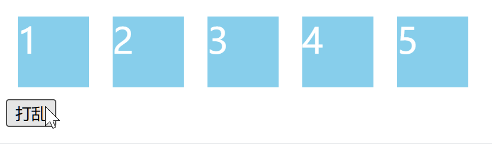

建议先阅读 [《FLIP 动画与实现原理》](https://paperplane.cc/p/3539b7731629/) 这篇博文。

本文从实战开发入手，分析在 React 中控制过渡动画的 “调度” 操作；下文还会介绍 `react-transition-group` 库，它用于**组织**过渡动画。


# 用 React 简单实现模态框

我在 [《CSS 开发的优良习惯、技巧与避坑》](https://paperplane.cc/p/841100bcbf06/) 这篇博文中提到一个 “完善” 的模态框应该是怎样的。本文只考虑过渡动画这方面，不考虑其他功能是否完善。

先提出需求——一个模态框，要有蒙层，且点击蒙层可以关闭模态框。

组件代码：

```tsx
interface IDialogProps {
  show?: boolean
  onClose?: () => void
  children?: ReactNode
}

/** 模态框组件 */
function Dialog(props: IDialogProps) {
  const { show, onClose, children } = props

  const component = (
    <div className="mask" onClick={onClose}>
      <div className="dialog">{children}</div>
    </div>
  )

  return createPortal(show ? component : null, document.body)
}
```

配套的样式代码：

```css
.mask {
  position: fixed;
  top: 0;
  bottom: 0;
  left: 0;
  right: 0;
  background-color: rgba(0, 0, 0, 0.5);
  display: flex;
  align-items: center;
  justify-content: center;
}

.dialog {
  display: inline-block;
  background-color: white;
  padding: 10px 20px;
  border-radius: 10px;
}
```

组件代码中，使用两层 DOM 分别管理蒙层和模态框内容，这是推荐的做法；还使用 `createPortal()` 将组件 DOM 发送到 `<body>` 内显示，这样可以避免层级覆盖问题。

使用以下这个代码测试使用此组件：

```tsx
export default function App() {
  const [show, setShow] = useState(false)

  return (
    <div>
      <Dialog show={show} onClose={() => void setShow(false)}>
        我是模态框内容
      </Dialog>

      <button onClick={() => void setShow(t => !t)}>切换</button>
    </div>
  )
}
```

效果如下：


这样我们成功实现了模态框的切换显示，但是，这个过程太突兀，没有任何过渡动画。
接下来，我们可以尝试给组件加上过渡动画。

-----

模态框的状态只有 “显示” 和 “隐藏” 两种，似乎没法设置过渡，最容易想到的就是 `opacity` 透明度了，我们可以让模态框在出现和消失时，执行一个缓慢的 “渐变” 的动画。

我们给外层的蒙层元素加上 CSS 过渡：

```css
.mask {
  transition: opacity 500ms;
  opacity: 1;
}
```

这样看似是可行了，但你可以实际尝试一下，这样并不会使得元素出现过渡动画。
还是这样子：


这是因为，组件需要经历 `opacity` 从 `0` 到 `1`（或者反过来）这个过程，才能应用过渡；
**而我们模态框的出现和隐藏，是直接附加和移除 DOM，这个过程完全不存在 `opacity` 的变动。**

> 通俗一点讲：
> 浏览器发现代码造出一个设置了 `opacity: 1` 的 `<div>`，就直接把它显示在屏幕上了，这似乎并不需要播放任何过渡动画，因为不存在任何样式的更新；
> 而移除掉 DOM 时，浏览器立刻在屏幕上把这个元素消除掉，这也不需要任何过渡动画。

图示如下：


为了让过渡能够产生，我们可以让 DOM 始终存在，也就是说组件不会再 `return null` 了。
此时，关闭模态框时，可以给组件应用以下样式：

```css
.hide {
  opacity: 0;
  visibility: hidden;
}
```

这里必须加上 `visibility: hidden`，不然即使组件处在隐藏状态时，透明度为 `0` 但蒙层还是盖在页面上的，会导致页面无法点击。

此后，通过 JS 控制这个类名：

```tsx
function Dialog(props: IDialogProps) {
  const { show, onClose, children } = props

  const component = (
    <div className={'mask' + (show ? '' : ' hide')} onClick={onClose}>
      <div className="dialog">{children}</div>
    </div>
  )

  //                  ↓ 这没有三目运算符了
  return createPortal(component, document.body)
}
```

这样以来，`opacity` 的过渡可以正常完整显示了。

运行后的效果：


-----

可以看到，模态框出现时候有渐变过渡动画，但是，**没有消失动画**。

这是因为，模态框设为隐藏后，`visibility: hidden` 瞬间被附加上，组件立即被隐藏，**没有一个时间区间用来播完这 500ms 的过渡动画**。
示意图：


<br />

有一种方法，就是使用两个变量来控制样式，另一个变量延迟 500ms 再变动，为渐出过渡 **“预留”** 出播放时间。

代码如下：

```tsx
function Dialog(props: IDialogProps) {
  const { show, onClose, children } = props

  const [delayedShow, setDelayedShow] = useState(!!show)

  // 状态 setDelayedShow 和 show 联动
  // 他们会同时开启，但关闭时 setDelayedShow 会延迟 500ms
  useEffect(() => {
    if (show) {
      setDelayedShow(true)
    } else {
      setTimeout(() => void setDelayedShow(false), 500)
    }
  }, [show])

  const component = (
    <div
      className="mask"
      onClick={onClose}
      style={{
        // 透明度是随组件显示切换的
        opacity: show ? 1 : 0,
        // 但可见状态会在组件关闭后延迟 500ms 后关闭
        visibility: delayedShow ? 'visible' : 'hidden',
      }}
    >
      <div className="dialog">{children}</div>
    </div>
  )

  return createPortal(component, document.body)
}
```

这样做之后，`visibility` 会等待 500ms 到 `opacity` 变成 `0` 再设为 `hidden`，过渡动画就可以产生了。
示意图：


运行代码，效果是这样的：


这样显示和隐藏的动画就都能显示了。

此时我们可以把 CSS 中的 `.hide` 移除掉，因为我们直接使用内联样式了。

-----

上述这种方式，模态框设为隐藏状态后，DOM 还是留存状态的。
更好（也是必须）的做法，是在模态框隐藏后，就移除掉它的 DOM，也就是把 `component` 改为 `null`。

为了让过渡动画能正常产生，可以这样尝试：
**组件 DOM 出现时，就带着 `opacity: 0` 属性，然后立刻将这个属性删去，这样就能产生透明度从 0 到 1 的过渡动画了。**

如图所示：


而且，我们需要在模态框关闭时，等待若干毫秒，等到模态框消失的渐出过渡动画播放完毕，再把 DOM 移除掉；
此时，我们要做的事是这样：

- **模态框打开时，先把 `opacity: 0` 的 DOM 放入页面；**
  **马上把 `opacity: 0` 这个样式删掉，让浏览器产生渐入显现的过渡动画；**
- **模态框关闭时，先把 `opacity: 0` 设置好，让浏览器开始渐出消失的过渡动画；**
  **此时需要等到 500ms 让过渡播放完毕，然后把 DOM 移除掉。** 

也就是说：

- 打开模态框时，DOM 变量变成 `true` 时模态框就要已经带着 `.hide` 类名，稍微延迟一点马上去掉 `.hide` 类名；
  （第二步可以看做一个延迟为 `0` 的定时器）
- 关闭模态框时，先给模态框加上 `.hide` 类名，然后等待 500ms 过渡动画完成，再将 DOM 变量设为 `false`。
  （第二步可以看做一个延迟为 `500` 的定时器，值取决于过渡动画的持续时间）

按照上述方式，将状态控制的部分修改为：

```ts
useEffect(() => {
  if (show) {
    setDelayedShow(true)
  } else {
    setTimeout(() => void setDelayedShow(false), 500)
  }
}, [show])
```

然后，直接去掉 `visibility` 样式的设置，并把最后一行代码修改为：

```tsx
return createPortal(delayedShow ? component : null, document.body)
```

这样修改之后，在模态框设为隐藏时，DOM 会被移除掉。

但是，实践之后我们会发现，过渡动画失效了。

如果读过我之前那篇博文，那么你一定能反应过来，**原因是 `useEffect()` 实际上是在依赖项变动并导致触发更新之后才执行回调的**；
因此，`delayedShow` 变成 `true` 的时间点很晚，也就是 `opacity` 变成 `1` 之后组件 DOM 才会出来，自然没有过渡动画。

<br />

解决方式很简单，我们可以让 `opacity` 的切换比 `delayedShow` 更晚即可。

将代码调整为：

```tsx
function Dialog(props: IDialogProps) {
  const { show, onClose, children } = props

  const [delayedShow, setDelayedShow] = useState(!!show)
  // 此处仅仅是简化代码行数
  useEffect(() => void setTimeout(() => void setDelayedShow(!!show), show ? 0 : 500), [show])

  const component = (
    <div
      className="mask"
      onClick={onClose}
      style={{
        // 注意这里的 opacity 采用“且”关系
        opacity: show && delayedShow ? 1 : 0,
        // visibility 的控制代码可以直接删除了
      }}
    >
      <div className="dialog">{children}</div>
    </div>
  )

  // 注意这里组件 DOM 的显示，采用“或”关系
  return createPortal(delayedShow || show ? component : null, document.body)
}
```

注意 `opacity` 处必须使用 “且” 关系来设置开启状态，因为 `useEffect()` 的回调始终在 DOM 变更后才触发，所以 `delayedShow` 变成开启状态始终会 “慢一步” 生效，而此时必须让它的生效比 `component` 更慢，使用 “且” 就能实现对变量 `delayedShow` 开启的 “等待” 操作。

也正因如此，`component` 处必须使用 “或” 关系，这样它的开启触发时机和 `show` 一样，会更早一些，它的生效时机才能够 “容纳” 上面的 `opacity` 的时机。

经过这样的调整，模态框的显示和隐藏动画就正常了：


而且我们这个模态框的实现相对比较 “完善”，在关闭时，DOM 也会被移除，不会有残留。

-----

**总结：**

- ① 想要触发元素的过渡动画，必须让浏览器检测到元素的样式属性发生改变，为了保证这一点，这期间过渡元素的 DOM 需要持续存在；
- ② 如果 DOM 一开始不存在，比如模态框已关闭，那么 DOM 在被插入文档时，它带有的样式是不能产生过渡动画的，还必须在它被插入文档后再修改一次样式属性，这才能触发过渡动画；
- ③ 想移除 DOM 时播放过渡动画，比如模态框的关闭过渡动画，那么不能马上移除 DOM，必须给过渡动画 “预留” 出时间，执行完过渡动画后，再移除掉 DOM。

你可能也看出了，过渡动画必须通过一系列方式组织调度，否则可能无法生效。
这也体现出了本文的主题——“组件过渡动画的**调度**”。


# React 封装一个过渡调度 hook

根据上面的逻辑，我们可以为模态框组件封装一个 hook，用以管理组件 DOM 和过渡样式的变换。

给他命名为 `useToggleTransitionState()`，它接受一个布尔参数、以及一个表示延迟毫秒数的参数，然后它会返回 “过渡状态” 和 “DOM 状态”，后者始终会等待前者变完之后，才会跟着变动。

具体来说：
① 切换为 `true` 时，“过渡状态” 仅仅比 “DOM 状态” 慢一帧，用于在 DOM 出现后触发渐入动画；
② 切换为 `false` 时，“DOM 状态” 会在延迟若干毫秒后切换，为渐出动画预留出播放时间。

代码如下：

```ts
function useToggleTransitionState(toggleState: boolean, delay: number) {
  const [delayedState, setDelayedState] = useState(!!toggleState)

  useEffect(() => {
    const timerId = setTimeout(() => void setDelayedState(toggleState), toggleState ? 0 : delay)
    return () => void clearTimeout(timerId)
  }, [toggleState, delay])

  const transitionState = toggleState && delayedState
  const domState = toggleState || delayedState

  return [transitionState, domState]
}
```

此后，可以使用这个 hook 来包装表示模态框显示与否的 `show` 状态：

```tsx
function Dialog(props: IDialogProps) {
  const { show, onClose, children } = props

  // 第一个元素是 “过渡状态”，第二个元素是 “DOM 状态”
  const [transitionState, domState] = useToggleTransitionState(!!show, 500)

  const component = (
    //                                                        ↓ 此处是“过渡状态”
    <div className="mask" onClick={onClose} style={{ opacity: transitionState ? 1 : 0 }}>
      <div className="dialog">{children}</div>
    </div>
  )

  //                  ↓ 此处是“DOM 状态”
  return createPortal(domState ? component : null, document.body)
}
```

运行时的效果如下：


这样一来，模态框的过渡状态得以完美生效，且代码组织也非常简单，只需要引入这个 hook 即可。

这就是一种对状态过渡的 “调度”，也是本文的核心要点之一。


# React 封装一个过渡调度的组件

我们还可以让封装的工具 “更进一步”，直接提供一个组件来接管模态框。

提供一个组件 `<ToggleTransition>`，可以用于包裹模态框等需要切换过渡状态的组件。
代码如下：

```tsx
interface IToggleTransitionProps {
  state?: boolean
  activeStyle?: CSSProperties
  inactiveStyle?: CSSProperties
  transition?: CSSProperties['transition']
  children?: ReactElement
}

const noop = () => {}

function ToggleTransition(props: IToggleTransitionProps) {
  const { state, activeStyle, inactiveStyle, transition, children } = props

  const [transitionState, setTransitionState] = useState(!!state)
  const [domState, setDomState] = useState(!!state)
  const [transitionEndCallback, setTransitionEndCallback] = useState(() => noop)

  // 细节 ①，此处使用 useLayoutEffect
  useLayoutEffect(() => {
    if (state) {
      // 立即放置 DOM
      setDomState(true)
      // 从下一帧开始，设置开启状态
      // 细节 ②，此处使用 requestAnimationFrame
      requestAnimationFrame(() => void setTransitionState(true))
      // 清除回调
      setTransitionEndCallback(() => noop)
    } else {
      // 立即设为关闭状态
      setTransitionState(false)
      // 设置回调，它将在动画播放完毕后触发，移除子组件 DOM 并清空回调
      setTransitionEndCallback(() => () => {
        setDomState(false)
        setTransitionEndCallback(() => noop)
      })
    }
  }, [state])

  if (!children || !domState) {
    return null
  }

  return cloneElement(children, {
    // 合并样式
    style: {
      ...children.props.style,
      transition,
      ...(transitionState ? activeStyle : inactiveStyle),
    },
    // 细节 ③，使用 transitionend 事件
    onTransitionEnd: transitionEndCallback,
  })
}
```

从代码中可以看出，我们把样式提取为参数并单独传入，然后在组件内控制 DOM 和过渡样式的应用。
这也是一种利用组件对过渡动画进行 “调度” 的操作。

<br />上述代码中，相比于之前封装的 hook，存在着几处细节优化：
细节 ①，使用 `useLayoutEffect()` 可以让过渡从这一帧的绘制时就开始执行，具体原理请参阅  [《FLIP 动画与实现原理》](https://paperplane.cc/p/3539b7731629/) 一文；
细节 ②，使用 `requestAnimationFrame()` 来取代 `setTimeout()`，原因和原理同 ①；
细节 ③，过渡执行完成后，浏览器会触发元素的 [`transitionend`](https://developer.mozilla.org/en-US/docs/Web/API/Element/transitionend_event) 事件，我们直接监听这个事件并以它作为过渡执行完毕的信号，这样就不需要手动设置 `delay` 了。

<br />使用这个组件后，我们可以从 CSS 文件中 `.mask` 样式中移除掉 `transition` 和 `opacity`，改为使用组件属性来提供这些样式。
只需要把模态框放置于组件中，代码如下：

```tsx
function Dialog(props: IDialogProps) {
  const { show, onClose, children } = props

  return createPortal(
    <ToggleTransition
      state={show}
      transition="opacity 500ms"
      inactiveStyle={{ opacity: 0 }}
    >
      <div className="mask" onClick={onClose}>
        <div className="dialog">{children}</div>
      </div>
    </ToggleTransition>,
    document.body
  )
}
```

可以看出，代码得到了极大的简化，而且语义也很明确。

代码中设置了 `transition` 过渡为 `"opacity 500ms"`，视同于设置这一条样式，为透明度的变化设置 500ms 的过渡；然后我们指定了 `inactiveStyle`，它表示组件即将消失时候透明度变成 `0`。

这样，组件便会根据 `state` 的值来显示或隐藏子元素，并自动调度过渡，使得 DOM 和过渡动画完美协调；
效果如下：


# Vue 提供的过渡调度

以下内容基于 Vue 3。

Vue 提供了两个内置组件，它们可以用于调度过渡动画：

- [`<Transition>`](https://cn.vuejs.org/guide/built-ins/transition.html) 组件用于调度单个组件的过渡样式，方式是控制组件的 `class` 类名，在特定的时机切换类名，它的做法和我们上面的代码类似；
- [`<TransitionGroup>`](https://cn.vuejs.org/guide/built-ins/transition-group.html) 组件用于对列表元素进行过渡，使得元素进入、移出都能产生过渡动画，还可以实现 FLIP 动画等效果。


## 内置组件 `<Transition>`

我们用 Vue 来实现上面的模态框的需求，先来一个最基础版本的：

```html
<template>
  <div v-if="props.show" className="mask" @click="close">
    <div className="dialog">
      <slot></slot>
    </div>
  </div>
</template>

<script setup>
const props = defineProps({ show: Boolean })

const emit = defineEmits(['close'])

const close = () => {
  emit('close')
}
</script>

<style scoped>
.mask {
  position: fixed;
  top: 0;
  bottom: 0;
  left: 0;
  right: 0;
  background-color: rgba(0, 0, 0, 0.5);
  display: flex;
  justify-content: center;
  align-items: center;
}

.dialog {
  display: inline-block;
  background-color: white;
  padding: 10px 20px;
  border-radius: 10px;
}
</style>
```

使用这个组件的测试代码：

```html
<template>
  <button @click="toggle">切换</button>
  <Dialog :show="show" @close="close"> 我是模态框内容 </Dialog>
</template>

<script setup>
import { ref } from 'vue'
import Dialog from './components/Dialog.vue'

const show = ref(false)

const toggle = () => {
  show.value = !show.value
}

const close = () => {
  show.value = false
}
</script>
```

效果如下：


<br />

然后，我们使用组件 `<Transition>` 来调度组件的过渡。

它的使用非常简单，只需要用此组件包裹模态框的模板代码即可：

```html
<template>
  <Transition>
    <div v-if="props.show" className="mask" @click="close">
      <div className="dialog">
        <slot></slot>
      </div>
    </div>
  </Transition>
</template>
```

然后，添加样式：

```html
<style scoped>
.v-enter-active,
.v-leave-active {
  transition: opacity 500ms;
}

.v-enter-from,
.v-leave-to {
  opacity: 0;
}
</style>
```

Vue 的 `<Transition>` 组件会根据子组件的 `v-if` 的显示与否，自动为我们调度这些类名的附加与否，实现对组件样式过渡的调度控制。

关于过渡过程中附加的几个类名，Vue 官网给出的示意图是这样的：


我觉得官网这个图具有误导性，建议直接看 Vue 官网文档中图片底下的 [文字](https://cn.vuejs.org/guide/built-ins/transition#transition-classes)，文字描述更准确。

具体而言：

- ①，在组件的 DOM 被插入的整个过渡期间都会带有 `v-enter-active` 类名；
  DOM 被移除时也是一样，过渡期间带有 `v-leave-active` 类名；
- ②，组件 DOM 被插入时带这 `v-enter-from` 类名，插入 DOM 后的下一帧这个类名就没了，变成了 `v-enter-to`，直到过渡动画完成；
  DOM 被移除时也是一样，在开始过渡时会被设置 `v-leave-from` 类名，从下一帧开始这个类名就没了，变成了 `v-leave-to` 直到过渡动画完成；
- 速记：开始过渡时是 `-active` 和 `-from` 类名，然后从下一帧开始直到过渡结束都是 `-active` 和 `-to` 类名。
  （总之 `-from` 只有一瞬间）

我自己画的示意图：     


<br />

上面的 ①，对应了这一段样式：

```css
.v-enter-active,
.v-leave-active {
  transition: opacity 500ms;
}
```

这样确保了只有过渡期间才会应用这一段样式，避免了污染。

我们写的另一段样式是这样的：

```css
.v-enter-from,
.v-leave-to {
  opacity: 0;
}
```

注意这两个类名，其中的 `-from` 或 `-to` 后缀必须写对。
解释：

- 模态框出现时，携带有 `v-enter-from` 类名以至于透明度为 0，但出现的下一帧马上 `v-enter-from` 被移除，这样 “从 0 到 1” 的渐入过渡动画得以开始；
- 模态框消失时，从触发后的第二帧开始一直带有 `v-leave-to` 直到过渡完成，这期间透明度一直为 0，可以保证 “从 1 到 0” 的渐出动画被完整播放；你可能发现了，这个 `v-leave-to` 换成 `v-leave-active` 也是可以的。

示意图：


渐出动画同理，此处就不额外作图了。

<br />

按照上文代码正确设置了样式后，组件的过渡动画就会生效：


可以看出，Vue 的 `<Transition>` 组件和我们自己实现的组件功能上非常相似，只不过，我们自己实现的组件是基于 `style` 来控制样式，而这个组件是基于 `class` 类名的。


## 内置组件 `<TransitionGroup>`

以上是 `<Transition>` 组件的用法，下面来讲一讲 `<TransitionGroup>` 组件。
我们可以简单理解成：

- `<Transition>` 适用于通过 `v-if` 来切换的组件；
- `<TransitionGroup>` 适用于通过 `v-for` 来列出的列表项。

对于列表项而言，它存在着增、删、排序这几种变动，`<TransitionGroup>` 会这样组织它们：

- 对于列表新增或删除的元素，会使用和 `<Transition>` 相同的方式组织它的渐入或渐出过渡；
  此时也是使用 `v-enter-form` 之类的类名附加到子元素上；
- 对于列表元素顺序发生改变，会应用 “FLIP 动画”，让过渡变得非常直观和协调；
  **列表元素被移动的期间，会被附加上 `v-move` 这个类名，这是新增的一个类名。**

给出一个随机打乱列表元素的示例：

```html
<template>
  <TransitionGroup style="display: flex" tag="div">
    <div class="box" v-for="item of list" :key="item">
      {{ item }}
    </div>
  </TransitionGroup>
  <button @click="shuffle">打乱</button>
</template>

<script setup>
import { reactive } from 'vue'

const list = reactive([1, 2, 3, 4, 5])
const shuffle = () => void list.sort(() => Math.random() - 0.5)
</script>

<style scoped>
.box {
  width: 60px;
  height: 60px;
  background-color: skyblue;
  color: white;
  font-size: 30px;
  margin: 10px;
}
.v-move {
  transition: all 2s;
}
</style>
```

实现上述样式后，Vue 会自动对子元素应用 FLIP 动画，最终效果如下：



再次建议没看过 [《FLIP 动画与实现原理》](https://paperplane.cc/p/3539b7731629/) 这篇博文的读者点击阅读。


# 使用 `react-transition-group` 组织过渡动画

Vue 的 `<Transition>` 和 `<TransitionGroup>` 内置组件固然好用，但如果我们选用 React 来作为开发工具，就无法利用这些组件。

推荐使用 [`react-transition-group`](https://reactcommunity.org/react-transition-group/) 这个包。
它是专为 React 准备、用于调度 CSS 过渡动画而开发的，作用和 Vue 上述两个内置组件相似。

```bash
yarn add react-transition-group
yarn add -D @types/react-transition-group
```

它提供了四个组件：

- **[`<Transition>`](https://reactcommunity.org/react-transition-group/transition)**
  提供对组件显示与否的状态值的高级包装，可以基于此回调参数来更精细的控制组件的渲染和过渡；
- **[`<CSSTransition>`](https://reactcommunity.org/react-transition-group/css-transition)**
  类似于 Vue 的 `<Transition>`，通过类名 `className` 的方式跟踪并调度组件的过渡动画；
- **[`<SwitchTransition>`](https://reactcommunity.org/react-transition-group/switch-transition)**
  它实现了 Vue 的 `<Transition>` 的 `mode` 属性的功能，用于在子元素切换时编排过渡动画的顺序；
- **[`<TransitionGroup>`](https://reactcommunity.org/react-transition-group/transition-group)**
  类似于 Vue 的 `<TransitionGroup>`，但它只提供了对增删元素的过渡控制，不支持 FLIP 动画。

在下文中，我们将继续使用上面模态框的 Demo 代码，对这些组件进行介绍。


## 组件 `<Transition>`

这个组件类似于我们上面自己实现的 `<ToggleTransition>` 组件，它基于一个布尔值状态，并包装为一个更高级的状态。

具体而言，它把组件的过渡分为了 **“渐入”**、**“渐出”** 这两种情况，通过一个参数 `in` 来切换。
（我们自己写的组件则是叫 `show` 属性）

然后，它的子组件是一个回调函数，其参数 `state` 可取值为：

- 渐入中 `"entering"`：属性 `in` 变为 `true` 后，过渡动画播放期间为此值；
- 已渐入 `"entered"`：在渐入过渡动画播放完毕后一直保持此值；
- 渐出中 `"exiting"`：属性 `in` 变为 `false` 后，过渡动画播放期间为此值；
- 已渐出 `"exited"`：在渐出过渡动画播放完毕后一直保持此值。

它的取值变化如下图：


开发者需要根据这个 `state` 属性来写判断条件，手动设置组件的样式。
（我们自己写的组件通过 `cloneElement()` 来自动设置子组件的样式）

开发者需要指定 `nodeRef` 指向子组件的 DOM 元素。
（我们自己写的组件直接通过 `props.children` 访问子元素）

开发者需要提供使用 `timeout` 参数来指定过渡的持续时间（毫秒数），它还支持 [对象格式](https://reactcommunity.org/react-transition-group/transition#Transition-prop-timeout)；
或者额外提供一个 `addEndListener` 方法属性，参数签名 `(done: Function) => void`，这样我们可以自己写代码，使用 `transitionend` 等事件来监听子元素的过渡动画完成，然后调用 `done()` 告诉组件过渡完成了。
（我们自己写的组件直接通过 `transitionend` 事件自动监听过渡的结束，无需其他配置）

和我们写组件不同的是，这个组件默认不会在 `in` 参数切换后移除或附加 DOM；
你可以理解成：**“这个组件默认认为子元素始终存在，而不是像模态框这种有时可能没有 DOM”**，所以如果在模态框中使用此组件，需要额外的配置：

- 默认情况下，子组件 DOM 是持续留存的，不会随着 `in` 的开关而被移除；
  如果想让 `in` 在开启时挂载子组件，关闭时移除子组件，则需要开发者同时开启 `mountOnEnter` 和 `unmountOnExit` 属性；
- 子组件初次挂载时也是默认不会执行 “渐入” 过渡的，这需要开发者开启 `appear` 属性。

<br />

我们使用这个组件来包装之前写的模态框组件，先去 CSS中删掉 `opacity` 和 `transition` 相关属性；
然后，将组件代码改写为：

```tsx
import { Transition } from 'react-transition-group'

function Dialog(props: IDialogProps) {
  const { show, onClose, children } = props

  const nodeRef = useRef(null)

  return createPortal(
    <Transition nodeRef={nodeRef} in={show} timeout={500} mountOnEnter unmountOnExit>
      {state => (
        <div
          ref={nodeRef}
          className="mask"
          onClick={onClose}
          style={{
            // 这里来区分组件的“显示状态”
            opacity: state === 'exiting' || state === 'exited' ? 0 : undefined,
            // 这里来区分组件是否处于“过渡中”
            transition: state === 'entering' || state === 'exiting' ? 'opacity 500ms' : undefined,
          }}
        >
          <div className="dialog">{children}</div>
        </div>
      )}
    </Transition>,
    document.body
  )
}
```

保存代码后，页面中的模态框组件就可以正确应用过渡动画了：


## 组件 `<CSSTransition>`

这个组件基于上面的 `<Transition>` 组件，继承了所有参数和用法，重复的参数就不赘述了；
此组件非常类似于 Vue 的内置组件 [`<Transition>`](https://cn.vuejs.org/guide/built-ins/transition)，它通过调度 **类名** 来调度 CSS 过渡。

最重要的就是 `classNames` 参数，注意最后有一个字母 `s`；这个参数和 Vue 内置组件 `<Transition>` 的 `name` 的含义相同，用于设置一个类名的前缀，后续附加类名时都会使用这个前缀。

此组件会根据处在过渡动画的不同阶段，对子组件附加不同的 `className` 类名；
具体规则如下：

- 在 `in` 被开启时，在浏览器绘制前为子组件附加 `<前缀>-enter` 类名，从浏览器开始绘制后会附加 `<前缀>-enter-active` 类名，这两个类名持续到过渡动画完成后才会被移除；
  过渡动画完成后会持续附加 `<前缀>-enter-done` 类名；
- 在 `in` 被关闭时，在浏览器绘制前会为子组件附加 `<前缀>-exit` 类名，从浏览器开始绘制后会附加 `<前缀>-exit-active` 类名，这两个类名持续到过渡动画完成后才会被移除；
  过渡动画完成后会持续附加 `<前缀>-exit-done` 类名；
- 如果开启 `appear` 属性，在组件被挂载后如果 `in` 默认是开启，那么则会在在初次出现时也执行过渡，过渡过程中会附加 `<前缀>-appear` 类名，过渡中附加 `<前缀>-appear-active` 类名，过渡完成后持续附加 `<前缀>-appear-done` 类名；
  **注意首次挂载时如果启动了过渡，`<前缀>-enter` 这类类名是不会生效的，但过渡完成后 `<前缀>-enter-done` 会生效。**

示意图如下，同时展示上述这两个组件的区别：


此外，它还有 [对象格式](https://reactcommunity.org/react-transition-group/css-transition#CSSTransition-prop-classNames) 的配置方式，可以通过对象精确地定义每一种情形使用的类名。

<br />

**坑点：**

你可能注意到了，这个组件并没有提供一个类似于 Vue 的 `v-enter-from` 和 `v-leave-from` 这种只在绘制前生效一瞬间的类名。

它和 Vue 的 `<Transition>` 的区别如下图所示：


实际上，图中的红色区域，也就是 Vue 提供的这种只持续一帧的 `-from` 类名很重要：
**模态框这类先挂载 DOM 然后产生过渡动画的场景，都很依赖这个时间节点。**

无奈，React 的 `<CSSTransition>` 不提供这个类名，我们只能以这种方式来模拟它：

```css
.<前缀>-enter:not(.<前缀>-enter-active) {
  /* ... */
}

.<前缀>-exit:not(.<前缀>-exit-active) {
  /* ... */
}
```

<br />

使用此组件来改写模态框组件，代码改为：

```tsx
import { CSSTransition } from 'react-transition-group'

function Dialog(props: IDialogProps) {
  const { show, onClose, children } = props

  const nodeRef = useRef(null)

  return createPortal(
    <CSSTransition
      nodeRef={nodeRef}
      in={show}
      timeout={500}
      classNames="dialog"
      mountOnEnter
      unmountOnExit
    >
      <div ref={nodeRef} className="mask" onClick={onClose}>
        <div className="dialog">{children}</div>
      </div>
    </CSSTransition>,
    document.body
  )
}
```

因为这个组件是通过类名来控制组件样式的，而我们提供的前缀叫 `"dialog"`；
编辑 CSS 文件，设置以下样式：

```css
/* 段落 ① */
.dialog-enter-active,
.dialog-exit-active {
  transition: opacity 500ms;
}

/* 段落 ② */
.dialog-enter {
  opacity: 0;
}
.dialog-enter-active {
  opacity: 1;
}

/* 段落 ③ */
.dialog-exit-active {
  opacity: 0;
}
```

先来看段落 ①：在过渡动画期间，也就是两个 `-active` 后缀的类名期间，需要设置过渡动画属性 `transition`，这一点不难理解。

段落 ②：
在组件 DOM 被挂载后、浏览器绘制前，也就是 `-enter` 这个类名所对应的时机，附加 `opacity: 0`，因为浏览器开始绘制时如果 `opacity` 已经变成 `1` 默认值了，那么透明度的过渡动画也就不会产生了；
浏览器开始绘制后，从下一帧开始，也就是 `-enter-active` 这个类名所对应的时机，使用 `opacity: 1` 让组件显现。

**此时上面讲到的 “坑点” 体现出来了，我们必须设置 `-enter` 和 `-enter-active` 这两个类名，分别对应绘制前和开始绘制后，因为是用后者覆盖前者，顺序还必须写对。**
你可以换一种写法，段落 ② 可以用一条规则替换：

```css
/* 段落 ② */
.dialog-enter:not(.dialog-enter-active) {
  opacity: 0;
}
```

<br />

段落 ③：组件准备隐藏前，在这个时机设置 `opacity: 0` 使得组件开始渐出的动画；
这里不能使用 `.dialog-exit`，因为它生效的时机早于 `transition` 生效的时机，所以必须用 `-active` 的后缀，否则过渡动画无法产生。


## 组件 `<SwitchTransition>`

如果子组件需要在多种内容之间切换，例如通过三目运算符来控制切换，使用此组件包裹后，可以调度组件在切换时的过渡动画。

这个组件专门用于实现类似于 Vue 的 `<Transition>` 的 [`mode`](https://cn.vuejs.org/guide/built-ins/transition#transition-modes) 属性的功能，它们的参数取值也类似：

- `"out-in"`：旧组件先展示 “渐出” 动画，然后新来的组件展示 “渐入” 动画；
- `"in-out"`：新来的组件展示 “渐入” 动画，然后旧组件展示 “渐出” 动画，也就是说，在过渡动画的播放时段内，两个组件都会暂时出现在页面上。

此组件和 Vue 的 `<Transition>` 的区别是：

- 它无法实现组件同时渐入和渐出，这需要使用下面的 `<TransitionGroup>` 组件；
- 它必须将**一个** `<CSSTransition>` 或者 `<Transition>` 当做子组件；
  子组件过渡期间，会通过类似于 `in` 属性切换的方式来调度其 “渐入”、“渐出” 状态来实现过渡效果的播放，子组件的 `nodeRef` 参数还要和其内部元素的 `ref` 传相同的值，而且子组件需要 `key` 属性，通过它的切换来实现渲染组件的区分。

> 通俗一点来讲：
> 过渡动画什么的都写到子组件上，`<SwitchTransition>` 只负责在元素切换时 “调度” 这些过渡样式。

此处给出一段代码示例：

```tsx
import { useState, useRef } from 'react'
import { CSSTransition, SwitchTransition } from 'react-transition-group'

export default function SwitchTransitionDemo() {
  const [toggler, setToggler] = useState(true)

  const openRef = useRef<HTMLDivElement>(null)
  const closeRef = useRef<HTMLDivElement>(null)
  const nodeRef = toggler ? openRef : closeRef

  return (
    <div>
      <button onClick={() => void setToggler(t => !t)}>切换</button>

      <SwitchTransition mode="in-out">
        <CSSTransition key={toggler ? 1 : 0} classNames="toggler" timeout={500} nodeRef={nodeRef}>
          {toggler ? (
            <div key={1} ref={openRef} className="toggler">
              开启
            </div>
          ) : (
            <div key={0} ref={closeRef} className="toggler">
              关闭
            </div>
          )}
        </CSSTransition>
      </SwitchTransition>
    </div>
  )
}
```

使用以下样式文件：

```css
.toggler {
  padding: 15px 30px;
  margin: 10px 0;
  font-size: 20px;
  text-align: center;
  width: 100px;
  background-color: skyblue;
}

/* 渐入期间 */
.toggler-enter {
  opacity: 0;
  transform: translateX(-100%);
}
/* DOM 出现后第一帧开始 */
.toggler-enter-active {
  opacity: 1;
  transform: translateX(0%);
}

/* 渐出期间 */
.toggler-exit {
  opacity: 1;
  transform: translateX(0%);
}
/* 渐出开始后第一帧开始 */
.toggler-exit-active {
  opacity: 0;
  transform: translateX(100%);
}

/* 渐入/渐出期间 */
.toggler-enter-active,
.toggler-exit-active {
  transition: opacity 500ms, transform 500ms;
}
```

运行代码，点击按钮，效果如下：


把组件代码的 `mode="in-out"` 改为 `mode="out-in"`，效果变为：


<br />

从代码中可以看出，最重要的是需要令 `nodeRef` 可以指向不同的节点，否则，组件的工作会不正常。

> 这个组件的使用非常繁琐，我认为它的易用程度是远不如 Vue 的；这也是 React 生态的一大问题，很多功能缺乏第一方支持，只能使用很蹩脚的方式来实现。

组件 `<SwitchTransition>` 提供了对多个元素切换时的过渡调度；
如果元素较多，比如是数组列表渲染，那么就要用到接下来的 `<TransitionGroup>` 组件了。


## 组件 `<TransitionGroup>`

它渲染一个容器元素，并在 **增删子项** 时对被增或删的子元素进行过渡动画的调度。

它的使用方法和参数都与 `<SwitchTransition>` 类似，只接受若干个 `<CSSTransition>` 或者 `<Transition>` 作为子元素；
但是，和 Vue 的 [`<TransitionGroup>`](https://cn.vuejs.org/guide/built-ins/transition-group.html) 不同的是，此组件不提供 “FLIP 过渡动画” 的实现，也不会提供类似于 `v-move` 这种类名。

这个组件的用法和实例可以直接参考 [官网文档](https://reactcommunity.org/react-transition-group/transition-group)，本文不再赘述。使用时切记要设置 `nodeRef` 属性。


# 过渡动效工具推荐：`motion`

[`motion`](https://motion.dev/) 是一套 Web 动效工具，它具备原生 JS 和 React 两种集成能力，提供了简单的 API 来赋予和调度组件的过渡动效。

我们使用它来修改之前写的模态框：

```tsx
import { motion, AnimatePresence } from 'motion/react'

function Dialog(props: IDialogProps) {
  const { show, onClose, children } = props

  const component = (
    <AnimatePresence>
      {show ? (
        <motion.div
          initial={{ opacity: 0 }}
          animate={{ opacity: 1 }}
          exit={{ opacity: 0 }}
          className="mask"
          onClick={onClose}
        >
          <div className="dialog">{children}</div>
        </motion.div>
      ) : null}
    </AnimatePresence>
  )

  return createPortal(component, document.body)
}
```

代码非常简洁和直观，这也体现出这个库功能的强大。

可以看到，如果子组件有可能被移除，那么需要使用 `<AnimatePresence>` 包裹子组件，这样 `motion` 会确保子组件的过渡动画播放完毕后再移除掉子组件——这直接解决了我们之前提到的痛点。

同时，这个工具提供了 `initial`、`animate`、`exit` 三个属性，可以分别设置组件挂载后的第一帧、组件通常状态、组件被移除时这三个时间的样式，并自动调度这些过渡动效。


# 过渡动效工具推荐：`react-spring`

[`@react-spring/web`](https://www.react-spring.dev/) 是一个适用于 React 的动效管理工具，正如它的名字，它能提供像 “弹簧” 一样的非线性动画过渡。

我们使用它来修改之前写的模态框：

```tsx
import { useTransition, animated } from '@react-spring/web'

function Dialog(props: IDialogProps) {
  const { show, onClose, children } = props

  const transitions = useTransition(!!show, {
    from: { opacity: 0 },
    enter: { opacity: 1 },
    leave: { opacity: 0 },
    config: { duration: 500 },
  })

  const component = transitions((style, isShow) =>
    isShow ? (
      <animated.div style={style} className="mask" onClick={onClose}>
        <div className="dialog">{children}</div>
      </animated.div>
    ) : null
  )

  return createPortal(component, document.body)
}
```

代码依旧是非常简洁和直观，而且因为 `@react-spring/web` 是专为 React 开发，所以它提供了大量 hooks 式用法。
模态框这类需求，使用 `useTransition()` 较为适合，当然也可以使用 `useSpring()`。

这里的配置项，其 `from`、`enter`、`leave` 用来定义组件挂载时、挂载后、移除时的样式，工具会自动调度这个过渡动画，让它们在合适的时机播放。


# 过渡动效工具推荐：`rc-queue-anim`

[`rc-queue-anim`](https://www.npmjs.com/package/rc-queue-anim) 是一套由 Ant Design 团队设计开发的基于 React 的过渡动效工具。[中文文档](https://motion.ant.design/components/queue-anim-cn#components-queue-anim-demo-simple)，[在线 Demo](https://queue-anim.vercel.app/)（国内可能打不开）

它提供的 `<QueueAnim>` 组件可以做到零配置就让子元素产生流畅的入场/离场过渡动效，还能根据用户浏览器视口滚动位置来控制过渡特效的播放与否，在 Landing 页等场景非常实用。

