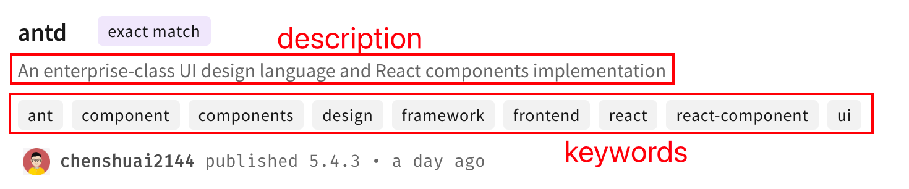
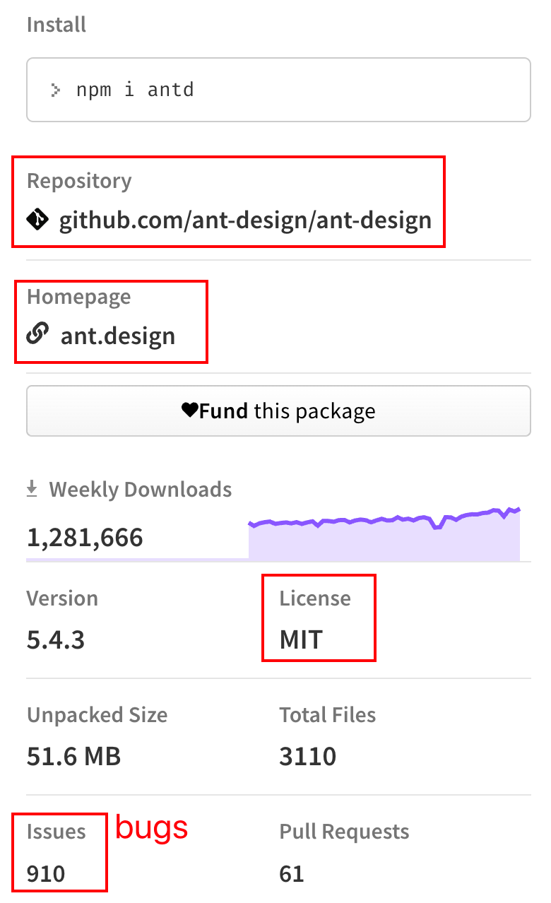

每个项目都有 `package.json`，我们对它并不陌生。
使用 `yarn init` 或 `npm init` 来初始化项目时，通过交互式命令填写完必要信息后，便可以创建出一个 `package.json` 文件。

几乎所有的前端项目都离不开它，因为它记录了一个和项目的***\*依赖项\****、***\*入口\****和***\*命令\****这三项最重要的信息。
这里用 `antd@4` 来举例：

这里放出 `antd@4.6.1` 的 `package.json` 文件的部分片段（非完整内容，且经过修整和删减）：

```json
{
  "name": "antd",
  "version": "4.6.1",
  "description": "An enterprise-class UI design language and React components implementation",
  "title": "Ant Design",
  "keywords": ["ant"],
  "homepage": "https://ant.design/",
  "bugs": {
    "url": "https://github.com/ant-design/ant-design/issues"
  },
  "repository": {
    "type": "git",
    "url": "https://github.com/ant-design/ant-design"
  },
  "license": "MIT",
  "contributors": ["ant"],
  "funding": {
    "type": "opencollective",
    "url": "https://opencollective.com/ant-design"
  },
  "files": ["dist", "lib", "es"],
  "sideEffects": ["dist/*", "es/**/style/*", "lib/**/style/*", "*.less"],
  "main": "lib/index.js",
  "module": "es/index.js",
  "unpkg": "dist/antd.min.js",
  "typings": "lib/index.d.ts",
  "scripts": {
    "build": "npm run compile && NODE_OPTIONS='--max-old-space-size=4096' npm run dist",
    "deploy": "bisheng gh-pages --push-only --dotfiles",
    "dist": "antd-tools run dist",
    "lint": "npm run tsc && npm run lint:script && npm run lint:demo && npm run lint:style && npm run lint:deps && npm run lint:md",
    "start": "antd-tools run clean && cross-env NODE_ENV=development concurrently \"npm run color-less\" \"bisheng start -c ./site/bisheng.config.js\"",
    "test": "jest --config .jest.js --no-cache"
  },
  "husky": {
    "hooks": {
      "pre-commit": "pretty-quick --staged"
    }
  },
  "browserslist": ["last 2 versions", "Firefox ESR", "> 1%", "ie >= 11"],
  "dependencies": {
    "@babel/runtime": "^7.10.4",
    "array-tree-filter": "^2.1.0",
    "classnames": "^2.2.6",
    "copy-to-clipboard": "^3.2.0",
    "lodash": "^4.17.20",
    "moment": "^2.25.3",
    "omit.js": "^2.0.2",
    "raf": "^3.4.1",
    "rc-animate": "~3.1.0"
  },
  "devDependencies": {
    "@types/classnames": "^2.2.8",
    "@types/lodash": "^4.14.139",
    "@typescript-eslint/eslint-plugin": "^3.0.0",
    "@typescript-eslint/parser": "^3.0.0",
    "cross-env": "^7.0.0",
    "eslint": "^7.3.1",
    "eslint-config-prettier": "^6.0.0",
    "husky": "^4.0.3",
    "rimraf": "^3.0.0",
    "typescript": "~4.0.0"
  },
  "peerDependencies": {
    "react": ">=16.9.0",
    "react-dom": ">=16.9.0"
  },
  "publishConfig": {
    "registry": "https://registry.npmjs.org/"
  }
}
```

可以看出，大型项目的 `package.json` 往往有数十个字段。我们看到这些内容，可能会引发怀疑：

- 这些字段真的有用吗？还是说，单纯是为了标注一下？
- 如果有用，是不是要遵循一定的格式？是不是需要某些工具来读取，才能生效？

以上面的示例来讲，其实这些字段大部分都是有用的。耐心看完本文，你对 `package.json` 的理解将更上一层楼。


# 包信息和公共信息

这部分字段标识了包的名称、版本等信息。
其中包的名称、版本号可以认为是最重要的部分之一；而还有例如简介、关键词、主页等字段则是无关紧要，主要起到 SEO 和描述作用。

这里给出一个示例：

```json
{
  "name": "my-lib",
  "private": true,
  "version": "1.2.3",

  "title": "我是项目标题，可以随便写点啥",
  "description": "我是项目描述，可以随便写点啥",
  "keywords": ["keyword1", "keyword2"],
  "homepage": "https://paperplane.cc/",
  "bugs": {
    "url": "https://git.paperplane.cc/jia-niang/paperplane-blog/issues"
  },
  "repository": {
    "type": "git",
    "url": "https://git.paperplane.cc/jia-niang/paperplane-blog"
  },
  "license": "MIT",
  "contributors": ["Frank Pu <1@paperplane.cc> (https://paperplane.cc/)"]
}
```

下文中，我们把这些字段分为两部分分别来介绍。


## 重要字段

`name` 字段，表示包的名称。如果项目需要作为 npm 包来发布，这个名字需要好好考虑避免重名或者歧义，重名的包是无法发布的；如果是普通的公司项目、内部项目，则名称可以随意取，只要能区分项目即可。
虽然包名允许下划线 `_` 、英文句点 `.`，但是强烈不推荐使用这些符号，如果要分词请尽量只使用横杠 `-`。以前包名允许大写字母，新发布包已经不允许大写字母了。

-----

`private` 字段，表示包是否为私有。如果项目不需作为 npm 库发布，直接设为 `true` 即可。

-----

`version` 字段，表示包的版本号，一般来说版本号可以分为三段：`major`.`mirror`.`patch`，可以这么理解：主要版本.次要版本.补丁版本。还可以在版本号后面接标签，例如 `1.2.3-alpha`。如果是公司项目或者前端项目，不需要作为 npm 库发布，那么这个字段不需要改动。

一般来说 `patch` 版本号的变更应只包含 bug 修复；而 `mirror` 版本号的变更可以包含功能的增加，但需做到向前兼容；而 `major` 版本号的变更可以包含破坏性的改动，可以不兼容以前的版本。

一般来说，如果一个库认为自己未完成开发，功能暂不稳定，那么 `major` 版本号应该为 `0`。例如 `react` 的版本号，在过去的七年里，一直处于 “未完成” 的状态，最后一个版本号是 `0.14.8`，然后开发人员终于认为这个项目 “完成” 了，正式版第一个版本号就直接是 `15.0.0` 了。

另外如果你对项目里的版本号的对比、判断等操作有需求，这里推荐 [semver](https://www.npmjs.com/package/semver) 这个库。


## 公共信息类字段

`contributors`（数组） 或者是 `author` 字段，用于提供包的作者或维护者信息，如果有多个人用前者，作者只有一个则用后者，可以把人名、邮箱、主页等信息放在里面，方便包的使用者后续联系。

-----

`title`、`description`、`keywords`（数组） 字段，用于标识一个 npm 包的功能和描述，这样更有利于 SEO，方便别人在 npm 上搜索到这个包。如果项目是公司项目或不准备发布包，那么可以留空。展现方式见下图：



-----

`bugs`、`repository`、`homepage`、`license` 字段，分别表示了**项目 bug 提交地址**、**项目代码仓库地址**、**项目主页地址**和**项目开原许可**。如果项目要作为 npm 包发布，那么可以一同给出这些地址，npm 可能会从这些地址自动读取一些信息，并展示在包的主页上。公司项目或不作为包发布的项目，则不需要提供这些字段。

展现方式见下图：



>请注意，如果是 `create-react-app` 创建的项目，可以将 `homepage` 设置为项目部署后的站点，`create-react-app` 会自动读取这个字段网址中的子路径来作为网站的子路径（subpath），并注入到 `process.env.PUBLIC_URL` 这个环境变量里。例如，设置了 `homepage: "https://paperplane.cc/app"`，那么 `process.env.PUBLIC_URL` 的值便等于 `/app`。


# 项目入口

通常来说，只有库需要入口，只有提供了入口，使用方才能直接 `import your_lib from "你的包名"`；
曾经，包的入口只需要一个 `main` 字段即可。经过前端工具多年的进化，现在的包通常会提供多个入口。

以 `antd` 举例：

```json
{
  "main": "lib/index.js",
  "module": "es/index.js",
  "jsnext:main": "es/index.js",
  "unpkg": "dist/antd.min.js",
  "typings": "lib/index.d.ts",
  "sideEffects": ["dist/*", "es/**/style/*", "lib/**/style/*", "*.less"]
}
```


其中：

`main` 字段，使用 CommonJS 方式加载包时入口文件的相对路径。

-----

`module` 字段，使用 Module 方式加载包时入口文件的相对路径。使用这种方式加载的包支持 [Treeshaking](https://webpack.docschina.org/guides/tree-shaking/)。

-----

`jsnext:main` 字段，曾经的 Module 方式加载包时入口文件的相对路径，现已被 `module` 字段取代；如果你的包需要兼容老项目，建议还是保留此字段。使用这种方式加载的包支持 [Treeshaking](https://webpack.docschina.org/guides/tree-shaking/)。

-----

`typings` 字段，如果这个包自身带有 Typescript 类型定义，此字段为类型定义的 .d.ts 入口文件。

-----

`unpkg` 字段，使用 UMD 方式加载包时入口文件的相对路径。
如果提供此字段，在 npm 包完成发布后，便可以通过 `https://unpkg.com/包名` 来直接访问你的包，例如在网页中写 `<script src="https://unpkg.com/lodash"></script>` 便可以直接引入 `lodash`。
项目如果想支持 `unpkg` 方式访问，必须在目录中准备一份 UMD 模块的代码，毕竟现在很少有人会用 `type="module"` 的方式来引入库。

-----

`type` 字段，这个字段通常是给 Node.js 项目使用的，取值为 `"commonjs"` （默认）或 `"module"`，它表示 .js 后缀文件的格式是是 CommonJS 还是 ES Module，注意 .mjs 后缀的文件始终会视为是 ES Module 格式，.cjs 后缀的文件始终会视为 CommonJS 格式。Node.js 现在默认是 CommonJS 模式，因此写 `import xx from "xx"` 会直接报错，把这个值改为 `"module"` 便不会报错了。

-----

`sideEffects`（可以为数组） 字段，只对 Webpack 之类的打包工具有用，此字段用于指定有副作用的文件，这样在 TreeShaking 时就不会把这些带有副作用的文件给删掉了。
这个字段可以设置为以下值：

-  `true` （也是默认的情况） 表示所有文件都有副作用；
- `false` 表示所有文件都无副作用；
- 一个字符串数组，数组中列出了有副作用的文件列表，支持 glob 通配符。对于这些带有副作用的文件，TreeShaking 时不会从它们中删去任何代码。

因为样式文件没有任何导出，会被 TreeShaking 当做没有用到的模块而删掉，所以我们可以看到 `antd` 把所有的样式文件都配置在了此字段里，这样可以避免 TreeShaking 删去任何 `import 'antd/lib/button/index.less'` 类的语句。
我们自己通过 `create-react-app` 创建的项目，其 Webpack 配置已经帮我们做了一些 `sideEffects` 的配置，所以我们直接引入样式文件都能正确生效。

如果某个 polyfill 库（例如 `core-js`）的 `package.json` 的 `sideEffects` 被设置为了 `false`，会发生什么情况？
这些库通常都是在项目入口处直接引入的：

```js
import 'core-js'
```

如果这类库的 `sideEffects` 被配置为了 `false`，那么 TreeShaking 会认为这个库未被使用，直接把这些代码删掉，导致功能失效。


# 项目依赖

这些字段也是我们熟悉的，每个项目都离不开这些配置，否则可能根本无法运行。
常见的依赖字段：

```json
{
  "dependencies": {
    "lodash": "^4.17.20",
    "typescript": "~4.0.0"
  },
  "devDependencies": {
    "@types/lodash": "^4.14.139",
    "eslint": "^7.3.1"
  },
  "peerDependencies": {
    "react": ">=16.9.0",
    "react-dom": ">=16.9.0"
  }
}
```

如果想安装某个依赖项，并把它加入到 `package.json` 的依赖字段 `dependencies` 中，可以通过以下方式：
`npm add lodash` 或者 `npm i -s lodash`（新版已经默认 `-s` 了），当然还有 `yarn add lodash`。

安装依赖时，可以指定版本号，例如：`yarn add antd@4.22.0` 这样便指定了 `4.22.0` 作为版本。安装依赖的时候如果不指定版本号，那么默认会安装最新版。


## 版本号规则

常见的版本号有以下几种格式：

- 指定版本号或标签，格式形如：`1.2.3` 或 `1.2.3-bete` 或 `tag-1.0.0`，运行 `npm i` 的时候会固定安装依赖包的这个版本；
  一般来说，例如 `prettier`、编译构建插件、私有业务库之类的对版本极其敏感的依赖包推荐使用这种格式；
- “兼容版本”，只固定第一位版本号，用 `~` 前缀表示；例如：`~1.2.3`，这种表示接受大于等于 `1.2.3` 的版本号，也可以写成 `>=1.2.3`；
- “近似版本”，固定前两位版本号，只允许第三位版本号更大，用 `^` 前缀表示；格式形如：`^1.2.3`，它表示接受 `1.2.A` 其中 `A` 大于等于 `3` 的版本；
- 任意版本 `*`，接受任意版本；
- 还有一些比较特别的格式：例如 `1.2.x` 表示固定前两位，第三位任意；或者是 `1.x` 表示只固定第一位版本号；还有例如 `>1.2.3` 或 `<=1.2.3` 或 `1.2.3-1.2.5` 或 `>=1.2.3 <1.2.4`，版本号可以带大于小于号以及横杠表示区间，多个版本号大小于规则之间还可以用 `||` 来分隔。

使用 `npm i xxx` 新增依赖包时，会自动安装这个包的最新版本，并使用 `^` 前缀连接其当前版本记录到 `package.json` 中；
使用 `npm i` 安装依赖时，或者是使用 `npm upgrade` 升级依赖，会尝试安装各个包符合版本号规定的最新版本。


## 项目依赖字段

几个依赖字段，也是有区别的：

`dependencies` 字段，项目运行必须的依赖，这是最常用的此处不再赘述。

-----

`devDependencies` 字段，项目的 “开发依赖”，一般在开发项目的时候才需要用到的依赖项会放在这里。
通过 `npm i -D eslint` 这种添加 `-D` 后缀的方式安装的依赖会添加到这里。
通过 `npm i --only=prod` 的方式来安装所有依赖时，将跳过 “开发依赖” 的安装，这样可以减少带宽开销，减少空间占用。

实际上，`dependencies` 和 `devDependencies` 的区分往往是给早期 Node.js 后台项目使用的，当时设计这两个字段的预期是：开发工具放置在 `devDependencies` 字段，而运行时确实需要的包放在 `dependencies` 字段。
开发时，两部分依赖项都需安装，而部署时只需要安装 `dependencies` 的部分。

如果你的项目是作为 npm 包发布的，那么你需要将项目中用到的依赖放到 `dependencies`，例如 `antd` 用到了 `moment` 和 `lodash`，所以必须有这两个依赖包，否则运行时会报错；
而只在开发过程中需要用的依赖，例如 `eslint` 和 `prettier` 这种源码处理工具，以及 `@types/*` 这种 Typescript 类型定义文件，都放在 `devDependencies`，只有 `antd` 的开发维护人员需要用到这些，作为使用者我们是不需要这些依赖的。

如果你的项目是作为前端网站项目，它往往是从源码编译为静态资源，在这个过程中需要用到 `typescript`、`webpack`、`babel` 等工具，如果没有这些工具，构建过程可能会直接报错终止；
而编译完成的产物就是一堆静态的 HTML、JS、CSS 文件，部署时只需复制到服务器的部署目录即可。

所以，前端网站项目可以把所有依赖都放进 `dependencies` 里，任何时候都一起安装好。

也可以换一种思路：在执行 CI/CD 时必须的依赖项，作为 `dependencies`，比如 `webpack` 这种；而作为只有在本地开发时需要的包，比如 `eslint`、`prettier`，则作为 `devDependencies`；这样则可以配置 CI/CD 安装依赖时运行 `npm i --only=prod` 仅安装项目依赖，可以加快 CI/CD 的运行效率。

-----

`peerDependencies` 字段，这是 “对等依赖”，一般对等依赖的版本号会写成 `>` 或 `>=` 的格式，例如 `"react": ">=16.9.0"`，它的作用是这样：**例如我要为 `react` 开发一个组件库，那么我不能把 `react` 作为项目的依赖，而是要认为这个组件库的使用者已经安装好了 `react`，所以需要把 `react` 作为项目的 “对等依赖” 添加到 `peerDependencies` 字段。**

运行 `yarn` 或 `npm i` 安装依赖时，不会主动安装这里面的依赖项，但是在安装了所有依赖后判断 `peerDependencies`  中的对等依赖是否已安装，如果有未完成安装的对等依赖项目，那么 npm 会在控制台打印出警告。

如果你的包是作为插件或者是作为 UI 组件库来发布，那么这个字段则是至关重要。前端网站项目则无需考虑这个字段。

-----

`peerDependenciesMeta` 字段，它是对 `peerDependencies` 的补充说明，它的格式是这样：

```json
{
  "peerDependencies": {
    "mylib": "1.2"
  },
  "peerDependenciesMeta": {
    "mylib": {
      "optional": true
    }
  }
}
```

如果只提供 `peerDependencies`，那么当使用者安装依赖后本地找不到 `mylib`，则 npm 会打印警告，使用上述的配置加一个 `optional: true` 便标志了 `mylib` 这一项对等依赖是 “可选” 的，即使没有安装它，npm 也不会打印警告。

-----

`optionalDependencies` 字段，表示 “可选的” 依赖，在运行 `npm i` 安装所有依赖时，这里面的依赖如果找不到、安装失败或者构建失败，安装过程仍然可以继续，npm 不会认为安装依赖的过程失败了。

-----

`bundleDependencies` 字段，格式是一个字符串数组，平时运行 `npm pack` 时是不会把 `node_modules` 目录打包的，如果提供了 `bundleDependencies` 字段之后，这里面指定的包都会被一起打包（此时便会带着 `node_modules` 目录打包了，但这里面只包含指定的包）。

-----

`overrides` 字段，可以用于强制覆写某个依赖包的版本配置，一般用于某个依赖包出现紧急安全问题时用以覆盖版本。这个字段是对象格式，支持包名的嵌套，格式如下：

```json
{
  "overrides": {
    "foo": {
      ".": "1.0.0",
      "bar": "1.0.0"
    }
  }
}
```

上面的示例表示，覆写项目自身的 `foo` 依赖为 `1.0.0`，同时覆写任意子孙依赖 `bar` 为 `1.0.0`，但是项目本身依赖的 `bar` 不会被覆写。


# 项目命令

继续以 `antd` 来举例，此处给出片段：

```json
{
  "scripts": {
    "build": "npm run compile && NODE_OPTIONS='--max-old-space-size=4096' npm run dist",
    "deploy": "bisheng gh-pages --push-only --dotfiles",
    "dist": "antd-tools run dist",
    "lint": "npm run tsc && npm run lint:script && npm run lint:demo && npm run lint:style && npm run lint:deps && npm run lint:md",
    "start": "antd-tools run clean && cross-env NODE_ENV=development concurrently \"npm run color-less\" \"bisheng start -c ./site/bisheng.config.js\"",
    "test": "jest --config .jest.js --no-cache"
  }
}
```

字段 `scripts` 中可以记录项目的各个脚本，例如启动项目、编译项目、运行单元测试等。


## 介绍

以上面的片段为例，`scripts` 由一系列键值对组成，其中所有的键为脚本名，值为完整指令。有些指令很长，我们只需要提供一个简短的脚本名即可直接运行。
以上面的片段为例，运行测试的命令是 `jest --config .jest.js --no-cache`，这个命令太长了，我们这个把它作为脚本记为 `test`，这样想要启动测试，只需要 `npm run test` 或 `yarn test`，使用 `yarn` 时可以省略 `run`。

注意：这些指令可以使用缩略指令运行，但并不一定可以直接使用完整指令运行。
例如：`"dist": "antd-tools run dist"` 这一段，如果我们正确安装了所有依赖，那么执行 `yarn dist` 肯定可以开始编译，但是执行 `antd-tools run dist` 却可能报错 “找不到 `antd-tools`”，此时改为 `npm run antd-tools run dist` 或者 `npx antd-tools run dist` 即可正常运行，因为如果 `antd-tools` 这个包不是全局安装的，那么操作系统是找不到它的启动位置的，而使用 `npm run` 或者 `npx` 运行指令则会尝试从当前目录中的 `node_modules` 中寻找。

------

有一部分 `scripts` 键是具备特殊功能的，它们会在包被安装、卸载或发布等动作时自动运行，可以用做预编译、清理等工作。可以查看 [官方文档](https://docs.npmjs.com/cli/v8/using-npm/scripts) 来了解这些指令。
我们自己新增 `scripts` 时，如果没有特殊需求，指令名需要避开这些特殊脚本名。


## 脚本的执行逻辑

npm 在执行当前的脚本前，会尝试在这个脚本名前加 `pre` 前缀并查找这个脚本，如果有则会先执行；
npm 还会在当前的脚本执行结束后，尝试在这个脚本名前加 `post` 前缀并查找这个脚本，如果有则会执行。

例如，你的指令的是 `dosomething`，那么你输入 `npm run dosomething` 按下回车键，npm 会先尝试找到 `predosomething` 脚本去提前执行，然后执行你的 `dosomething`，最后再去尝试找到 `postdosomething` 脚本去执行。

并且，部分 npm 自身的指令也会尝试像上述逻辑一样寻找 `pre` 和 `post` 前缀的指令来运行，例如执行 `npm install` 命令也会提前运行 `preinstall` 脚本，并在执行完成后运行 `postinstall` 脚本；但是请注意，并不是所有的 npm 指令都会这样，例如 `npm ci` 就不会。


## npm 生命周期脚本

`prepare`：在执行 `npm i` 安装所有依赖（即后面不能接任何包名）后自动运行，也会在项目生成打包文件之前提前运行，在脚本 `prepublish` 之后且在脚本 `prepublishOnly` 之前运行（执行 `npm public` 和 `npm pack` 都会生成打包文件）；它的作用是在安装依赖包后进行一些编译、检查、下载二进制文件等动作；

`prepublish`：已弃用，不推荐使用，因为语义不明确；在执行 `npm ci` 和 `npm install` 时运行，但是在执行 `npm publish` 时不会运行；

`prepublishOnly`：它是脚本 `prepublish` 的替代品，仅会在执行 `npm publish` 之前运行；

`prepack`：在为项目生成打包文件之前运行（执行 `npm public` 和 `npm pack` 都会生成打包文件）；

`postpack`：在项目生成打包文件后、但打包文件被移走使用之前执行，例如可以用它来计算打包文件的哈希值；

`dependencies`：在 `node_modules` 下发生文件变动后执行，全局运行 npm 命令时不会触发。


大部分 npm 指令都会自动运行以上脚本，有的命令会运行很多个脚本，例如 `npm ci`，具体清空可以查看 [官方文档](https://docs.npmjs.com/cli/v8/using-npm/scripts#life-cycle-operation-order)。


# monorepo 支持

npm 现在原生支持 monorepo，它提供了一个 `workspaces` 字段用于定义 monorepo 的 “工作区”。查看 [官方文档](https://docs.npmjs.com/cli/v9/using-npm/workspaces)。
这个字段的格式如下：

```json
{
  "workspaces": [
    "./packages/my-package-a",
    "./packages/my-package-b",
  ]
}
```

也可以支持 glob 通配符：

```json
{
  "workspaces": [
    "./packages/*"
  ]
}
```

使用 monorepo 时，我们可以把多个仓库放在 `./packages/` 目录下，并指定正确的 `workspaces` 字段，这样只需要运行 `npm i` 便可以自动为每个子包安装所有依赖，并自动建立符号连接。


# 环境要求字段

通常 Node.js 项目或是需本地编译的项目，会需求这些字段。举例：

```json
{
  "engines": {
    "node": ">=0.10.3 <15",
    "npm": "~1.0.20"
  },
  "os": [
    "darwin",
    "linux",
    "!win32"
  ],
  "cpu": [
    "x64",
    "!ia32"
  ]
}
```

其中：

`engines` 字段，表示项目运行时需求的 Node.js 和 npm 版本号，格式支持上面的锁定依赖版本号格式或者是大于小于号的格式，执行 npm 命令时，如果 Node.js 和 npm 版本号不符合这里规定的版本，那么会直接报错；

-----

`os` 字段，表示运行时候的操作系统要求；以 `!` 感叹号开头的项目表示除外的；

-----

`cpu` 字段，表示支持的处理器类型；以 `!` 感叹号开头的项目表示除外的；


# 给其他工具准备的字段

部分工具支持使用单独的配置文件，或者是读取 `package.json` 中的字段。
例如，`prettier` 可以读取项目根目录的 `.prettierrc` 文件，但也支持读取 `package.json` 中的 `prettier` 字段。具体要看工具的支持情况。

一般来说，`babel`、`eslint`、`prettier` 这类工具并不推荐把配置放在 `package.json` 中，原因是这些配置可能会使用 JS 代码来控制，或者是供给编辑器读取，如果放在 `package.json` 中可能会导致配置不便；而且这些配置的变更不应该反馈到 `package.json` 文件的变更时间线。

相对来说，更推荐把 `husky`、`browserslist` 这些配置放在 `package.json` 中，因为它们本身就带有一定的 “描述性”，且不会频繁更改。
